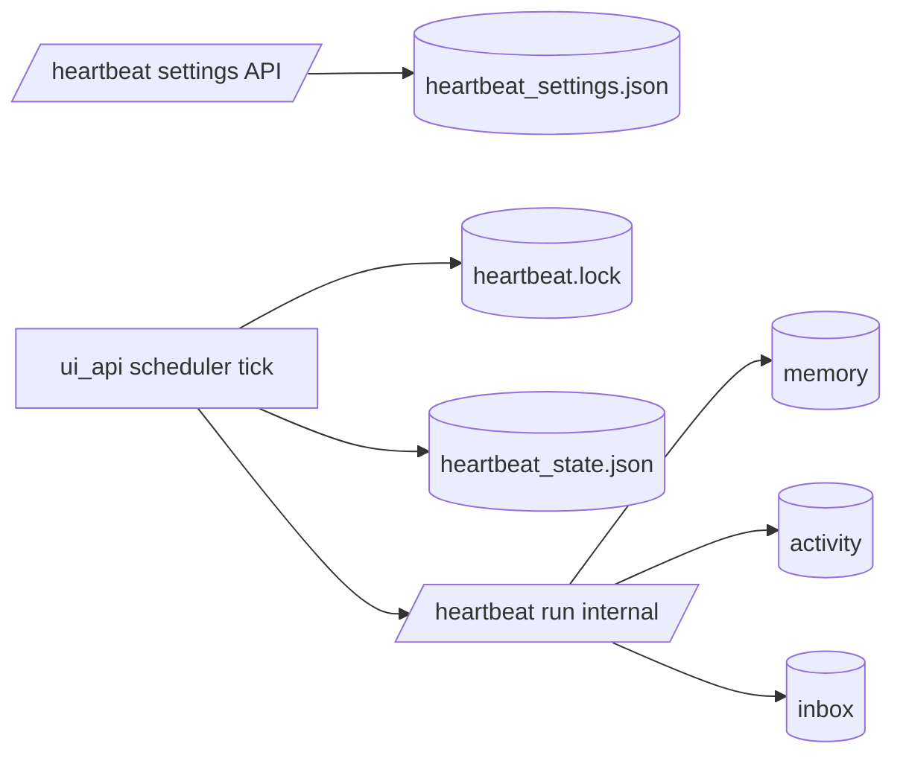
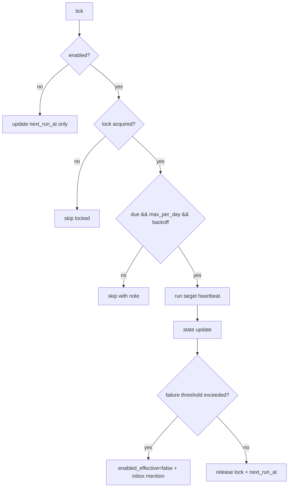

# Design: design_20260228_agent_heartbeat_v1_scheduler

- Status: Ready
- Owner: Codex
- Created: 2026-02-28
- Updated: 2026-02-28
- Scope: Agent Heartbeat v1: scheduled run + safety (max-per-day, lock, backoff, stop)

## Context
- Problem: v0 heartbeat is manual only.
- Goal: add scheduler-based heartbeat operations in ui_api process with safety devices and UI controls.
- Non-goals: LLM summarization, external cron integration.

## Design diagram

## Whiteboard impact
- Now: Before: heartbeat manual only. After: scheduled heartbeat + run_now + state visibility.
- DoD: Before: no scheduler safety controls. After: max_per_day/lock/backoff/stop and UI save+state+run_now.
- Blockers: none.
- Risks: lock stale mis-detection.

## Multi-AI participation plan
- Reviewer:
  - Request: safety correctness and additive compatibility.
  - Expected output format: concise bullets.
- QA:
  - Request: smoke deterministic checks for settings/state/run_now.
  - Expected output format: concise bullets.
- Researcher:
  - Request: schedule/backoff/lock strategy assessment.
  - Expected output format: concise bullets.
- External AI:
  - Request: optional.
  - Expected output format: n/a.
- external_participation: optional
- external_not_required: true

## Open Decisions
- [x] scheduler host process
- [x] run_now max_per_day handling

### Open Decisions checklist
- [x] Add "Decision 1 Final:" entry with final choice.
- [x] Add "Decision 2 Final:" entry with final choice.

## Final Decisions
- Decision 1 Final: run scheduler inside `ui_api.ts` process (desktop optional compatible).
- Decision 2 Final: `run_now` also respects max_per_day and returns `skipped_reason` when capped.

## Discussion summary
- Change 1: add heartbeat settings/state APIs and runtime files.
- Change 2: add lock+stale recovery, backoff, failure stop, and enabled_effective semantics.
- Change 3: extend settings UI panel for schedule save/state/run_now.

## Plan
1. design + reviews + gate
2. API scheduler + run_now
3. UI and smoke updates
4. docs and verification

## Risks
- Risk: stale lock false positives.
  - Mitigation: conservative stale threshold and lock note/state visibility.

## Test Plan
- API smoke: settings GET/POST, state GET, run_now dry_run.
- Build/gate: ui_build_smoke + ci_smoke_gate.

## Reviewed-by
- Reviewer / Codex / 2026-02-28 / approved
- QA / Codex / 2026-02-28 / approved
- Researcher / Codex / 2026-02-28 / noted

## External Reviews
- n/a / skipped
