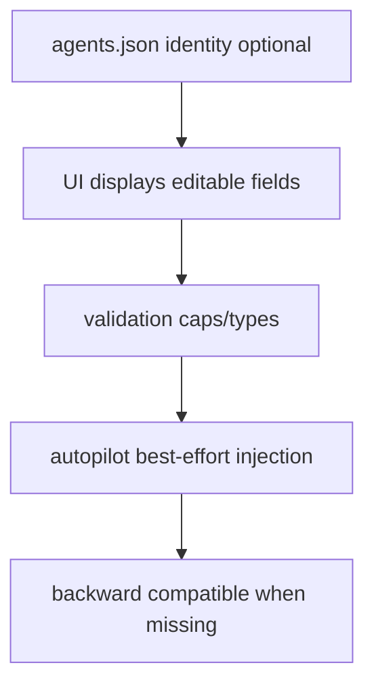

# Design: design_20260228_agent_identity_traits_v1

- Status: Approved
- Owner: Codex
- Created: 2026-02-28
- Updated: 2026-02-28
- Scope: Agent identity traits (profile edit + autopilot prompt injection)

## Context
- Problem: agents had role/status only, so autopilot responses lacked persistent character consistency.
- Goal: add editable identity traits per agent and inject them into council prompts.
- Non-goals: autonomous personality evolution, auth model changes.

## Design diagram
```mermaid
flowchart LR
  A[#メンバー edit identity] --> B[POST /api/org/agents]
  B --> C[agents.json persisted]
  C --> D[desktop autopilot loads identity]
  D --> E[role prompt includes [IDENTITY]]
```



## Whiteboard impact
- Now: Before: agents had no stable persona profile. After: each agent carries identity traits and autopilot prompts reflect them.
- DoD: Before: no identity edit/persist/injection path. After: identity schema + UI editing + prompt injection + smoke/gate green.
- Blockers: none.
- Risks: overlong identity text can bloat prompts if caps are not enforced.

## Multi-AI participation plan
- Reviewer:
  - Request: validate schema caps and backward compatibility.
  - Expected output format: severity bullets.
- QA:
  - Request: verify identity POST/GET persistence and UI editing flow.
  - Expected output format: pass/fail bullets.
- Researcher:
  - Request: verify prompt injection placement and failure isolation.
  - Expected output format: concise notes.
- External AI:
  - Request: not required.
  - Expected output format: n/a.
- external_participation: optional
- external_not_required: true

## Open Decisions
- [x] Decision 1
- [x] Decision 2

## Final Decisions
- Decision 1 Final: `agents[].identity` is optional and fully additive; missing identity is valid.
- Decision 2 Final: caps enforced in API (`string <= 200`, `speaking_style/focus <= 400`, list length <= 5).
- Decision 3 Final: council prompt injection reads `workspace/ui/org/agents.json` best-effort and omits block if unavailable.

## Discussion summary
- Add identity defaults for all five agents in initial snapshot for immediate usage.
- Keep UI editing simple with textarea/newline list format to avoid new dependencies.
- Preserve existing chat/taskify/export/inbox behavior by limiting changes to additive fields and prompt text.

## Plan
1. Extend org agent model/sanitizer/patch validation with identity.
2. Add identity editing controls in `#メンバー`.
3. Inject identity block into council role/final prompts.
4. Update smoke/docs and run gate.

## Risks
- Risk: identity partial update may unintentionally erase fields.
  - Mitigation: patch merge semantics preserve existing fields unless provided.
- Risk: prompt length drift from verbose identity.
  - Mitigation: strict caps and list limits before persistence/injection.

## Test Plan
- `npm.cmd run docs:check:json`
- `powershell -NoProfile -ExecutionPolicy Bypass -File tools/design_gate.ps1 -DesignPath docs/design/design_20260228_agent_identity_traits_v1.md`
- `powershell -NoProfile -ExecutionPolicy Bypass -File tools/ui_smoke.ps1 -Json`
- `npm.cmd run desktop:smoke:json`
- `npm.cmd run ci:smoke:gate:json`
- `powershell -NoProfile -ExecutionPolicy Bypass -File tools/whiteboard_update.ps1 -DryRun -Json`

## Reviewed-by
- Reviewer / Codex / 2026-02-28 / approved
- QA / Codex / 2026-02-28 / approved
- Researcher / Codex / 2026-02-28 / noted

## External Reviews
- n/a / skipped
