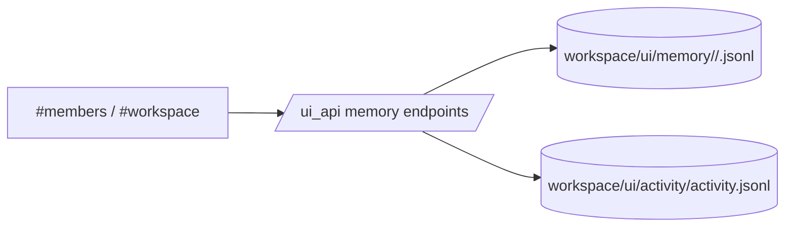
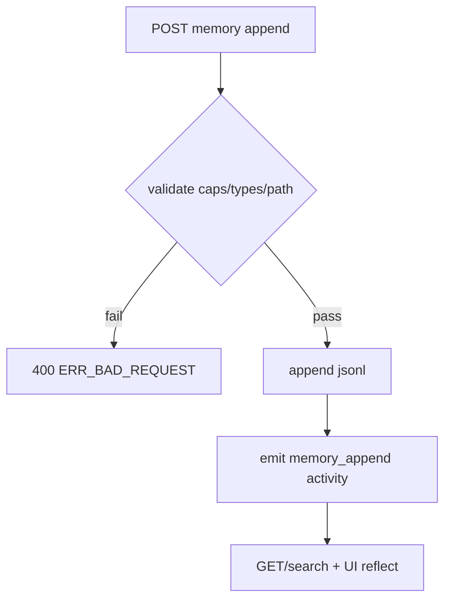

# Design: design_20260228_agent_memory_v1

- Status: Ready
- Owner: Codex
- Created: 2026-02-28
- Updated: 2026-02-28
- Scope: Agent Memory v1: episodes/knowledge/procedures with UI + API

## Context
- Problem: Org agents had profile/state but no persistent per-agent memory timeline for episodes/knowledge/procedures.
- Goal: Add safe append-only memory APIs and UI browse/search/add flows, with activity emit.
- Non-goals: vector search, automatic extraction/summarization, update/delete.

## Design diagram

## Whiteboard impact
- Now: Before: member status and global activity only. After: member memory (episodes/knowledge/procedures) can be viewed/searched/appended.
- DoD: Before: no memory API/UI. After: `/api/memory` GET/POST/search + UI tab + smoke booleans + gate green.
- Blockers: none.
- Risks: unbounded reads; mitigated by read cap 256KB and limit<=200.

## Multi-AI participation plan
- Reviewer:
  - Request: Check additive compatibility and API safety.
  - Expected output format: bullets with risks/tests.
- QA:
  - Request: Verify smoke determinism and edge validations.
  - Expected output format: bullets with pass/fail criteria.
- Researcher:
  - Request: Validate append-only schema and search cap tradeoffs.
  - Expected output format: bullets with alternatives.
- External AI:
  - Request: Optional, not required for this delta.
  - Expected output format: short review memo.
- external_participation: optional
- external_not_required: true

## Open Decisions
- [x] agent_id validation strategy
- [x] large-file read behavior

### Open Decisions checklist
- [x] Add "Decision 1 Final:" entry with final choice.
- [x] Add "Decision 2 Final:" entry with final choice.

## Final Decisions
- Decision 1 Final: validate `agent_id` with regex `^[a-z0-9_-]{1,40}$` and require membership in `org/agents` IDs.
- Decision 2 Final: enforce read cap `256KB`; if file is larger, tail-read and return `truncated/note`.

## Discussion summary
- Change 1: Added memory JSONL model and APIs (GET category, POST append, GET search) with caps and broken-line skip.
- Change 2: Added UI memory panel under members and workspace shortcut.
- Change 3: Added smoke checks and docs updates.

## Plan
1. Design + gate files
2. Implement API + UI + smoke
3. Update docs
4. Run docs/smoke/build/gate verification

## Risks
- Risk: false negatives in substring search due capped scan.
  - Mitigation: document best-effort behavior and expose direct category GET.

## Test Plan
- Unit: TypeScript compile check for `ui_api.ts` and UI build smoke.
- E2E: `tools/ui_smoke.ps1 -Json` memory_post/memory_get/memory_search booleans true.

## Reviewed-by
- Reviewer / Codex / 2026-02-28 / approved
- QA / Codex / 2026-02-28 / approved
- Researcher / Codex / 2026-02-28 / noted

## External Reviews
- n/a / skipped
