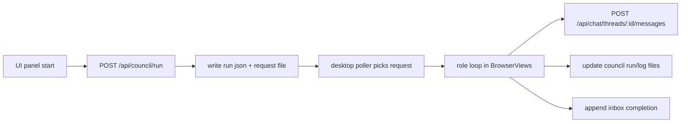
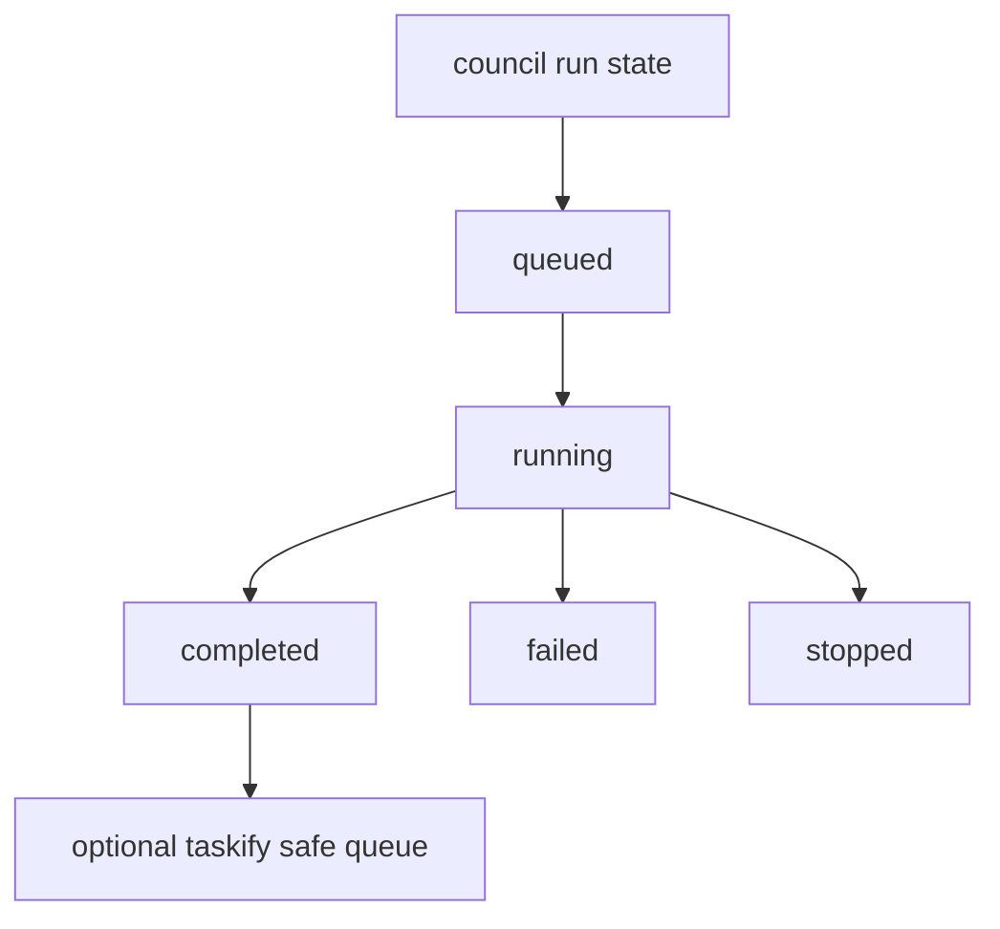

# Design: design_20260228_council_autopilot_v1

- Status: Approved
- Owner: Codex
- Created: 2026-02-28
- Updated: 2026-02-28
- Scope: Council autopilot runner with role-based desktop execution and ui_api start/status APIs

## Context
- Problem: role views are isolated, but there is no orchestrated auto-debate flow across roles.
- Goal: run facilitator/design/impl/qa/jester turns automatically, persist logs/state, and publish final result to chat/inbox.
- Non-goals: autonomous scheduling/cron, auth, non-local transport.

## Design diagram

## Whiteboard impact
- Now: Before: debate flow was manual. After: one-start autopilot performs multi-role rounds and records progress.
- DoD: Before: no council run API/state existed. After: start/status endpoints + desktop runner + UI controls + smoke green.
- Blockers: none.
- Risks: headless/offline desktop path can only provide best-effort smoke coverage.

## Multi-AI participation plan
- Reviewer:
  - Request: validate cross-process contract (ui_api request file <-> desktop poller) and error handling.
  - Expected output format: severity-ordered bullets.
- QA:
  - Request: validate end-to-end start/status and chat/inbox artifacts.
  - Expected output format: pass/fail bullets.
- Researcher:
  - Request: validate polling/caps/atomic write choices for local runtime.
  - Expected output format: concise notes.
- External AI:
  - Request: not required.
  - Expected output format: n/a
- external_participation: optional
- external_not_required: true

## Open Decisions
- [x] Decision 1
- [x] Decision 2

## Final Decisions
- Decision 1 Final: ui_api owns run/status/request state files; desktop runner consumes request files and updates run/log atomically.
- Decision 2 Final: optional auto_build triggers existing safe Taskify draft+queue API from desktop after final answer.

## Discussion summary
- Change 1: add council storage paths and API endpoints (`POST /api/council/run`, `GET /api/council/run/status`).
- Change 2: add desktop council poller/runner using active role BrowserViews and bridge send/capture hooks.
- Change 3: add UI autopilot panel in workspace/settings with start/status/stop/open-thread controls.
- Change 4: append activity/inbox events for start/step/finish and update smoke checks.

## Plan
1. Add ui_api council models/storage and start/status endpoints.
2. Add desktop poller and run loop with per-role prompts and chat posting.
3. Add UI panel and controls.
4. Update smoke/docs and run gate + CI smoke gate.

## Risks
- Risk: assistant capture may return stale content.
  - Mitigation: wait-for-change loop with timeout and per-role last text tracking.
- Risk: request file race across multiple desktop instances.
  - Mitigation: atomic rename claim + single-file request per run id.

## Test Plan
- `npm.cmd run docs:check:json`
- `powershell -NoProfile -ExecutionPolicy Bypass -File tools/design_gate.ps1 -DesignPath docs/design/design_20260228_council_autopilot_v1.md`
- `node --check apps/ui_desktop_electron/main.cjs`
- `powershell -NoProfile -ExecutionPolicy Bypass -File tools/ui_smoke.ps1 -Json`
- `npm.cmd run desktop:smoke:json`
- `npm.cmd run ci:smoke:gate:json`

## Reviewed-by
- Reviewer / Codex / 2026-02-28 / approved
- QA / Codex / 2026-02-28 / approved
- Researcher / Codex / 2026-02-28 / noted

## External Reviews
- n/a / skipped
