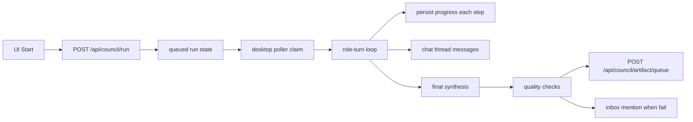
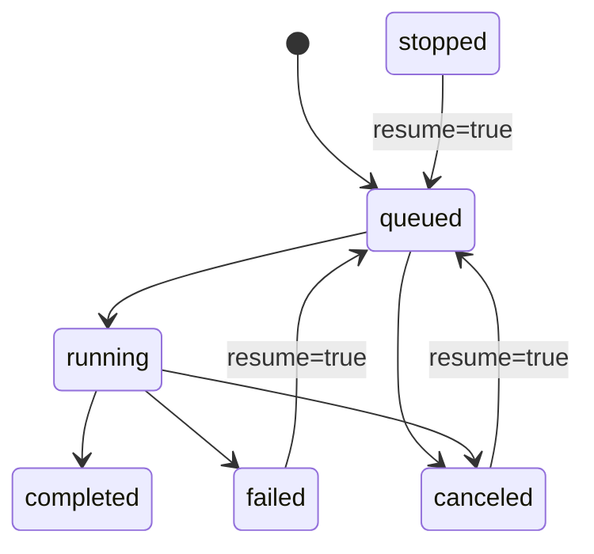

# Design: design_20260228_council_autopilot_v1_1_stability

- Status: Approved
- Owner: Codex
- Created: 2026-02-28
- Updated: 2026-02-28
- Scope: Council autopilot stability upgrade (cancel/resume, auto artifact, minimal quality checks)

## Context
- Problem: v1 can run debates, but operations need safer interruption/restart, stronger completion artifacts, and explicit quality signaling.
- Goal: add cancel/resume controls, auto-generate safe artifacts on completion, and notify inbox on quality check failures.
- Non-goals: autonomous cron scheduling, auth/permissions, destructive build automation.

## Design diagram

## Whiteboard impact
- Now: Before: long council runs were hard to interrupt/recover and completion artifact quality was implicit. After: cancel/resume is explicit, artifact queue is automatic, and quality failure is visible via inbox mention.
- DoD: Before: council API/UI lacked cancel/resume and artifact auto-generation contract. After: cancel/resume APIs + desktop runner resume/cancel behavior + artifact queue + quality signal + smoke green.
- Blockers: none.
- Risks: desktop unavailable paths remain best-effort; resume semantics depend on persisted step consistency.

## Multi-AI participation plan
- Reviewer:
  - Request: review cancel/resume state machine integrity and API compatibility.
  - Expected output format: severity-ordered bullets.
- QA:
  - Request: verify start/status/cancel/resume and quality-fail inbox mention behavior.
  - Expected output format: pass/fail bullets with missing coverage.
- Researcher:
  - Request: validate artifact queue safety and cap/path assumptions.
  - Expected output format: concise risk notes.
- External AI:
  - Request: not required.
  - Expected output format: n/a.
- external_participation: optional
- external_not_required: true

## Open Decisions
- [x] Decision 1
- [x] Decision 2

## Final Decisions
- Decision 1 Final: keep `POST /api/council/run` additive and introduce resume via `{ resume: true, run_id }`.
- Decision 2 Final: add `POST /api/council/run/cancel` and persist `status/current_step/current_role/retries/last_error/can_resume`.
- Decision 3 Final: queue safe artifact pipeline automatically after final synthesis and expose artifact paths in run status.
- Decision 4 Final: enforce minimal text quality checks and append inbox mention on failure while still saving draft/artifact.

## Discussion summary
- Additive API: `cancel` route and `resume` input preserve existing start/status compatibility.
- Runner safety: persist progress after each role turn so restart continues from next pending step.
- Completion output: always produce answer markdown; optional bundle archive via safe queue.
- Reliability: canceled/failed runs expose `can_resume=true` to keep UI controls deterministic.

## Plan
1. Extend ui_api council models/status fields and add cancel/resume/artifact queue endpoints.
2. Extend desktop runner to persist progress, honor cancel, and continue from persisted step on resume.
3. Update ui_discord autopilot panel with Start/Cancel/Resume and artifact/status visibility.
4. Add smoke coverage for cancel state transition and keep gate checks green.

## Risks
- Risk: cancellation during wait loop can race with final capture.
  - Mitigation: wait loop checks persisted run state (`stop_requested`/`canceled`) before each poll.
- Risk: artifact bundle input mismatch causes queue failure.
  - Mitigation: keep queue best-effort, persist `artifact_status`, and notify failures via status/inbox.

## Test Plan
- `npm.cmd run docs:check:json`
- `powershell -NoProfile -ExecutionPolicy Bypass -File tools/design_gate.ps1 -DesignPath docs/design/design_20260228_council_autopilot_v1_1_stability.md`
- `node --check apps/ui_desktop_electron/main.cjs`
- `powershell -NoProfile -ExecutionPolicy Bypass -File tools/ui_smoke.ps1 -Json`
- `npm.cmd run desktop:smoke:json`
- `npm.cmd run ui:build:smoke:json`
- `npm.cmd run ci:smoke:gate:json`

## Reviewed-by
- Reviewer / Codex / 2026-02-28 / approved
- QA / Codex / 2026-02-28 / approved
- Researcher / Codex / 2026-02-28 / noted

## External Reviews
- n/a / skipped
