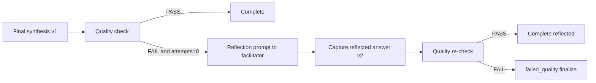
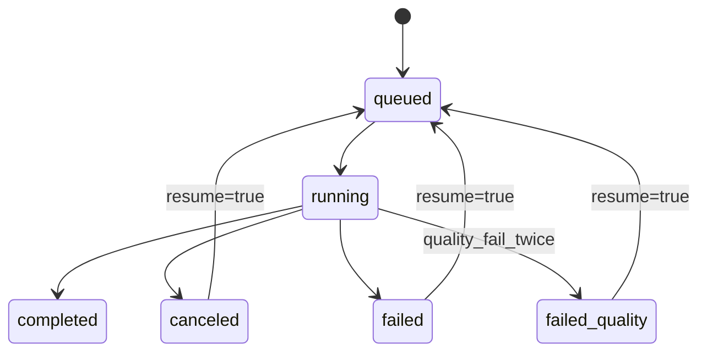

# Design: design_20260228_council_autopilot_v1_2_reflection

- Status: Approved
- Owner: Codex
- Created: 2026-02-28
- Updated: 2026-02-28
- Scope: Council autopilot one-shot reflection loop on quality failure

## Context
- Problem: v1.1 quality failure ends immediately, reducing completion rate for minor formatting/content misses.
- Goal: add exactly one automatic reflection attempt, keep cancel/resume compatibility, and always preserve best-effort artifacts.
- Non-goals: multi-attempt self-healing loops, autonomous scheduling, auth/permission model changes.

## Design diagram

## Whiteboard impact
- Now: Before: quality NG stopped as-is. After: one-shot reflection can fix and finish without operator retry.
- DoD: Before: no bounded reflection state in council run. After: `reflection.attempts/max=1` + `finalization.mode/version` + inbox behavior + gate green.
- Blockers: none.
- Risks: reflection quality still depends on LLM output and may end in `failed_quality`.

## Multi-AI participation plan
- Reviewer:
  - Request: validate one-shot cap and non-loop guarantee across resume/cancel paths.
  - Expected output format: severity-ordered bullets.
- QA:
  - Request: validate reflected success and failed_quality notification/artifact paths.
  - Expected output format: pass/fail bullets with gaps.
- Researcher:
  - Request: validate state schema additions and compatibility with existing status consumers.
  - Expected output format: concise notes.
- External AI:
  - Request: not required.
  - Expected output format: n/a.
- external_participation: optional
- external_not_required: true

## Open Decisions
- [x] Decision 1
- [x] Decision 2

## Final Decisions
- Decision 1 Final: reflection attempts are hard-capped at 1 (`max_reflection_attempts=1`), no additional retries.
- Decision 2 Final: failed second quality check finalizes run as `failed_quality` while still creating best-effort artifact.
- Decision 3 Final: additive run state includes `quality_check`, `reflection`, and `finalization`.
- Decision 4 Final: reflected success uses normal completion notification with reflected marker; failed_quality sends mention notification with failure summary.

## Discussion summary
- Additive status schema supports operational introspection and resume continuity.
- Reflection runs only on facilitator final response and reuses existing bridge/send/capture logic.
- Artifact queue path from v1.1 is preserved and enriched with version/reflection metadata in markdown.
- UI and smoke check only status/API fields; DOM-dependent reflection simulation remains best-effort.

## Plan
1. Extend council state schema in ui_api and ensure status endpoint returns new fields.
2. Implement one-shot reflection branch in desktop runner finalization.
3. Update UI autopilot panel to display reflection/finalization/quality summary.
4. Update smoke/docs and run full gate.

## Risks
- Risk: reflection prompt may still omit required headings.
  - Mitigation: second failure terminates deterministically as `failed_quality` with mention + artifact.
- Risk: cancel signal during reflection wait can corrupt state.
  - Mitigation: wait loop keeps cancellation checks and writes terminal canceled state.

## Test Plan
- `node --check apps/ui_desktop_electron/main.cjs`
- `npm.cmd run docs:check:json`
- `powershell -NoProfile -ExecutionPolicy Bypass -File tools/design_gate.ps1 -DesignPath docs/design/design_20260228_council_autopilot_v1_2_reflection.md`
- `powershell -NoProfile -ExecutionPolicy Bypass -File tools/ui_smoke.ps1 -Json`
- `npm.cmd run desktop:smoke:json`
- `npm.cmd run ci:smoke:gate:json`
- `powershell -NoProfile -ExecutionPolicy Bypass -File tools/whiteboard_update.ps1 -DryRun -Json`

## Reviewed-by
- Reviewer / Codex / 2026-02-28 / approved
- QA / Codex / 2026-02-28 / approved
- Researcher / Codex / 2026-02-28 / noted

## External Reviews
- n/a / skipped
