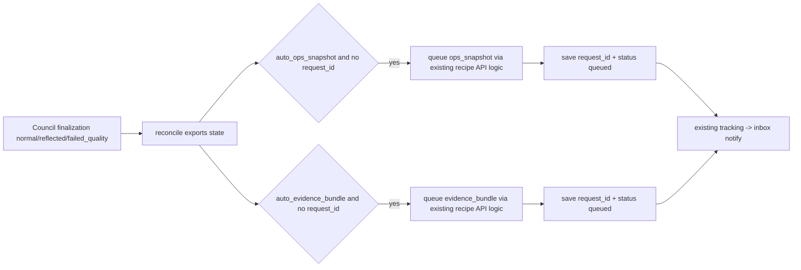
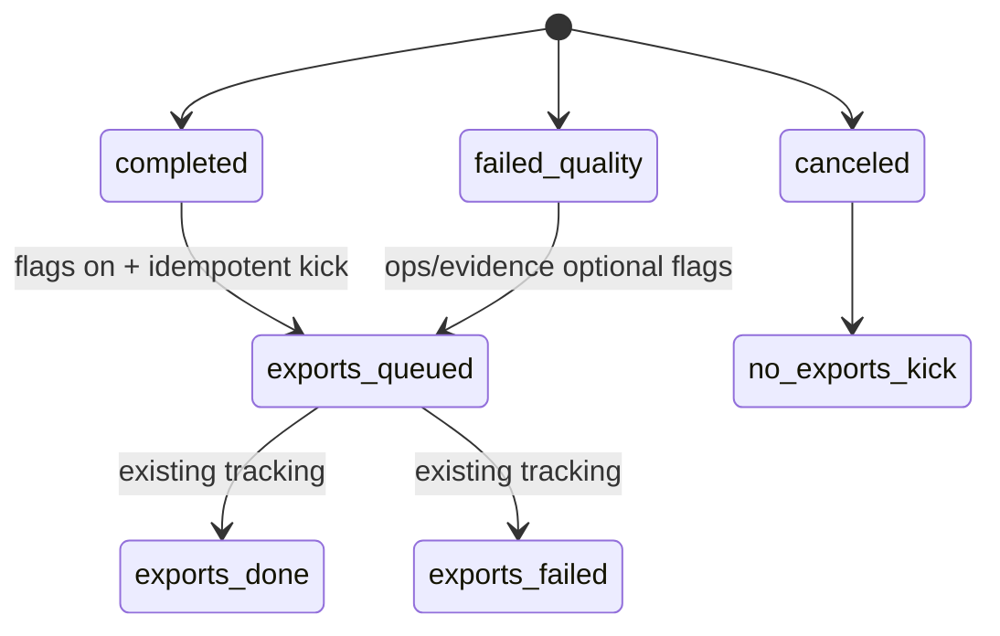

# Design: design_20260228_council_autopilot_v1_3_auto_exports

- Status: Approved
- Owner: Codex
- Created: 2026-02-28
- Updated: 2026-02-28
- Scope: Council autopilot completion hooks for auto ops_snapshot and evidence_bundle

## Context
- Problem: council completion still requires manual export actions to produce operational snapshot/evidence bundle.
- Goal: optionally auto-kick existing export APIs on council finalization and surface tracking state in council status.
- Non-goals: export payload expansion, custom file path generation, distribution packaging.

## Design diagram

## Whiteboard impact
- Now: Before: council completion required manual export clicks. After: optional auto-kick runs ops snapshot/evidence export automatically with existing tracking/inbox notifications.
- DoD: Before: council status had no export kick state. After: additive `exports` state + idempotent request_id persistence + gate/smoke green.
- Blockers: none.
- Risks: export queueing can fail due to template/runtime conditions; council should remain stable.

## Multi-AI participation plan
- Reviewer:
  - Request: validate idempotent kick semantics and cancel compatibility.
  - Expected output format: severity bullets.
- QA:
  - Request: validate UI flag wiring and status fields (`request_id/status`) visibility.
  - Expected output format: pass/fail bullets.
- Researcher:
  - Request: validate additive schema compatibility and existing tracking reuse.
  - Expected output format: concise notes.
- External AI:
  - Request: not required.
  - Expected output format: n/a.
- external_participation: optional
- external_not_required: true

## Open Decisions
- [x] Decision 1
- [x] Decision 2

## Final Decisions
- Decision 1 Final: auto export kicks are performed only after council reaches terminal finalization (`completed` or `failed_quality`), never on `canceled`.
- Decision 2 Final: request IDs are persisted in run state and used as idempotency keys to prevent duplicate kicks.
- Decision 3 Final: autopilot does not write export inbox messages directly; existing export tracking/inbox flow remains source of truth.

## Discussion summary
- Reuse existing export queue builder/tracking logic to preserve allowlist/caps and safety.
- Keep council logic additive by extending run state with `exports` and lazy reconciliation on status reads.
- UI only controls flags and displays tracking state; no direct export task authoring from council panel.

## Plan
1. Extend council run schema and sanitize logic with `exports`.
2. Add auto-kick/reconcile helper for ops/evidence export with idempotency.
3. Wire UI toggles and status display into council start/resume panel.
4. Update smoke/docs and run full gate.

## Risks
- Risk: repeated status polling could trigger repeated queueing.
  - Mitigation: strict request_id null-check before kick.
- Risk: queue failure could hide operational context.
  - Mitigation: persist `exports.note/status=failed` in run state; keep council result intact.

## Test Plan
- `npm.cmd run docs:check:json`
- `powershell -NoProfile -ExecutionPolicy Bypass -File tools/design_gate.ps1 -DesignPath docs/design/design_20260228_council_autopilot_v1_3_auto_exports.md`
- `powershell -NoProfile -ExecutionPolicy Bypass -File tools/ui_smoke.ps1 -Json`
- `npm.cmd run desktop:smoke:json`
- `npm.cmd run ci:smoke:gate:json`
- `powershell -NoProfile -ExecutionPolicy Bypass -File tools/whiteboard_update.ps1 -DryRun -Json`

## Reviewed-by
- Reviewer / Codex / 2026-02-28 / approved
- QA / Codex / 2026-02-28 / approved
- Researcher / Codex / 2026-02-28 / noted

## External Reviews
- n/a / skipped
