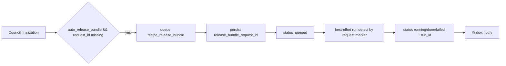
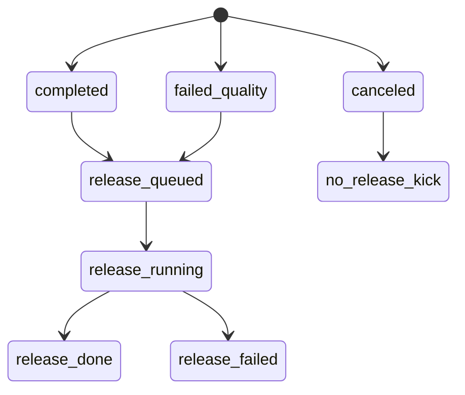

# Design: design_20260228_council_autopilot_v1_4_auto_release_bundle

- Status: Approved
- Owner: Codex
- Created: 2026-02-28
- Updated: 2026-02-28
- Scope: Council autopilot auto-kick recipe_release_bundle + status integration

## Context
- Problem: council completion still requires a separate manual action to run release bundle recipe for submission packaging.
- Goal: optionally auto-kick `recipe_release_bundle` at council finalization and show unified tracking state in council status/UI.
- Non-goals: changing release bundle recipe internals, broadening execution permissions.

## Design diagram

## Whiteboard impact
- Now: Before: release bundle required manual trigger after council completion. After: optional auto release bundle kick enables one-button end-to-end completion.
- DoD: Before: no council-integrated release bundle request/run tracking. After: additive `auto_release_bundle` + request/run/status integration + smoke/gate green.
- Blockers: none.
- Risks: run detection relies on request marker in task metadata and best-effort polling.

## Multi-AI participation plan
- Reviewer:
  - Request: verify idempotent kick and cancel compatibility.
  - Expected output format: severity bullets.
- QA:
  - Request: verify UI toggle, queued/request_id persistence, run_id status integration.
  - Expected output format: pass/fail bullets.
- Researcher:
  - Request: verify safe reuse of existing recipe path and additive schema compatibility.
  - Expected output format: concise notes.
- External AI:
  - Request: not required.
  - Expected output format: n/a.
- external_participation: optional
- external_not_required: true

## Open Decisions
- [x] Decision 1
- [x] Decision 2

## Final Decisions
- Decision 1 Final: release bundle kick is allowed only through existing recipe execution path (`recipe_release_bundle`), no new arbitrary task path.
- Decision 2 Final: council run state persists request_id and prevents duplicate kicks for the same run.
- Decision 3 Final: canceled runs do not kick release bundle; post-kick tracking is best-effort.

## Discussion summary
- Council exports section remains additive and now includes release-specific request/status/run fields.
- Tracking uses request marker in task metadata and run task yaml scanning, aligned with existing tracking patterns.
- Inbox notifications are emitted on release completion/failure with dedup by source+request_id.

## Plan
1. Extend council exports schema with release bundle fields.
2. Add internal queue helper for `recipe_release_bundle` with request marker injection.
3. Add best-effort status integration (request_id -> run_id -> terminal status) and inbox notify.
4. Wire UI toggle/status and smoke assertions; run gate.

## Risks
- Risk: task metadata marker not found in some runs.
  - Mitigation: fallback to queued status and continue best-effort scanning; no council failure.
- Risk: repeated status checks could re-notify inbox.
  - Mitigation: dedup using existing request notification check.

## Test Plan
- `npm.cmd run docs:check:json`
- `powershell -NoProfile -ExecutionPolicy Bypass -File tools/design_gate.ps1 -DesignPath docs/design/design_20260228_council_autopilot_v1_4_auto_release_bundle.md`
- `powershell -NoProfile -ExecutionPolicy Bypass -File tools/ui_smoke.ps1 -Json`
- `npm.cmd run desktop:smoke:json`
- `npm.cmd run ci:smoke:gate:json`
- `powershell -NoProfile -ExecutionPolicy Bypass -File tools/whiteboard_update.ps1 -DryRun -Json`

## Reviewed-by
- Reviewer / Codex / 2026-02-28 / approved
- QA / Codex / 2026-02-28 / approved
- Researcher / Codex / 2026-02-28 / noted

## External Reviews
- n/a / skipped
