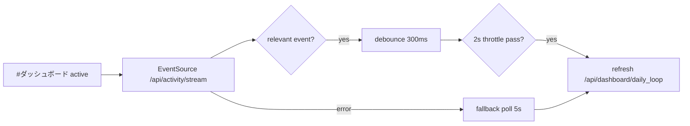
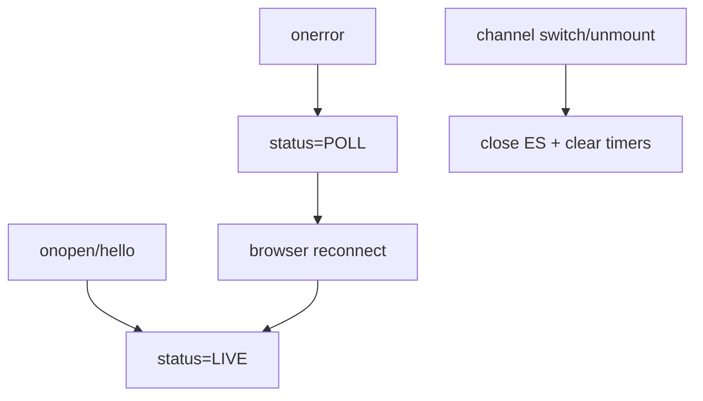

# Design: design_20260228_daily_loop_dashboard_v2_sse_refresh

- Status: Ready
- Owner: Codex
- Created: 2026-02-28
- Updated: 2026-02-28
- Scope: Daily Loop Dashboard v2: SSE-driven refresh (activity stream) with debounce + fallback

## Context
- Problem: v1 dashboard uses interval polling only, which is either delayed or wasteful.
- Goal: make dashboard refresh event-driven with SSE first, and low-frequency polling fallback on disconnect.
- Non-goals: no new dashboard-specific stream endpoint; no breaking changes to existing `/api/activity/stream`.

## Design diagram

## Whiteboard impact
- Now: Before: dashboard updates on fixed interval. After: updates are driven by activity stream with fallback polling.
- DoD: Before: no LIVE/POLL visibility on dashboard. After: dashboard shows LIVE/POLL mode, last update time, and last event id.
- Blockers: none.
- Risks: noisy events could trigger over-refresh.

## Multi-AI participation plan
- Reviewer:
  - Request: validate additive SSE wiring and no regression to existing activity/workspace stream flows.
  - Expected output format: concise bullets.
- QA:
  - Request: validate debounce/throttle/fallback behavior and smoke feasibility.
  - Expected output format: concise bullets.
- Researcher:
  - Request: assess event relevance policy and future schema compatibility.
  - Expected output format: concise bullets.
- External AI:
  - Request: optional.
  - Expected output format: n/a.
- external_participation: optional
- external_not_required: true

## Open Decisions
- [x] Decision 1
- [x] Decision 2

### Open Decisions checklist
- [x] Add "Decision 1 Final:" entry with final choice.
- [x] Add "Decision 2 Final:" entry with final choice.

## Final Decisions
- Decision 1 Final: dashboard consumes existing `/api/activity/stream?limit=20`; no new SSE endpoint added.
- Decision 2 Final: refresh gating uses debounce 300ms + hard throttle 2s, with fallback poll every 5s when disconnected.

## Discussion summary
- Change 1: add dashboard channel SSE lifecycle (connect, relevant-event parse, fallback polling, cleanup).
- Change 2: add in-flight guard to dashboard fetch to prevent concurrent refresh.
- Change 3: add UI meta indicators (`LIVE/POLL`, last update time, last event id).

## Plan
1. Update dashboard refresh logic in `App.tsx`.
2. Add minimal styles for LIVE/POLL and meta row.
3. Update docs and run verification gates.

## Risks
- Risk: event parsing failures from non-JSON payloads.
  - Mitigation: ignore parse errors and rely on fallback polling.

## Test Plan
- API smoke: existing stream header check (`activity_stream_ok`) and dashboard API check (`dashboard_ok`) remain.
- Build/gate: docs check, design gate, ui smoke, ui build smoke, desktop smoke, ci smoke gate.

## Reviewed-by
- Reviewer / Codex / 2026-02-28 / approved
- QA / Codex / 2026-02-28 / approved
- Researcher / Codex / 2026-02-28 / approved

## External Reviews
- n/a / skipped
