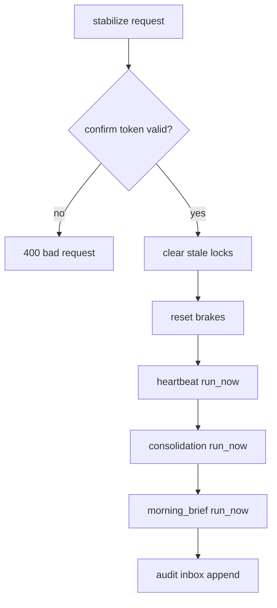

# Design: design_20260228_daily_loop_dashboard_v3_ops_quick_actions

- Status: Ready
- Owner: Codex
- Created: 2026-02-28
- Updated: 2026-02-28
- Scope: Dashboard v3: Ops Quick Actions (reset brakes/clear locks/stabilize) with audit

## Context
- Problem: incident recovery requires multiple manual operations across files/endpoints.
- Goal: provide safe server-side quick actions from dashboard with mandatory confirm and audit trail.
- Non-goals: no destructive operations beyond stale lock cleanup; no new automation logic.

## Design diagram
```mermaid
flowchart LR
  UI[Dashboard Ops Card] --> S[/api/ops/quick_actions/status]
  S --> T[confirm token 60s]
  UI --> C[/clear_stale_locks]
  UI --> R[/reset_brakes]
  UI --> Z[/stabilize]
  C --> I[#inbox audit]
  R --> I
  Z --> I
```



## Whiteboard impact
- Now: Before: recovery steps were scattered/manual. After: one dashboard card executes scoped recovery with preview+confirm.
- DoD: Before: no quick-actions APIs. After: status/clear/reset/stabilize APIs + UI confirm modal + smoke checks.
- Blockers: none.
- Risks: misuse of safe_run if confirmed without review.

## Multi-AI participation plan
- Reviewer:
  - Request: validate safety boundaries and additive compatibility.
  - Expected output format: concise bullets.
- QA:
  - Request: validate dry-run smoke coverage and confirm token behavior assumptions.
  - Expected output format: concise bullets.
- Researcher:
  - Request: validate audit/event schema and future extension concerns.
  - Expected output format: concise bullets.
- External AI:
  - Request: optional.
  - Expected output format: n/a.
- external_participation: optional
- external_not_required: true

## Open Decisions
- [x] Decision 1
- [x] Decision 2

### Open Decisions checklist
- [x] Add "Decision 1 Final:" entry with final choice.
- [x] Add "Decision 2 Final:" entry with final choice.

## Final Decisions
- Decision 1 Final: confirm token is issued by status endpoint and validated server-side for stabilize.
- Decision 2 Final: every quick action appends audit to inbox (`source=ops_quick_actions`), with mention on failures.

## Discussion summary
- Change 1: add quick-actions APIs (status/clear/reset/stabilize) using existing runtime states.
- Change 2: add dashboard ops card with confirm modal and JSON preview.
- Change 3: add smoke checks for quick-actions dry-run flow.

## Plan
1. Implement API helpers/endpoints.
2. Add dashboard UI card + confirm workflow.
3. Update smoke/docs.
4. Run gate/smoke verification.

## Risks
- Risk: stale-lock heuristic could be too aggressive for unusual environments.
  - Mitigation: stale-only delete with threshold and dry-run endpoint.

## Test Plan
- API smoke:
  - status
  - clear_stale_locks dry-run
  - reset_brakes dry-run
  - stabilize dry-run
- Build/gate:
  - docs check, design gate, ui smoke, ui build smoke, desktop smoke, ci smoke gate.

## Reviewed-by
- Reviewer / Codex / 2026-02-28 / approved
- QA / Codex / 2026-02-28 / approved
- Researcher / Codex / 2026-02-28 / approved

## External Reviews
- n/a / skipped
