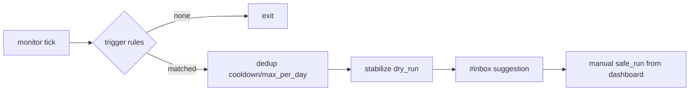
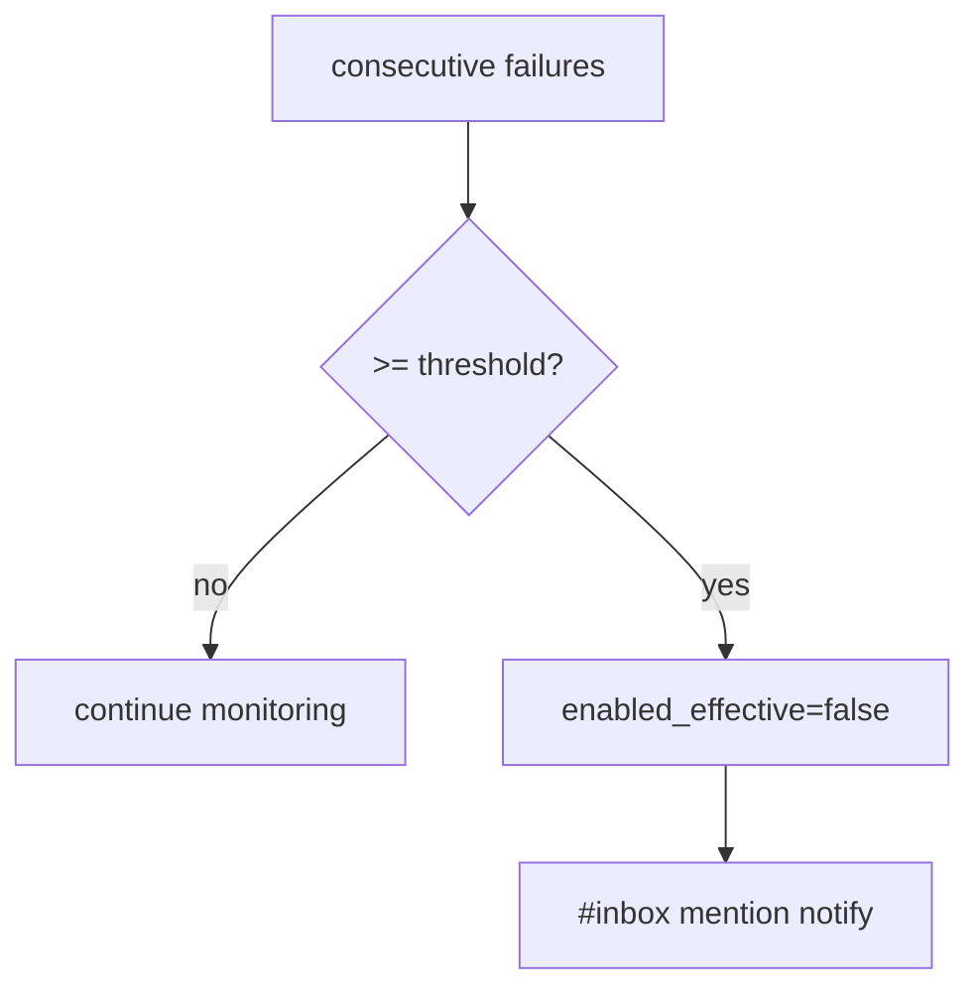

# Design: design_20260228_daily_loop_dashboard_v4_auto_stabilize_dryrun

- Status: Ready
- Owner: Codex
- Created: 2026-02-28
- Updated: 2026-02-28
- Scope: Dashboard v4: auto-stabilize (dry-run only) + inbox suggestion + dedup

## Context
- Problem: ops anomalies can remain unnoticed until manual dashboard checks.
- Goal: add server-side auto monitor that runs stabilize dry-run and posts dashboard suggestion.
- Non-goals: no automatic safe_run execution.

## Design diagram

## Whiteboard impact
- Now: Before: manual ops quick actions only. After: optional monitor auto-suggests dry-run stabilize.
- DoD: Before: no auto_stabilize settings/state APIs. After: APIs + monitor loop + dashboard section + smoke checks.
- Blockers: none.
- Risks: excessive suggestions if thresholds are too low.

## Multi-AI participation plan
- Reviewer:
  - Request: validate dry-run-only safety and additive integration with v3.
  - Expected output format: concise bullets.
- QA:
  - Request: validate smoke determinism for settings/state/run_now.
  - Expected output format: concise bullets.
- Researcher:
  - Request: validate dedup/auto-stop state schema.
  - Expected output format: concise bullets.
- External AI:
  - Request: optional.
  - Expected output format: n/a.
- external_participation: optional
- external_not_required: true

## Open Decisions
- [x] Decision 1
- [x] Decision 2

### Open Decisions checklist
- [x] Add "Decision 1 Final:" entry with final choice.
- [x] Add "Decision 2 Final:" entry with final choice.

## Final Decisions
- Decision 1 Final: auto monitor executes stabilize in dry-run mode only.
- Decision 2 Final: dedup uses cooldown + max_per_day and failure brake uses enabled_effective.

## Discussion summary
- Change 1: add auto_stabilize settings/state/lock runtime files and APIs.
- Change 2: add monitor poller in ui_api process with deterministic trigger evaluation.
- Change 3: extend dashboard ops card with auto-stabilize controls and run_now.

## Plan
1. API and monitor implementation.
2. Dashboard UI extension.
3. smoke/docs updates.
4. gate/smoke verification.

## Risks
- Risk: noisy trigger reasons may produce repeated suggestions.
  - Mitigation: cooldown/max_per_day dedup and auto-stop on failures.

## Test Plan
- API smoke: auto_stabilize settings GET/POST, state GET, run_now dry-run.
- Build/gate: docs/design/ui_smoke/ui_build/desktop/ci gate.

## Reviewed-by
- Reviewer / Codex / 2026-02-28 / approved
- QA / Codex / 2026-02-28 / approved
- Researcher / Codex / 2026-02-28 / approved

## External Reviews
- n/a / skipped
