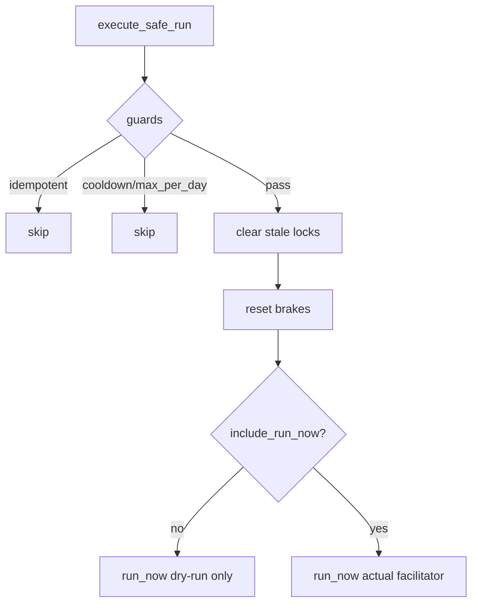

# Design: design_20260228_daily_loop_dashboard_v5_auto_stabilize_execute_safe_run

- Status: Ready
- Owner: Codex
- Created: 2026-02-28
- Updated: 2026-02-28
- Scope: Dashboard v5: execute safe_run from auto-stabilize suggestion (double-confirm + audit)

## Context
- Problem: auto-stabilize suggestions require manual context switching before executing safe recovery.
- Goal: allow direct execution from inbox suggestion with strict confirmation and audit.
- Non-goals: no automatic safe_run execution by monitor.

## Design diagram
```mermaid
flowchart LR
  INB[#inbox ops_auto_stabilize item] --> UI[confirm modal]
  UI --> ST[/api/ops/quick_actions/status]
  ST --> TK[confirm_token]
  TK --> EX[/api/ops/auto_stabilize/execute_safe_run]
  EX --> AU[#inbox audit: ops_auto_stabilize_execute]
```



## Whiteboard impact
- Now: Before: suggestion was advisory only. After: suggestion can execute safe workflow directly.
- DoD: Before: no execute endpoint with confirm token + idempotency. After: endpoint and inbox card actions added.
- Blockers: none.
- Risks: operator may choose `safe+run_now` without reviewing warnings.

## Multi-AI participation plan
- Reviewer:
  - Request: validate two-step confirmation and guard logic.
  - Expected output format: concise bullets.
- QA:
  - Request: validate smoke dry-run path for execute endpoint.
  - Expected output format: concise bullets.
- Researcher:
  - Request: validate execute state schema and audit correlation fields.
  - Expected output format: concise bullets.
- External AI:
  - Request: optional.
  - Expected output format: n/a.
- external_participation: optional
- external_not_required: true

## Open Decisions
- [x] Decision 1
- [x] Decision 2

### Open Decisions checklist
- [x] Add "Decision 1 Final:" entry with final choice.
- [x] Add "Decision 2 Final:" entry with final choice.

## Final Decisions
- Decision 1 Final: execute endpoint requires server confirm token even for dry-run.
- Decision 2 Final: execution state tracks cooldown/max_per_day/idempotent source_inbox_id and audit is mandatory for dry_run=false.

## Discussion summary
- Change 1: add `POST /api/ops/auto_stabilize/execute_safe_run` with guard checks.
- Change 2: add inbox detail actions for `ops_auto_stabilize*` sources.
- Change 3: extend smoke to verify confirm token and execute dry-run path.

## Plan
1. API endpoint + execute state.
2. Inbox card actions and confirm flow.
3. smoke/docs updates.
4. gate/smoke verification.

## Risks
- Risk: token expiration race between status fetch and execute call.
  - Mitigation: explicit 400 reason; UI refreshes token before preparing action.

## Test Plan
- smoke: confirm token retrieval + execute endpoint dry-run.
- full gate: docs/design/ui_smoke/ui_build/desktop/ci.

## Reviewed-by
- Reviewer / Codex / 2026-02-28 / approved
- QA / Codex / 2026-02-28 / approved
- Researcher / Codex / 2026-02-28 / approved

## External Reviews
- n/a / skipped
