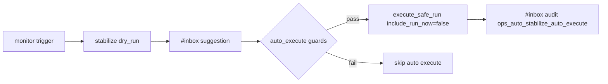

# Design: design_20260228_daily_loop_dashboard_v6_auto_safe_no_exec

- Status: Ready
- Owner: Codex
- Created: 2026-02-28
- Updated: 2026-02-28
- Scope: Auto-stabilize v6: auto execute safe(no exec) with strict guards + audit

## Context
- Problem: auto-stabilize monitor only emits dry-run suggestions; operational recovery still requires repeated manual steps even for low-risk no-exec path.
- Goal: allow monitor to auto-execute only safe(no exec) flow under strict guards and always audit to inbox.
- Non-goals: no automatic `safe+run_now` execution; no removal of existing manual dashboard/inbox execute controls.

## Design diagram


```mermaid
flowchart TD
  G1[enabled + enabled_effective] --> G2[reason has brake/stale_lock]
  G2 --> G3[cooldown + max_per_day]
  G3 --> G4[idempotency by source_inbox_id]
  G4 --> G5[server-only confirm token]
  G5 --> RUN[run safe(no exec)]
```

## Whiteboard impact
- Now: Before: monitor could only suggest dry-run stabilize. After: monitor can additionally execute safe(no exec) automatically when strict guards pass.
- DoD: Before: no auto safe(no exec) execution path. After: settings/state fields, guarded monitor execution, and audit inbox logs are implemented.
- Blockers: none.
- Risks: repeated noisy triggers can still create suggestion churn if thresholds are too loose.

## Multi-AI participation plan
- Reviewer:
  - Request: verify guard order and guarantee that `include_run_now=true` is never used by auto path.
  - Expected output format: concise bullets with risk notes.
- QA:
  - Request: verify settings/state roundtrip and smoke assertions for new `auto_execute` fields.
  - Expected output format: concise bullets with determinism checks.
- Researcher:
  - Request: verify additive schema compatibility and idempotency/audit semantics.
  - Expected output format: concise bullets.
- External AI:
  - Request: optional.
  - Expected output format: n/a.
- external_participation: optional
- external_not_required: true

## Open Decisions
- [x] Decision 1
- [x] Decision 2

### Open Decisions checklist
- [x] Add "Decision 1 Final:" entry with final choice.
- [x] Add "Decision 2 Final:" entry with final choice.

## Final Decisions
- Decision 1 Final: monitor always runs dry-run suggestion first, then may run auto execute only when guard conditions pass.
- Decision 2 Final: auto execute path is fixed to `safe_no_exec` (`include_run_now=false`), and every auto execution result is audited to inbox.

## Discussion summary
- Change 1: extend auto-stabilize settings/state with `auto_execute` policy and result counters.
- Change 2: add server-only short confirm token helper for monitor-side execution gating.
- Change 3: update monitor flow to evaluate strict guards (`brake/stale_lock`, cooldown, max_per_day, idempotency, confirm token availability).
- Change 4: add dedicated audit source `ops_auto_stabilize_auto_execute` and UI visibility.

## Plan
1. Extend ops auto-stabilize schema and loaders/mergers.
2. Implement monitor-side guarded execute path (`include_run_now=false` only).
3. Update dashboard settings UI + state rendering.
4. Extend smoke/docs and run gate verification.

## Risks
- Risk: monitor and run_now share lock/state and can race on writes.
  - Mitigation: monitor uses single lock and reloads state after dry-run suggestion write before applying auto-execute updates.

## Test Plan
- smoke: settings/state/execute dry-run remain green and include new fields.
- gate: docs check, design gate, ui_smoke, ui_build_smoke, desktop_smoke, ci_smoke_gate.

## Reviewed-by
- Reviewer / Codex / 2026-02-28 / approved
- QA / Codex / 2026-02-28 / approved
- Researcher / Codex / 2026-02-28 / approved

## External Reviews
- n/a / skipped
