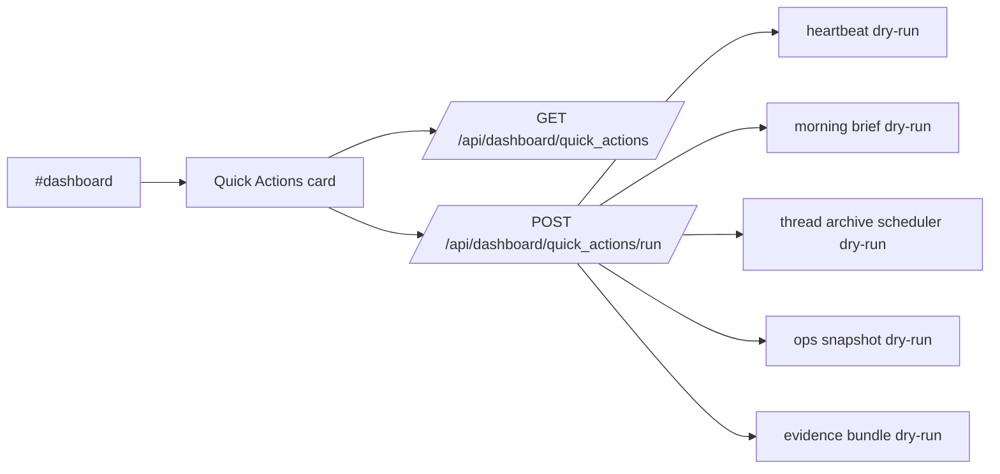
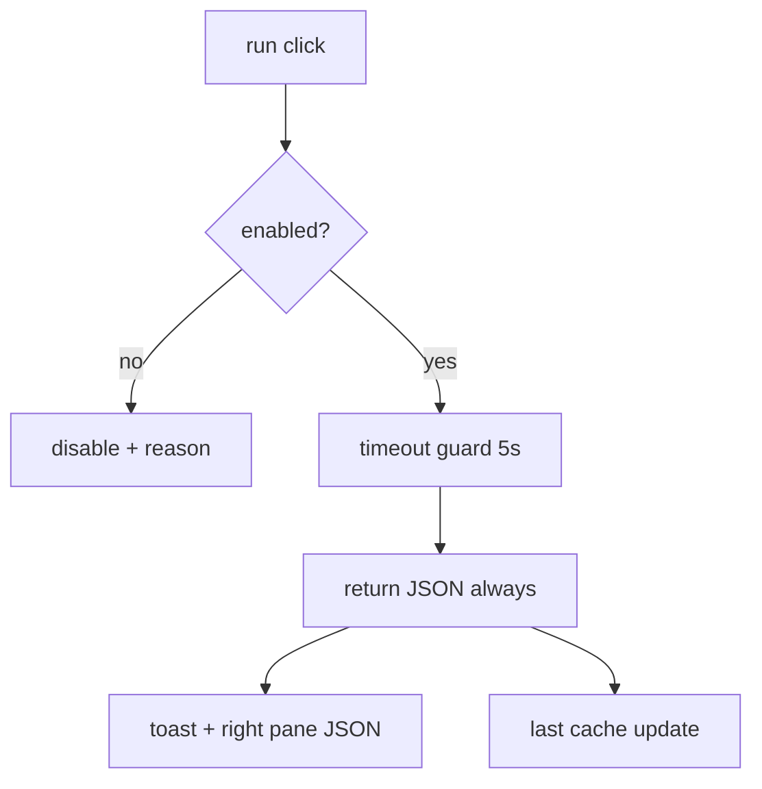

# Design: design_20260228_dashboard_unified_quick_actions_v1

- Status: Final
- Owner: Codex
- Created: 2026-03-01
- Updated: 2026-03-01
- Scope: Dashboard Unified Quick Actions v1 (one-click dry-run control panel)

## Context
- Problem: daily operations and export dry-runs are spread across settings/export views, increasing click-cost and operator context switching.
- Goal: add one dashboard card that runs common routines/exports as dry-run only and keeps failures non-breaking.
- Non-goals: no one-click actual execution (`dry_run=false` / queue execution), no new DB, no scheduler behavior changes.

## Design diagram

## Whiteboard impact
- Now: Before: operators opened multiple screens to run routine/export dry-runs. After: dashboard has a unified Quick Actions dry-run card with one-click controls.
- DoD: Before: no unified dashboard quick-action API/card. After: `/api/dashboard/quick_actions` and `/api/dashboard/quick_actions/run` are available, UI card is wired, smoke checks cover GET/run.
- Blockers: none.
- Risks: dry-run wrappers can still surface underlying runtime errors; UI must treat failures as data (`ok=false`) without breaking rendering.

## Multi-AI participation plan
- Reviewer:
  - Request: verify additive API contract and non-breaking failure semantics (`ok=false` path) for dashboard consumption.
  - Expected output format: concise risk-focused bullets.
- QA:
  - Request: verify deterministic smoke assertions for quick actions list + run endpoint behavior.
  - Expected output format: pass/fail bullets with flakiness notes.
- Researcher:
  - Request: verify contract evolution quality for fixed action IDs and additive `last` fields.
  - Expected output format: concise maintainability notes.
- External AI:
  - Request: optional.
  - Expected output format: optional notes.
- external_participation: optional
- external_not_required: true

## Open Decisions
- [x] Decision 1
- [x] Decision 2

### Open Decisions checklist
- [x] Add "Decision 1 Final:" entry with final choice.
- [x] Add "Decision 2 Final:" entry with final choice.

## Final Decisions
- Decision 1 Final: v1 quick actions are fixed to dry-run semantics and route actual execution to settings.
- Decision 2 Final: run endpoint returns a normalized payload (`ok/status_code/result/elapsed_ms`) even on failure to keep dashboard UX stable.

## Discussion summary
- Change 1: add backend quick-actions list/run endpoints with fixed action IDs and best-effort enable probes.
- Change 2: add timeout-guarded run wrapper and additive last-result cache (`workspace/ui/dashboard/quick_actions_last.json`).
- Change 3: add dashboard Quick Actions card with run/view-last/open-settings actions and inflight+debounce guard.
- Change 4: extend ui_smoke, spec/run docs, and drift sync artifacts.

## Plan
1. Implement backend endpoints and cache.
2. Wire dashboard UI card and refresh integration.
3. Extend smoke checks and docs.
4. Run docs/design/smoke/gate verification.

## Risks
- Risk: a long-running underlying routine can exceed dashboard expectations.
  - Mitigation: quick-action wrapper applies timeout guard and returns structured failure.

## Test Plan
- Smoke: `tools/ui_smoke.ps1 -Json` checks quick-actions GET/run.
- Gate: docs check, design gate, ui build smoke, desktop smoke, ci smoke gate.

## Reviewed-by
- Reviewer / Codex / 2026-03-01 / approved
- QA / Codex / 2026-03-01 / approved
- Researcher / Codex / 2026-03-01 / noted

## External Reviews
- docs/design/design_20260228_dashboard_unified_quick_actions_v1__external.md / optional_not_requested
