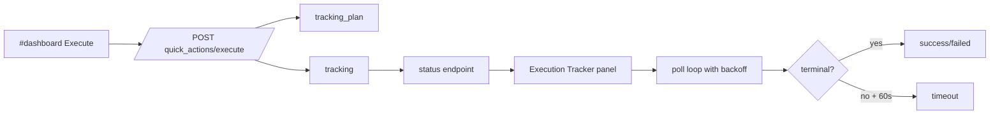
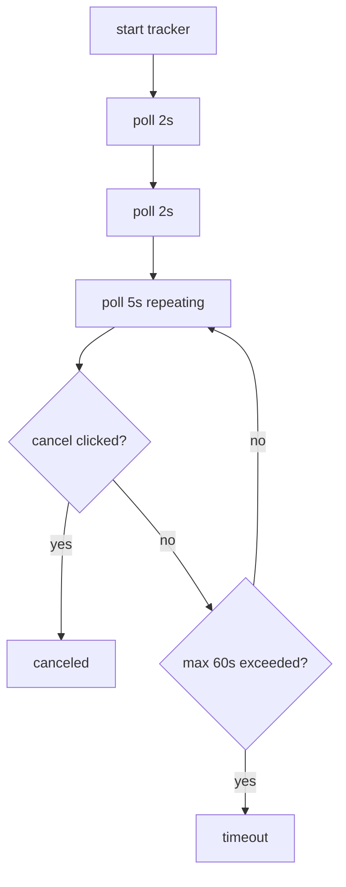

# Design: design_20260228_dashboard_unified_quick_actions_v2_1_execute_tracking

- Status: Final
- Owner: Codex
- Created: 2026-03-01
- Updated: 2026-03-01
- Scope: Unified Quick Actions v2.1 execute tracking panel with safe polling

## Context
- Problem: v2 execute actions return immediate JSON, but operator has no integrated completion tracker in dashboard for queue-backed flows.
- Goal: start an Execution Tracker after execute, auto-poll safe status endpoints, and stop deterministically (success/failed/timeout/canceled).
- Non-goals: no scheduler/runner behavior change, no automatic execute expansion.

## Design diagram

## Whiteboard impact
- Now: Before: execute completion had no integrated follow-up status loop in dashboard. After: right-pane Execution Tracker auto-polls status endpoint and shows terminal state.
- DoD: Before: no execute tracking metadata and no dashboard tracker panel. After: execute response includes `tracking_plan/tracking`, UI polls safely with max 60s and cancel.
- Blockers: none.
- Risks: status endpoints differ by action shape; tracker must remain best-effort and tolerant to missing fields.

## Multi-AI participation plan
- Reviewer:
  - Request: validate tracker safety controls (timeout/backoff/cancel/inflight) and additive API compatibility.
  - Expected output format: concise risk bullets.
- QA:
  - Request: validate smoke checks for tracking_plan fields in dry-run execute path.
  - Expected output format: deterministic pass/fail bullets.
- Researcher:
  - Request: validate contract quality for normalized tracking metadata and terminal heuristics.
  - Expected output format: maintainability notes.
- External AI:
  - Request: optional.
  - Expected output format: optional notes.
- external_participation: optional
- external_not_required: true

## Open Decisions
- [x] Decision 1
- [x] Decision 2

### Open Decisions checklist
- [x] Add "Decision 1 Final:" entry with final choice.
- [x] Add "Decision 2 Final:" entry with final choice.

## Final Decisions
- Decision 1 Final: tracker polling policy is fixed safe defaults (`2s->5s`, max `60s`) independent of action-specific runtime variance.
- Decision 2 Final: execute response always includes additive `tracking_plan`; `tracking` is included only when execution context exists.

## Discussion summary
- Change 1: extend execute response with `tracking_plan` and `tracking` metadata.
- Change 2: add right-pane Execution Tracker model + safe polling loop with timeout/cancel/inflight guard.
- Change 3: add tracker actions (`Refresh now`, `Open run`, `Go to #inbox`, copy ids).
- Change 4: extend smoke and docs for tracking metadata.

## Plan
1. Generate design/review artifacts.
2. Implement backend tracking metadata.
3. Implement UI tracker and safe poll lifecycle.
4. Extend smoke/docs and run full verification.

## Risks
- Risk: endpoint payloads may not expose explicit terminal status on every poll.
  - Mitigation: best-effort terminal detection + hard timeout ensures finite loop.

## Test Plan
- Unit: tracker terminal detection paths and poll lifecycle guards.
- E2E: ui_smoke tracking_plan checks + full smoke gate.

## Reviewed-by
- Reviewer / Codex / 2026-03-01 / approved
- QA / Codex / 2026-03-01 / approved
- Researcher / Codex / 2026-03-01 / noted

## External Reviews
- docs/design/design_20260228_dashboard_unified_quick_actions_v2_1_execute_tracking__external.md / optional_not_requested
