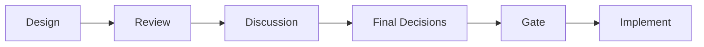
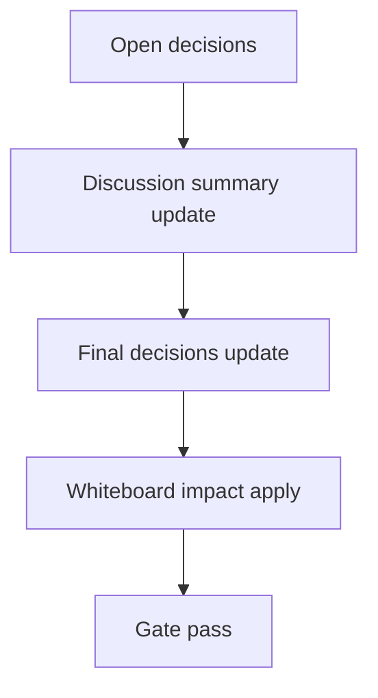

# Design: design_20260228_dashboard_unified_quick_actions_v2_2_tracker_history

- Status: Final
- Owner: Codex
- Created: 2026-03-02
- Updated: 2026-03-02
- Scope: Unified Quick Actions v2.2: tracker history, auto-close on success, and re-open

## Context
- Problem: v2.1 tracker shows only active execution; terminal results are lost after close/reload and operators cannot re-open polling context quickly.
- Goal: add safe local history (latest 10), one-click detail/re-open/copy/open-run/go-inbox actions, and success auto-close toggle while keeping execute contracts unchanged.
- Non-goals: backend persistence, execute mapping changes, scheduler/export behavior changes.

## Design diagram

## Whiteboard impact
- Now: Before: active tracker only, no durable right-pane history. After: right pane adds Tracker History sourced from localStorage and replay actions.
- DoD: Before: no post-terminal recovery UX. After: terminal tracker entries append safely (cap10), re-open starts safe polling (30s), auto-close on success toggle works.
- Blockers: none.
- Risks: localStorage corruption and oversized payload; mitigated by try/catch reset, payload sample trimming, and bounded history length.

## Multi-AI participation plan
- Reviewer:
  - Request: validate additive-only UI design and regressions against v2.1 polling semantics.
  - Expected output format: bullets with risk + missing tests.
- QA:
  - Request: validate deterministic smoke posture and UI-only coverage gaps.
  - Expected output format: bullets with deterministic checks and negative tests.
- Researcher:
  - Request: assess data-shape hygiene for tracker history and future migration path.
  - Expected output format: bullets with schema and compatibility notes.
- External AI:
  - Request: quick sanity check for UX safety wording and operational clarity.
  - Expected output format: short bullets.
- external_participation: optional
- external_not_required: true

## Open Decisions
- [x] Decision 1
- [x] Decision 2

### Open Decisions checklist
- [x] Add "Decision 1 Final:" entry with final choice.
- [x] Add "Decision 2 Final:" entry with final choice.

## Final Decisions
- Decision 1 Final: Persist tracker history in browser localStorage only (`regionai.tracker_history.v1`), append-only latest-first cap10 with invalid-data reset.
- Decision 2 Final: Auto-close on success default enabled and configurable (`regionai.tracker_autoclose_success.v1`); history append occurs before close.

## Discussion summary
- Change 1: Keep API unchanged; implement v2.2 strictly as UI additive layer and smoke via existing execute preview/tracking_plan path.

## Plan
1. Design
2. Review
3. Implement
4. Verify

## Risks
- Risk: history replay without request_id for export kinds can confuse operators.
  - Mitigation: re-open validates request_id and shows toast `no request_id`; thread archive scheduler supports id-less reopen.
- Risk: duplicated terminal history rows on repeated renders.
  - Mitigation: terminal dedup key (`id|kind|startedAt|status`) guard in UI state.

## Test Plan
- Unit: none (existing project posture relies on smoke/build gates).
- E2E: `ui_smoke` execute preview asserts `tracking_plan`; build/desktop/ci smoke gates ensure no regression.

## Reviewed-by
- Reviewer / Codex / 2026-03-02 / approved
- QA / Codex / 2026-03-02 / approved
- Researcher / Codex / 2026-03-02 / noted

## External Reviews
- docs/design/design_20260228_dashboard_unified_quick_actions_v2_2_tracker_history__external.md / optional_not_requested
