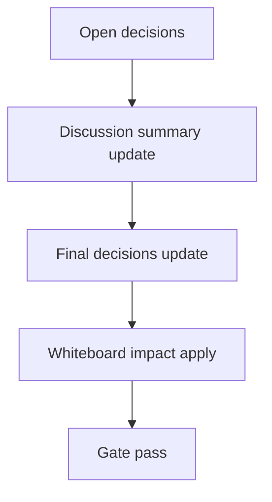

# Design: design_20260228_dashboard_unified_quick_actions_v2_3_tracker_history_portability

- Status: Final
- Owner: Codex
- Created: 2026-03-02
- Updated: 2026-03-02
- Scope: Unified Quick Actions v2.3: tracker history export/import/clear with validation + caps

## Context
- Problem: tracker history is local-only and cannot be moved across browser profiles; operators also lack controlled reset flow.
- Goal: add UI-only export/import/clear with schema-ish validation, dedupe+cap behavior, and broken-data safe handling while preserving v2.2 behavior.
- Non-goals: backend API changes, workspace persistence, execute/tracker polling behavior changes.

## Design diagram

## Whiteboard impact
- Now: Before: tracker history persisted locally but had no portability tooling. After: dashboard tracker history provides Export/Import/Clear controls with safety checks.
- DoD: Before: no portable JSON flow and no explicit clear confirm. After: versioned export + validated import(skip invalid) + confirm-gated clear are available.
- Blockers: none.
- Risks: malformed imports and duplicate rows; mitigated by schema/entry validation, skip accounting, dedupe key, and cap10.

## Multi-AI participation plan
- Reviewer:
  - Request: verify additive-only scope and compatibility with existing v2.2 tracker behavior.
  - Expected output format: bullets with risks and missing tests.
- QA:
  - Request: verify deterministic smoke/gate path remains stable for UI-only additions.
  - Expected output format: bullets with deterministic checks and negative paths.
- Researcher:
  - Request: evaluate schema versioning and merge strategy for forward compatibility.
  - Expected output format: bullets with compatibility notes.
- External AI:
  - Request: optional UX safety sanity review.
  - Expected output format: short bullets.
- external_participation: optional
- external_not_required: true

## Open Decisions
- [x] Decision 1
- [x] Decision 2

### Open Decisions checklist
- [x] Add "Decision 1 Final:" entry with final choice.
- [x] Add "Decision 2 Final:" entry with final choice.

## Final Decisions
- Decision 1 Final: export/import uses versioned schema `regionai.tracker_history.export.v1` with UI-only validation and no backend changes.
- Decision 2 Final: import merges existing+imported entries with dedupe key (`id|kind|request_id|run_id|started_at|ended_at`), sort by `ended_at` desc, cap latest 10.

## Discussion summary
- Change 1: add tracker history portability controls (Export/Copy/Import/Clear) in dashboard right pane.
- Change 2: centralize entry normalization and reuse in startup load + import validation.
- Change 3: smoke/docs updates for portability flag and schema documentation.

## Plan
1. Design
2. Review
3. Implement
4. Verify

## Risks
- Risk: users import large/invalid payloads.
  - Mitigation: schema check + per-entry validation + skip invalid + cap10.
- Risk: accidental history deletion.
  - Mitigation: clear action requires explicit `CLEAR` phrase.

## Test Plan
- Unit: none (current project validation relies on smoke/build/gate).
- E2E: ui_smoke + ui_build_smoke + desktop_smoke + ci_smoke_gate.

## Reviewed-by
- Reviewer / Codex / 2026-03-02 / approved
- QA / Codex / 2026-03-02 / approved
- Researcher / Codex / 2026-03-02 / noted

## External Reviews
- docs/design/design_20260228_dashboard_unified_quick_actions_v2_3_tracker_history_portability__external.md / optional_not_requested
