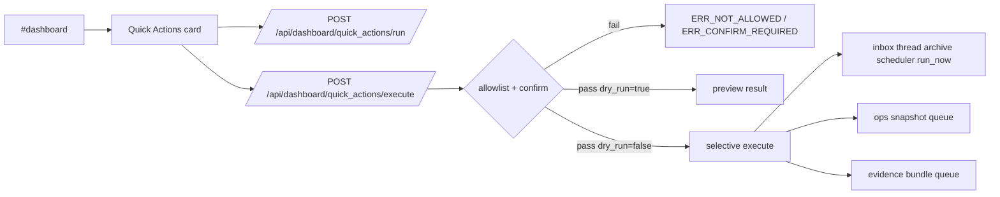

# Design: design_20260228_dashboard_unified_quick_actions_v2_selective_execute

- Status: Final
- Owner: Codex
- Created: 2026-03-01
- Updated: 2026-03-01
- Scope: Unified Quick Actions v2: selective execute with confirm + preflight (safe-by-default)

## Context
- Problem: v1 quick actions are dry-run only, so operators still move across screens for selected safe execution paths.
- Goal: keep v1 dry-run behavior and add selective execute for three allowlisted actions with mandatory confirm phrase and preflight-friendly UX.
- Non-goals: no release bundle execution, no heartbeat/morning-brief execute, no auto-execution expansion.

## Design diagram


```mermaid
flowchart TD
  C[Open confirm modal] --> P[Run preflight dry-run]
  P --> J[Show JSON preview]
  J --> T[Type EXECUTE]
  T --> X[Execute(confirm)]
  X --> R[Normalized JSON response]
  R --> L[last_execute cache update]
```

## Whiteboard impact
- Now: Before: quick actions were dry-run only. After: three allowlisted actions support execute(confirm) while dry-run remains unchanged.
- DoD: Before: no execute API with confirm/allowlist. After: `/api/dashboard/quick_actions/execute` enforces allowlist + confirm phrase and UI offers preflight+confirm flow.
- Blockers: none.
- Risks: operator misuse risk remains if confirm UX is bypassed; server-side confirm and allowlist are mandatory guards.

## Multi-AI participation plan
- Reviewer:
  - Request: validate allowlist/confirm enforcement and additive compatibility with v1 clients.
  - Expected output format: concise risk-first bullets.
- QA:
  - Request: validate preview execution check and confirm-required negative check in smoke without failing suite.
  - Expected output format: deterministic check bullets.
- Researcher:
  - Request: validate contract evolution quality for execute metadata and normalized payload shape.
  - Expected output format: maintainability notes.
- External AI:
  - Request: optional.
  - Expected output format: optional notes.
- external_participation: optional
- external_not_required: true

## Open Decisions
- [x] Decision 1
- [x] Decision 2

### Open Decisions checklist
- [x] Add "Decision 1 Final:" entry with final choice.
- [x] Add "Decision 2 Final:" entry with final choice.

## Final Decisions
- Decision 1 Final: execute API is strictly allowlisted to `thread_archive_scheduler`, `ops_snapshot`, and `evidence_bundle`.
- Decision 2 Final: confirm phrase `EXECUTE` is required server-side for execute endpoint, and preflight dry-run path is exposed for the same endpoint.

## Discussion summary
- Change 1: extend quick action metadata with execute support hints and side-effect descriptors.
- Change 2: add execute endpoint with allowlist + confirm phrase validation + timeout + normalized result payload.
- Change 3: add confirm modal UI with preflight and guarded execute button.
- Change 4: extend smoke/docs and run drift sync.

## Plan
1. Create design and review artifacts.
2. Implement backend execute flow and metadata extensions.
3. Implement dashboard modal/preflight/execute UX.
4. Extend smoke and complete verification gate.

## Risks
- Risk: queue-backed execute actions may fail at template/runtime boundaries.
  - Mitigation: return normalized `ok=false` payloads and persist execute summaries in last cache.

## Test Plan
- Unit: quick action mapping and execute allowlist/confirm validation paths.
- E2E: ui_smoke preview + confirm-negative checks; docs/design/gate/smoke full pass.

## Reviewed-by
- Reviewer / Codex / 2026-03-01 / approved
- QA / Codex / 2026-03-01 / approved
- Researcher / Codex / 2026-03-01 / noted

## External Reviews
- docs/design/design_20260228_dashboard_unified_quick_actions_v2_selective_execute__external.md / optional_not_requested
