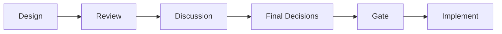
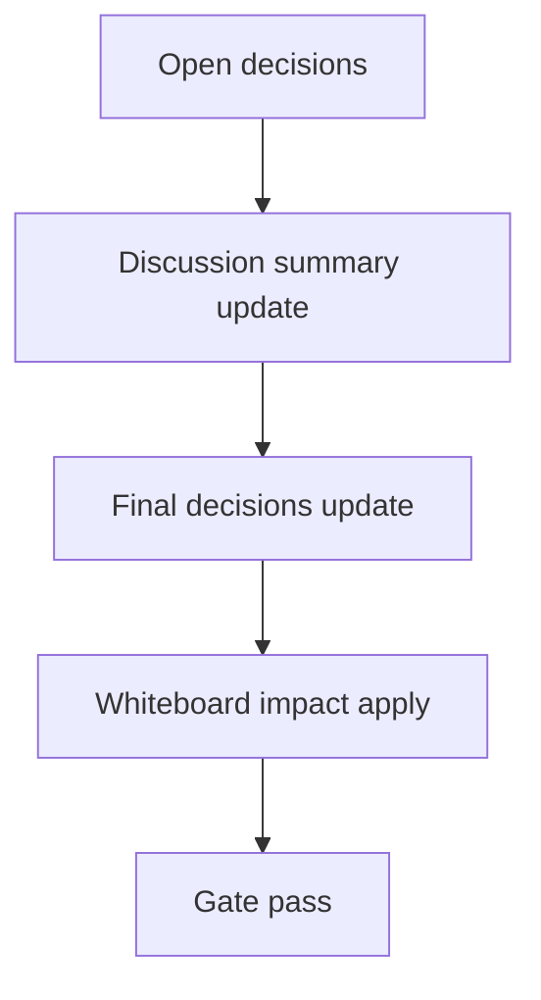

# Design: design_20260228_e2e_scripts_hardening_v1

- Status: Draft
- Owner: Codex
- Created: 2026-03-01
- Updated: 2026-03-01
- Scope: E2E scripts hardening v1: route recipes/e2e scripts via tools/run_e2e.ps1 for stdout-safe execution

## Context
- Problem: `apps/orchestrator` 配下の `npm run e2e:auto:recipe_morning_brief_bundle:json` と `npm run recipes:all` が npm stdout 由来の不安定要因で exit 1 になることがある。
- Goal: recipes/e2e の主要導線を `tools/run_e2e.ps1` と新規 `tools/recipes_all.ps1` に集約し、最終1行 JSON で機械判定可能な実行経路を固定する。
- Non-goals: 既存 `run_e2e.ps1` の mode 契約変更、Linux/macOS 向け cross-platform 化、既存 recipe テンプレートの仕様変更。

## Design diagram

## Whiteboard impact
- Now: Before: `recipes:all` は npm script 連結に依存し stdout 由来の失敗が混入し得る。 After: PowerShell 経由で `run_e2e.ps1 -Json` を逐次実行し、最終1行JSONで PASS/FAIL 判定する。
- DoD: Before: `cd apps/orchestrator && npm run ...` で cwd 依存や stdout 揺れが残る。 After: script 側で `Set-Location (Resolve-Path '..\\..')` を強制し、`e2e:auto:recipe_morning_brief_bundle:json` と `recipes:all` が安定して exit_code=0 を返す。
- Blockers: なし（既存 `run_e2e.ps1 -IsolatedWorkspace -Json` が動作実績あり）。
- Risks: `recipes:all` の mode 固定リストが将来の追加 mode と乖離する可能性があるため、docs と script の同時更新運用が必要。

## Multi-AI participation plan
- Reviewer:
  - Request: 既存 npm scripts から tools 経由への置換で回帰がないか確認する。
  - Expected output format: verdict + regressions + missing tests（箇条書き）。
- QA:
  - Request: 最終1行JSON維持と exit code 判定の再現性を確認する。
  - Expected output format: verdict + deterministic checks + flakiness risks（箇条書き）。
- Researcher:
  - Request: 運用導線変更の docs 反映妥当性を確認する。
  - Expected output format: verdict + maintainability notes（箇条書き）。
- External AI:
  - Request: 変更方針の盲点がないか独立観点で確認する。
  - Expected output format: verdict + risk notes（箇条書き）。
- external_participation: optional
- external_not_required: false

## Open Decisions
- [ ] Decision 1
- [ ] Decision 2

### Open Decisions checklist
- [ ] Add "Decision 1 Final:" entry with final choice.
- [ ] Add "Decision 2 Final:" entry with final choice.

## Final Decisions
- npm script の recipes/e2e 主要導線は repo root 固定で `tools/run_e2e.ps1` / `tools/recipes_all.ps1` を呼ぶ。
- `tools/recipes_all.ps1` は fail-fast の逐次実行と最終1行JSON (`action/ok/modes_run/failed_mode/exit_code`) を提供する。

## Discussion summary
- `recipes:all` の mode 群は v1 ではハードコードし、現在の scripts 内訳と揃える。
- `e2e:auto:recipe_morning_brief_bundle:json` は npm 連鎖を避けて直接 `run_e2e.ps1 -Mode recipe_morning_brief_bundle -IsolatedWorkspace -Json` を呼ぶ。
- docs は runbook/spec の運用導線のみ更新し、テンプレート仕様は変更しない。

## Plan
1. Design
2. Review
3. Implement
4. Verify

## Risks
- Risk: recipes mode 追加時に `tools/recipes_all.ps1` の固定配列更新漏れが起きる。
  - Mitigation: docs/runbook と script を同一PRで更新し、`recipes:all` 実行確認を DoD に含める。

## Test Plan
- Unit: なし（PowerShell orchestration 変更のため）。
- E2E: 指定 DoD 一式（docs/gate/whiteboard/ui smoke/対象 npm scripts/build+smoke+gate/drift dry-run）を実行。

## Reviewed-by
- Reviewer / approved / 2026-03-01 / npm scripts tools routing regressions checked
- QA / approved / 2026-03-01 / one-line JSON and exit-code determinism checked
- Researcher / noted / 2026-03-01 / hardcoded mode list drift risk noted

## External Reviews
- docs/design/design_20260228_e2e_scripts_hardening_v1__external_claude.md / noted
