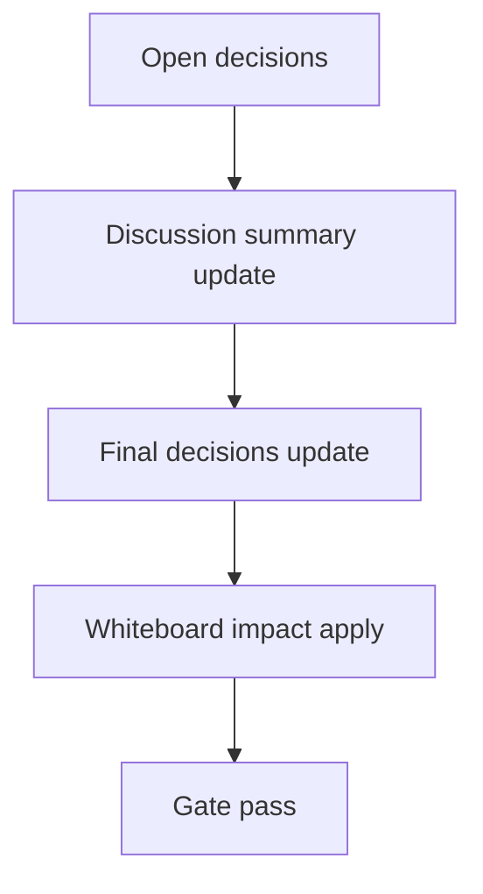

# Design: design_20260228_heartbeat_autopilot_suggest_v1

- Status: Ready
- Owner: Codex
- Created: 2026-02-28
- Updated: 2026-02-28
- Scope: Heartbeat v1 + Autopilot: inbox suggestion with one-click approval

## Context
- Problem: Heartbeat v1 only appends digest/memory and stops there; operators still need manual context transfer before launching council.
- Goal: After successful heartbeat, create deterministic Autopilot suggestion and require explicit human approval from `#inbox` for start.
- Non-goals: fully automatic council start, LLM-generated suggestion text.

## Design diagram

## Whiteboard impact
- Now: Before: heartbeat output ended at memory/activity/inbox done notice. After: heartbeat also emits open Autopilot suggestion with one-click approve/dismiss path.
- DoD: Before: no persisted suggestion state. After: persisted `open|accepted|dismissed` suggestions, idempotent accept, and smoke checks.
- Blockers: none.
- Risks: duplicate suggestions without date+target dedup.

## Multi-AI participation plan
- Reviewer:
  - Request: confirm additive behavior and idempotent accept semantics.
  - Expected output format: concise bullets with risks.
- QA:
  - Request: verify smoke determinism for suggest/list/accept.
  - Expected output format: concise bullets with missing tests.
- Researcher:
  - Request: validate safety boundaries and storage cap choices.
  - Expected output format: concise bullets.
- External AI:
  - Request: optional.
  - Expected output format: n/a.
- external_participation: optional
- external_not_required: true

## Open Decisions
- [x] Decision 1
- [x] Decision 2

### Open Decisions checklist
- [x] Add "Decision 1 Final:" entry with final choice.
- [x] Add "Decision 2 Final:" entry with final choice.

## Final Decisions
- Decision 1 Final: suggestion generation is deterministic and deduped by `local_date + agent_id + category`, no auto-start.
- Decision 2 Final: accept endpoint is idempotent and launches council with safe defaults (`max_rounds=1`, ops snapshot on, evidence/release off).

## Discussion summary
- Change 1: add fixed-path suggestion store (`workspace/ui/heartbeat/autopilot_suggestions.json`) with caps and atomic write.
- Change 2: extend heartbeat success flow (`dry_run=false`) to create suggestion + inbox item (`source=heartbeat_suggest`) best-effort.
- Change 3: add list/accept/dismiss APIs and UI actions from inbox/settings.
- Change 4: extend smoke to validate suggest creation and accept contract.

## Plan
1. finalize design/review pack and gate
2. implement API + UI + smoke updates
3. update docs/spec entries
4. run full verification set and gate

## Risks
- Risk: accepting suggestion may fail when council queue write fails.
  - Mitigation: keep heartbeat success independent; return best-effort note and preserve suggestion status.

## Test Plan
- Smoke/API:
  - heartbeat run_now non-dry-run creates suggestion
  - suggestions list returns open item
  - accept returns run id or idempotent response
- Build/gate:
  - ui build smoke, desktop smoke, ci smoke gate.

## Reviewed-by
- Reviewer / Codex / 2026-02-28 / approved
- QA / Codex / 2026-02-28 / approved
- Researcher / Codex / 2026-02-28 / approved

## External Reviews
- n/a / skipped
