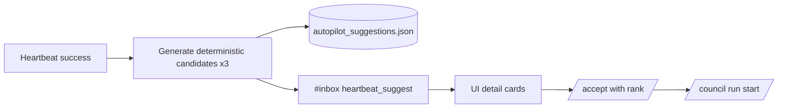
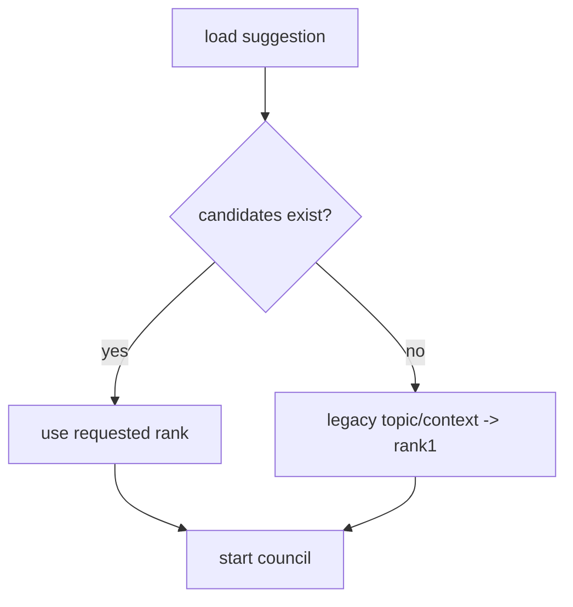

# Design: design_20260228_heartbeat_autopilot_suggest_v1_1_ranked

- Status: Ready
- Owner: Codex
- Created: 2026-02-28
- Updated: 2026-02-28
- Scope: Suggest v1.1: ranked candidates (x3) with rationale + pick-one launch

## Context
- Problem: v1 suggestion supports only one topic/context, so operators cannot choose intent before launch.
- Goal: provide deterministic up-to-3 candidates with rationale and rank-select accept.
- Non-goals: automatic launch and LLM-generated suggestion text.

## Design diagram

## Whiteboard impact
- Now: Before: one suggestion topic only. After: ranked candidates with rationale and pick-one launch.
- DoD: Before: accept had no selection. After: `accept {rank}` + backward-compatible default rank1.
- Blockers: none.
- Risks: malformed candidate rank from old data.

## Multi-AI participation plan
- Reviewer:
  - Request: check additive compatibility and idempotent accept.
  - Expected output format: concise bullets.
- QA:
  - Request: verify smoke determinism for candidate presence and rank accept.
  - Expected output format: concise bullets.
- Researcher:
  - Request: check schema/back-compat strategy for legacy suggestions.
  - Expected output format: concise bullets.
- External AI:
  - Request: optional.
  - Expected output format: n/a.
- external_participation: optional
- external_not_required: true

## Open Decisions
- [x] Decision 1
- [x] Decision 2

### Open Decisions checklist
- [x] Add "Decision 1 Final:" entry with final choice.
- [x] Add "Decision 2 Final:" entry with final choice.

## Final Decisions
- Decision 1 Final: suggestions store ranked candidates (`<=3`) and keep `topic/context` as compatibility mirrors.
- Decision 2 Final: accept endpoint takes optional `rank`; missing rank defaults to rank1.

## Discussion summary
- Change 1: suggestion schema expanded with `candidates[]` and `selected_rank`.
- Change 2: deterministic candidate generation adds rationale and keyword-based tags.
- Change 3: UI shows candidate cards and rank-select launch actions.
- Change 4: smoke verifies candidate generation and ranked accept.

## Plan
1. update API schema/generation/accept logic
2. update UI suggestion panels
3. update smoke/docs
4. gate + smoke verification

## Risks
- Risk: legacy entries without candidates.
  - Mitigation: convert legacy topic/context to synthetic rank1 on read.

## Test Plan
- API smoke: heartbeat run_now -> suggestions include candidates -> accept rank=1 returns run id or ok.
- Build/gate: docs check, design gate, ui build smoke, desktop smoke, ci smoke gate.

## Reviewed-by
- Reviewer / Codex / 2026-02-28 / approved
- QA / Codex / 2026-02-28 / approved
- Researcher / Codex / 2026-02-28 / approved

## External Reviews
- n/a / skipped
