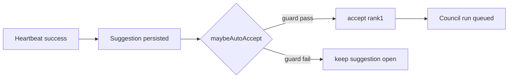
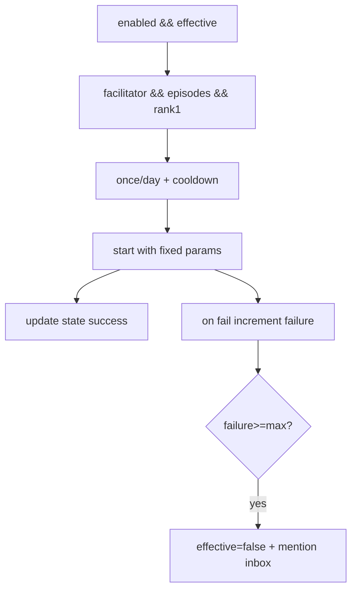

# Design: design_20260228_heartbeat_autopilot_suggest_v2_auto_accept

- Status: Ready
- Owner: Codex
- Created: 2026-02-28
- Updated: 2026-02-28
- Scope: Suggest v2: auto-accept rank1 once/day (facilitator only) with safety guards

## Context
- Problem: ranked suggestions still require manual approval for every cycle.
- Goal: add optional guarded auto-accept for safe facilitator episodes flow.
- Non-goals: full autonomous operation or LLM-based policy.

## Design diagram

## Whiteboard impact
- Now: Before: manual pick-one only. After: optional auto-accept rank1 with strict safety guards.
- DoD: Before: no auto path. After: settings/state API + guarded auto-start + failure brake.
- Blockers: none.
- Risks: accidental over-trigger without cooldown/day cap.

## Multi-AI participation plan
- Reviewer:
  - Request: verify guard strictness and additive safety.
  - Expected output format: concise bullets.
- QA:
  - Request: ensure smoke covers settings/state/probe deterministically.
  - Expected output format: concise bullets.
- Researcher:
  - Request: validate state brake and recovery behavior.
  - Expected output format: concise bullets.
- External AI:
  - Request: optional.
  - Expected output format: n/a.
- external_participation: optional
- external_not_required: true

## Open Decisions
- [x] Decision 1
- [x] Decision 2

### Open Decisions checklist
- [x] Add "Decision 1 Final:" entry with final choice.
- [x] Add "Decision 2 Final:" entry with final choice.

## Final Decisions
- Decision 1 Final: auto-accept remains default OFF and executes only for facilitator/episodes/rank1.
- Decision 2 Final: failure brake is state-level (`auto_accept_enabled_effective=false`) with mention inbox notify.

## Discussion summary
- Change 1: add suggest settings/state runtime files and APIs.
- Change 2: add `maybeAutoAcceptSuggestion` hook after suggestion creation.
- Change 3: reuse internal accept logic for manual and auto paths.
- Change 4: add UI controls and smoke probe checks.

## Plan
1. API settings/state + auto hook
2. UI settings panel additions
3. smoke/docs updates
4. gate + smoke verification

## Risks
- Risk: auto-accept accidental repetition.
  - Mitigation: once/day and cooldown checks in state.

## Test Plan
- API smoke:
  - suggest settings GET/POST
  - suggest state GET
  - heartbeat run_now probe for suggestion + auto path signal
- Build/gate: docs/design/ui build/desktop/ci smoke gate.

## Reviewed-by
- Reviewer / Codex / 2026-02-28 / approved
- QA / Codex / 2026-02-28 / approved
- Researcher / Codex / 2026-02-28 / approved

## External Reviews
- n/a / skipped
