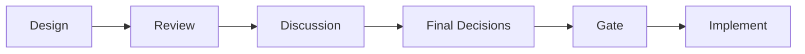
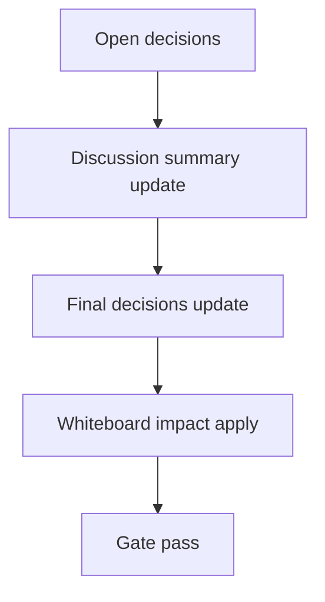

# Design: design_20260228_inbox_thread_actions_v1

- Status: Draft
- Owner: Codex
- Created: 2026-03-01
- Updated: 2026-03-01
- Scope: Inbox Thread Actions v1: mark read by thread_key (+ optional archive/compact by thread)

## Context
- Problem: Thread view は閲覧中心で、同一 `thread_key` の通知を一括で既読にする導線がない。
- Goal: Thread view から `thread_key` 単位で既読化できる API/UI 操作を追加し、既存 read_state 契約と互換維持する。
- Non-goals: inbox 全行マイグレーション、thread_key derive 設計変更、thread compact の必須化。

## Design diagram

## Whiteboard impact
- Now: Before: #inbox は item/filter 単位の既読操作のみ。 After: Thread view で `Mark read (this thread)` を実行し、同一 thread_key を一括既読化できる。
- DoD: Before: thread_key での read_state 更新APIがない。 After: `/api/inbox/thread/read_state` が `marked_read/scanned/exit_code` を返し、UIから再取得まで完結する。
- Blockers: なし。
- Risks: read_state 形式に追加キーを持たせるため、既存 reader が未知フィールドを無視する前提に依存。

## Multi-AI participation plan
- Reviewer:
  - Request: 既存 read_state との後方互換性と安全 cap の妥当性を確認。
  - Expected output format: verdict + risk + missing tests（箇条書き）。
- QA:
  - Request: thread_key 既読 API の smoke 判定観点を確認。
  - Expected output format: verdict + deterministic checks（箇条書き）。
- Researcher:
  - Request: stable key 設計（id/request_id/hash fallback）の保守性を確認。
  - Expected output format: verdict + maintainability notes（箇条書き）。
- External AI:
  - Request: UX での誤操作リスクと確認フロー妥当性を確認。
  - Expected output format: verdict + risk notes（箇条書き）。
- external_participation: optional
- external_not_required: false

## Open Decisions
- [ ] Decision 1
- [ ] Decision 2

### Open Decisions checklist
- [ ] Add "Decision 1 Final:" entry with final choice.
- [ ] Add "Decision 2 Final:" entry with final choice.

## Final Decisions
- `/api/inbox/thread/read_state` を追加し、末尾走査 + cap 付きで thread_key 一括既読を実装する。
- read_state は既存 `global_last_read_ts/by_thread` を維持しつつ `thread_keys` マップを additive で保存する。

## Discussion summary
- thread_key 一括既読は `mode=mark_read` 固定で v1 実装し、optional compact API は見送る。
- 既読キーは `item.id` 優先、次に `msg_id`、最後に `ts+source+title` hash fallback とする。
- UI は Thread view 内ボタン + confirm modal を追加し、成功後に inbox/thread を再取得する。

## Plan
1. Design
2. Review
3. Implement
4. Verify

## Risks
- Risk: hash fallback は同一内容重複時に衝突し得る。
  - Mitigation: `id`/`msg_id` 優先を維持し、fallback は補助キーとして扱う。

## Test Plan
- Unit: なし（統合API/UI中心）。
- E2E: docs_check / design_gate / ui_smoke / ui:build:smoke / desktop:smoke / ci:smoke:gate / whiteboard dry-run。

## Reviewed-by
- Reviewer / approved / 2026-03-01 / backward compatibility and cap policy checked
- QA / approved / 2026-03-01 / thread read-state API smokeability checked
- Researcher / noted / 2026-03-01 / fallback key collision risk noted

## External Reviews
- docs/design/design_20260228_inbox_thread_actions_v1__external_claude.md / noted
