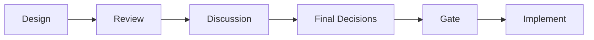
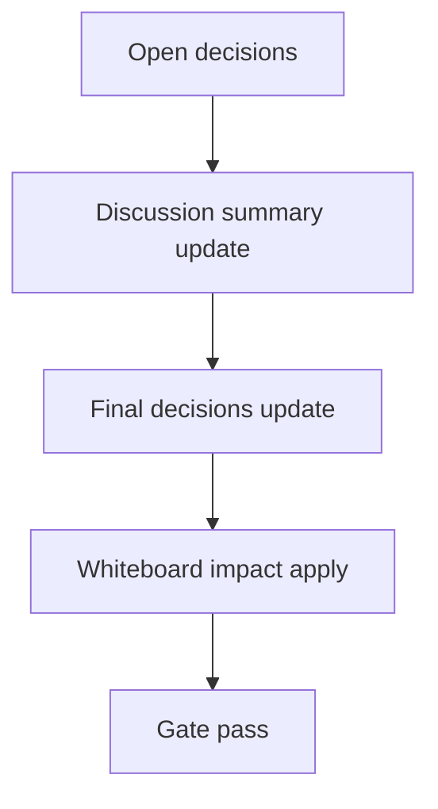

# Design: design_20260228_inbox_thread_archive_scheduler_v1

- Status: Draft
- Owner: Codex
- Created: 2026-03-01
- Updated: 2026-03-01
- Scope: Inbox Thread Archive Scheduler v1: nightly non-destructive thread archive with safety + summary inbox audit

## Context
- Problem: <fill>
- Goal: <fill>
- Non-goals: <fill>

## Design diagram

## Whiteboard impact
- Now: Before: <fill>. After: <fill>.
- DoD: Before: <fill>. After: <fill>.
- Blockers: <fill>
- Risks: <fill>

## Multi-AI participation plan
- Reviewer:
  - Request:
  - Expected output format:
- QA:
  - Request:
  - Expected output format:
- Researcher:
  - Request:
  - Expected output format:
- External AI:
  - Request:
  - Expected output format:
- external_participation: optional
- external_not_required: false

## Open Decisions
- [ ] Decision 1
- [ ] Decision 2

### Open Decisions checklist
- [ ] Add "Decision 1 Final:" entry with final choice.
- [ ] Add "Decision 2 Final:" entry with final choice.

## Final Decisions
- Decision 1 Final:
- Decision 2 Final:

## Discussion summary
- Change 1:

## Plan
1. Design
2. Review
3. Implement
4. Verify

## Risks
- Risk:
  - Mitigation:

## Test Plan
- Unit:
- E2E:

## Reviewed-by
- Reviewer / pending / 2026-03-01 / pending
- QA / pending / 2026-03-01 / pending
- Researcher / pending / 2026-03-01 / optional

## External Reviews
- <optional reviewer file path> / <status>
