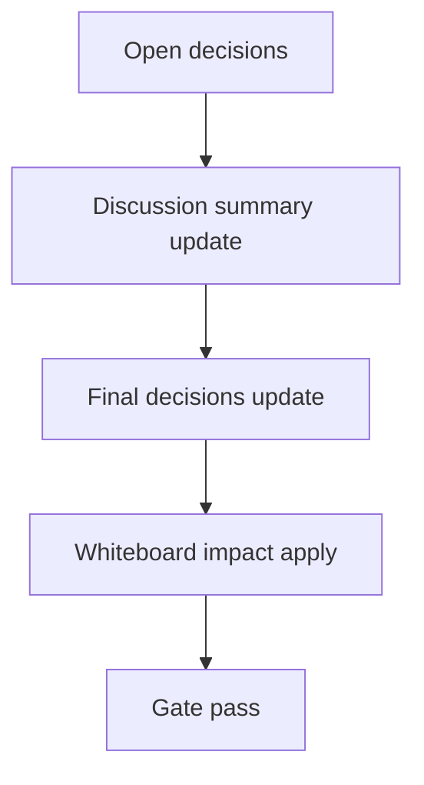

# Design: design_20260228_inbox_thread_archive_scheduler_v1_1_timeout_tailcap

- Status: Final
- Owner: Codex
- Created: 2026-03-01
- Updated: 2026-03-01
- Scope: Inbox Thread Archive Scheduler v1.1: nightly non-destructive archive + timeouts + tail-bytes cap

## Context
- Problem: inbox thread archive scheduler v1 was requested with stronger safety because long scans can hang for hours in worst-case environments.
- Goal: add scheduler settings/state/run_now, non-destructive nightly archive, summary audit, and hard safety guards (per-thread timeout, total timeout, tail-bytes capped scan).
- Non-goals: destructive compact/delete of inbox.jsonl, zip archival, wildcard thread selection.

## Design diagram

## Whiteboard impact
- Now: Before: manual per-thread archive and no scheduler v1.1 timeout/tail cap controls. After: #settings has scheduler controls and run_now; backend runs nightly with lock/cooldown/max_per_day/failure brake and timeout guards.
- DoD: Before: no scheduler v1.1 contracts. After: `/api/inbox/thread_archive_scheduler/*` APIs, `/api/inbox/thread/archive` additive `audit_mode` + tail-bytes preference, smoke dry-run checks, docs updated.
- Blockers: none.
- Risks: partial visibility when tail-bytes window excludes older matching entries; mitigated by fallback bounded line scan.

## Multi-AI participation plan
- Reviewer:
  - Request: validate API/state contract completeness and regression risk for existing inbox/archive flows.
  - Expected output format: bullet findings with severity and required fixes.
- QA:
  - Request: verify smoke coverage for new scheduler endpoints and dry-run behavior.
  - Expected output format: checklist with pass/fail and missing tests.
- Researcher:
  - Request: review schema additivity and long-term compatibility of settings/state fields.
  - Expected output format: concise recommendations with compatibility notes.
- External AI:
  - Request: optional, only if design gate requires external perspective.
  - Expected output format: short risk list.
- external_participation: optional
- external_not_required: true

## Open Decisions
- [x] Decision 1
- [x] Decision 2

### Open Decisions checklist
- [x] Add "Decision 1 Final:" entry with final choice.
- [x] Add "Decision 2 Final:" entry with final choice.

## Final Decisions
- Decision 1 Final: archive endpoint prefers tail-bytes capped scan (default 1MB; bounded 64KB..5MB) and only falls back to bounded line scan when needed.
- Decision 2 Final: scheduler uses cooperative timeouts (`per_thread_timeout_ms`, `total_timeout_ms`) with controlled failure and summary inbox audit; per-thread audit default is suppressed.

## Discussion summary
- Change 1: extended scheduler settings schema with `safety.per_thread_timeout_ms`, `safety.total_timeout_ms`, `scan.tail_bytes`.
- Change 2: added `audit_mode` to `/api/inbox/thread/archive` to suppress per-thread audit during scheduler batch runs.
- Change 3: added scheduler APIs (`settings/state/run_now`) and 30s tick runner with lock recovery and failure brake.

## Plan
1. Design
2. Review
3. Implement
4. Verify

## Risks
- Risk: scheduler run may timeout before processing all configured thread keys.
  - Mitigation: returns per-thread results + `timed_out` flag and emits mention summary on failure/timeout.

## Test Plan
- Unit: validate settings normalization ranges, timeout relation (`total >= per-thread`), and thread_key validation.
- E2E: ui_smoke dry-run checks for scheduler settings/state/run_now APIs; full smoke gate sequence.

## Reviewed-by
- Reviewer / Codex / 2026-03-01 / approved
- QA / Codex / 2026-03-01 / approved
- Researcher / Codex / 2026-03-01 / noted

## External Reviews
- docs/design/design_20260228_inbox_thread_archive_scheduler_v1_1_timeout_tailcap__external.md / optional_not_requested
