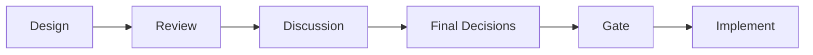
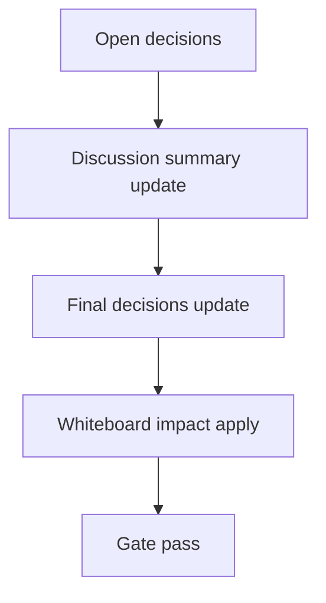

# Design: design_20260228_inbox_thread_archive_v1

- Status: Draft
- Owner: Codex
- Created: 2026-03-01
- Updated: 2026-03-01
- Scope: Inbox Thread Archive v1: non-destructive thread archive (append-only JSONL) + audit

## Context
- Problem: thread_key 単位の履歴は閲覧できるが、非破壊での抽出アーカイブ導線がない。
- Goal: `POST /api/inbox/thread/archive` で thread単位の append-only JSONL アーカイブを実装し、監査ログを #inbox に残す。
- Non-goals: inbox 本体の削除/compact、zip化、既存データの再書換え。

## Design diagram

## Whiteboard impact
- Now: Before: thread履歴は参照のみで保全アーカイブが手作業。 After: thread_key 指定で dry-run/実行でき、非破壊で archive JSONL に追記される。
- DoD: Before: thread archive 実行結果と監査証跡がない。 After: archive_path/archived件数を返し、`source=inbox_thread_archive` の監査通知が残る。
- Blockers: なし。
- Risks: repeated実行で重複アーカイブが起きうるため `since_ts` と state の更新運用に依存。

## Multi-AI participation plan
- Reviewer:
  - Request: 非破壊性と fixed path 制約が守られるか確認。
  - Expected output format: verdict + risk + missing tests。
- QA:
  - Request: dry-run API 判定項目と smoke 反映観点を確認。
  - Expected output format: verdict + deterministic checks。
- Researcher:
  - Request: archive state 形式と拡張性を確認。
  - Expected output format: verdict + maintainability notes。
- External AI:
  - Request: UI confirm flow の誤操作耐性を確認。
  - Expected output format: verdict + risk notes。
- external_participation: optional
- external_not_required: false

## Open Decisions
- [ ] Decision 1
- [ ] Decision 2

### Open Decisions checklist
- [ ] Add "Decision 1 Final:" entry with final choice.
- [ ] Add "Decision 2 Final:" entry with final choice.

## Final Decisions
- `/api/inbox/thread/archive` は非破壊（inbox不変更）で archive/threads 配下 JSONL へ追記し、dry_run を標準提供する。
- archive state (`thread_archive_state.json`) を additive 管理し、既定 `since_ts` は state の last_archived_ts_by_thread_key を利用する。

## Discussion summary
- write時は 64KB/line cap 超過行を skip し、note で報告する。
- 実行時は `max_items` と `limit_scan` を強制 cap し、末尾走査で対象を収集する。
- 監査ログは `source=inbox_thread_archive` を append し、失敗時のみ mention=true を許容する。

## Plan
1. Design
2. Review
3. Implement
4. Verify

## Risks
- Risk: thread_key derive が変わると過去と将来で抽出対象がズレる可能性。
  - Mitigation: deriveロジックを共通関数に固定し、変更時は設計更新と smoke 追加を必須化する。

## Test Plan
- Unit: なし（統合API/UI変更）。
- E2E: docs_check, design_gate, ui_smoke, ui:build:smoke, desktop:smoke, ci:smoke:gate, whiteboard dry-run。

## Reviewed-by
- Reviewer / approved / 2026-03-01 / non-destructive and fixed-path policy checked
- QA / approved / 2026-03-01 / dry-run smoke checks defined
- Researcher / noted / 2026-03-01 / duplicate archive risk noted

## External Reviews
- docs/design/design_20260228_inbox_thread_archive_v1__external_claude.md / noted
