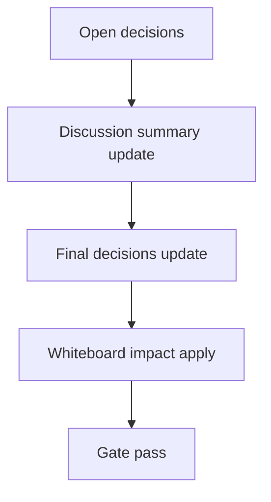

# Design: design_20260228_inbox_threadification_v1

- Status: Draft
- Owner: Codex
- Created: 2026-03-01
- Updated: 2026-03-01
- Scope: Inbox Threadification v1: thread_key grouping + one-click thread history

## Context
- Problem: `#inbox` 通知が source/thread_id 単位で散在し、同系統イベント履歴を即座に辿れない。
- Goal: `thread_key` を additive に導入し、既存行は derive 補完で後方互換を保ちながら API/UI でスレッド履歴をワンクリック表示可能にする。
- Non-goals: 新規DB導入、既存 `inbox.jsonl` 全行書き換え、破壊的マイグレーション。

## Design diagram

## Whiteboard impact
- Now: Before: #inbox は item 単位閲覧が中心で同系統履歴を探しにくい。 After: item に `thread_key`（旧行は derive）を持たせ、`/api/inbox/thread` で履歴を取得できる。
- DoD: Before: UI から同スレッド履歴取得の専用導線がない。 After: #inbox 右ペインで selected item の thread_key を表示し `Show thread (last 20)` で履歴を即表示できる。
- Blockers: なし。
- Risks: source ベース derive ルールが将来の新 source を網羅しきれない可能性があるため mapping 追加運用が必要。

## Multi-AI participation plan
- Reviewer:
  - Request: additive 変更で既存 inbox 契約を壊さないか確認。
  - Expected output format: verdict + regression risks + missing tests（箇条書き）。
- QA:
  - Request: `/api/inbox` と `/api/inbox/thread` の deterministic 判定点を確認。
  - Expected output format: verdict + smoke観点 + flaky risk（箇条書き）。
- Researcher:
  - Request: thread_key derive 規則の保守性を確認。
  - Expected output format: verdict + maintainability notes（箇条書き）。
- External AI:
  - Request: スレッド化 UX の盲点を外部視点で指摘。
  - Expected output format: verdict + risk notes（箇条書き）。
- external_participation: optional
- external_not_required: false

## Open Decisions
- [ ] Decision 1
- [ ] Decision 2

### Open Decisions checklist
- [ ] Add "Decision 1 Final:" entry with final choice.
- [ ] Add "Decision 2 Final:" entry with final choice.

## Final Decisions
- inbox item に `thread_key?: string` を追加し、読み込み時は `deriveInboxThreadKey(item)` で必ず補完する。
- 新規 API `/api/inbox/thread?key=...&limit=...` を追加し、末尾側走査 + 最新順返却で履歴表示を実装する。

## Discussion summary
- writer 側は共通 append ヘルパで `thread_key` を付与し、新規行は原則 thread_key 付きに統一する。
- UI は `selectedInboxItem.thread_key` をキーに thread history を取得し、詳細ペインで一覧表示する。
- v1 は `/api/inbox/threads` を必須にせず、必要なら後続で追加する。

## Plan
1. Design
2. Review
3. Implement
4. Verify

## Risks
- Risk: derive 規則外 source は `source:<source>` へフォールバックし、粒度が粗いグルーピングになる。
  - Mitigation: source 追加時に derive mapping を追記し smoke で thread_key 非空を継続監視する。

## Test Plan
- Unit: なし（既存 API/UI 統合変更中心）。
- E2E: docs_check / design_gate / ui_smoke / ui:build:smoke / desktop:smoke / ci:smoke:gate / whiteboard dry-run を実行。

## Reviewed-by
- Reviewer / approved / 2026-03-01 / additive contract and backward compatibility checked
- QA / approved / 2026-03-01 / thread_key and thread API smokeability checked
- Researcher / noted / 2026-03-01 / derive mapping maintenance risk noted

## External Reviews
- docs/design/design_20260228_inbox_threadification_v1__external_claude.md / noted
