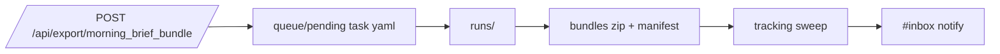
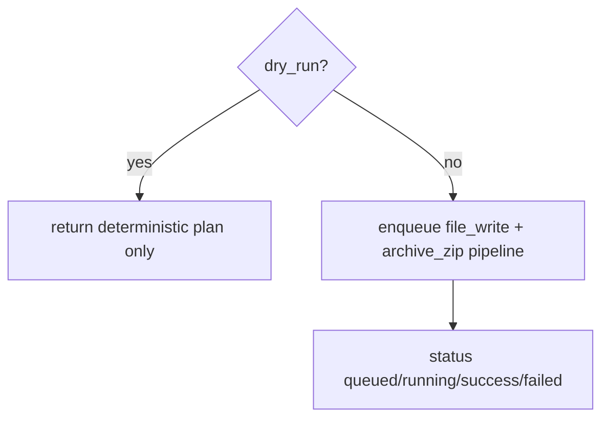

# Design: design_20260228_morning_brief_bundle_v1

- Status: Ready
- Owner: Codex
- Created: 2026-02-28
- Updated: 2026-02-28
- Scope: Morning Brief Bundle v1: deterministic bundle (zip+manifest) + tracking + inbox notify

## Context
- Problem: Morning brief output exists but is not always collected as a deterministic deliverable bundle.
- Goal: provide a queue-based export that always yields a zip + manifest, with tracking status and inbox notify.
- Non-goals: no distribution/upload/signing; no LLM summarization changes.

## Design diagram

## Whiteboard impact
- Now: Before: morning brief routine output could be fragmented. After: bundle export endpoint provides deterministic collection.
- DoD: Before: no morning brief bundle export/status API. After: export+status+tracking+notify are available and smoke-covered.
- Blockers: none.
- Risks: archive content path semantics must remain stable across executor versions.

## Multi-AI participation plan
- Reviewer:
  - Request: validate additive API contract and tracking dedup policy.
  - Expected output format: concise bullets.
- QA:
  - Request: validate dry-run plan response and smoke boolean coverage.
  - Expected output format: concise bullets.
- Researcher:
  - Request: validate bundle acceptance strategy (zip entries + json pointer checks).
  - Expected output format: concise bullets.
- External AI:
  - Request: optional.
  - Expected output format: n/a.
- external_participation: optional
- external_not_required: true

## Open Decisions
- [x] Decision 1
- [x] Decision 2

### Open Decisions checklist
- [x] Add "Decision 1 Final:" entry with final choice.
- [x] Add "Decision 2 Final:" entry with final choice.

## Final Decisions
- Decision 1 Final: implement dedicated `POST/GET /api/export/morning_brief_bundle*` with queue-based pipeline and tracking store under `workspace/ui/routines`.
- Decision 2 Final: notifier dedup uses both `tracking.notified` and inbox request_id scan (`source=export_morning_brief_bundle`).

## Discussion summary
- Change 1: add deterministic bundle generator with dry-run plan and enqueue mode.
- Change 2: add tracking sweep to resolve run + emit inbox success/failure.
- Change 3: add settings UI panel (dry-run/generate/status refresh).
- Change 4: add recipe + e2e template and script wiring.

## Plan
1. API: export endpoint + status + tracking sweep.
2. UI: settings panel + result rendering + run jump.
3. Recipes/E2E: morning brief bundle template + mode/script registration.
4. smoke/gate/docs verification.

## Risks
- Risk: archive task may resolve relative input roots differently across modes.
  - Mitigation: recipe/e2e acceptance includes zip entry checks to detect regressions.

## Test Plan
- smoke:
  - `POST /api/export/morning_brief_bundle` dry-run returns `ok=true`.
- recipes/e2e:
  - `e2e:auto:recipe_morning_brief_bundle:json` succeeds with zip entry + json pointer checks.
- gate:
  - docs/design/ui_smoke/ui_build/desktop/ci smoke gate all pass.

## Reviewed-by
- Reviewer / Codex / 2026-02-28 / approved
- QA / Codex / 2026-02-28 / approved
- Researcher / Codex / 2026-02-28 / approved

## External Reviews
- n/a / skipped
