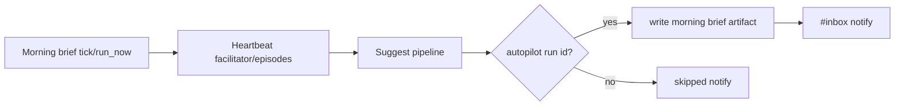
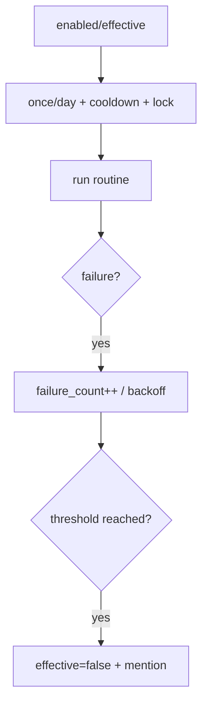

# Design: design_20260228_morning_brief_v1

- Status: Ready
- Owner: Codex
- Created: 2026-02-28
- Updated: 2026-02-28
- Scope: Morning Brief v1: daily brief pipeline (safe auto) with artifact + inbox

## Context
- Problem: morning routine requires repetitive manual orchestration.
- Goal: add safe daily routine orchestration and brief artifact generation.
- Non-goals: forcing autopilot execution when suggest guards skip.

## Design diagram

## Whiteboard impact
- Now: Before: independent heartbeat/suggest/autopilot flows. After: morning routine orchestration with safe guards and brief artifact.
- DoD: Before: no morning routine settings/state. After: settings/state/run_now API + scheduler + inbox notification.
- Blockers: none.
- Risks: autopilot may not start due suggest guards.

## Multi-AI participation plan
- Reviewer:
  - Request: verify additive safety and fallback behavior.
  - Expected output format: concise bullets.
- QA:
  - Request: verify smoke endpoints without timing dependency.
  - Expected output format: concise bullets.
- Researcher:
  - Request: check routine-state schema and brake behavior.
  - Expected output format: concise bullets.
- External AI:
  - Request: optional.
  - Expected output format: n/a.
- external_participation: optional
- external_not_required: true

## Open Decisions
- [x] Decision 1
- [x] Decision 2

### Open Decisions checklist
- [x] Add "Decision 1 Final:" entry with final choice.
- [x] Add "Decision 2 Final:" entry with final choice.

## Final Decisions
- Decision 1 Final: routine never forces autopilot; if no run_id then skipped notification.
- Decision 2 Final: failure brake disables effective state and emits mention inbox notification.

## Discussion summary
- Change 1: add morning brief runtime settings/state/lock and APIs.
- Change 2: add scheduler tick + run_now orchestrator.
- Change 3: generate deterministic brief artifact in `written/` and notify inbox.
- Change 4: add UI settings controls and smoke checks.

## Plan
1. API settings/state/run_now + scheduler
2. UI settings panel
3. smoke/docs updates
4. gate/smoke verification

## Risks
- Risk: brief artifact has limited content when autopilot answer unavailable.
  - Mitigation: emit minimal deterministic brief with run links.

## Test Plan
- API smoke: settings GET/POST, run_now dry-run, state GET.
- Build/gate: docs/design/ui build/desktop/ci smoke gate.

## Reviewed-by
- Reviewer / Codex / 2026-02-28 / approved
- QA / Codex / 2026-02-28 / approved
- Researcher / Codex / 2026-02-28 / approved

## External Reviews
- n/a / skipped
