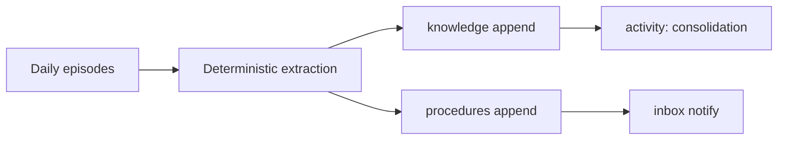
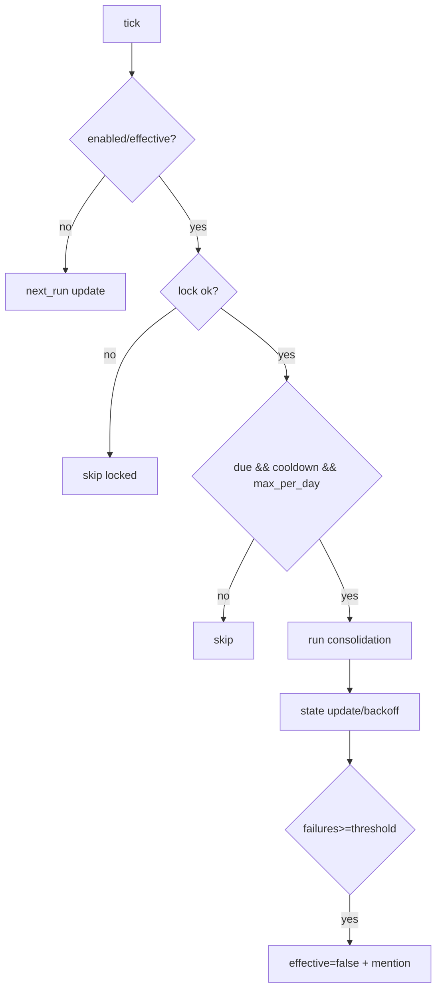

# Design: design_20260228_night_consolidation_v1

- Status: Ready
- Owner: Codex
- Created: 2026-02-28
- Updated: 2026-02-28
- Scope: Night Consolidation v1: deterministic distillation episodes -> knowledge/procedures

## Context
- Problem: episodes accumulate but reusable knowledge/procedures are not distilled consistently.
- Goal: nightly deterministic consolidation into knowledge/procedures with safe scheduler.
- Non-goals: LLM summarization, rewrite/delete of episodes, embedding retrieval.

## Design diagram

## Whiteboard impact
- Now: Before: manual memory append only. After: nightly deterministic distillation episodes -> knowledge/procedures.
- DoD: Before: no consolidation scheduler/state. After: settings/state/run_now and guarded scheduler with lock/backoff.
- Blockers: none.
- Risks: over-trigger without cooldown/day guard.

## Multi-AI participation plan
- Reviewer:
  - Request: validate additive safety and scheduler behavior.
  - Expected output format: concise bullets.
- QA:
  - Request: verify smoke checks for settings/run_now/persist.
  - Expected output format: concise bullets.
- Researcher:
  - Request: validate deterministic extraction strategy and caps.
  - Expected output format: concise bullets.
- External AI:
  - Request: optional.
  - Expected output format: n/a.
- external_participation: optional
- external_not_required: true

## Open Decisions
- [x] Decision 1
- [x] Decision 2

### Open Decisions checklist
- [x] Add "Decision 1 Final:" entry with final choice.
- [x] Add "Decision 2 Final:" entry with final choice.

## Final Decisions
- Decision 1 Final: consolidation is deterministic and append-only to knowledge/procedures.
- Decision 2 Final: scheduler safety uses lock, cooldown, max_per_day, backoff, and failure brake.

## Discussion summary
- Change 1: add consolidation runtime settings/state/lock with atomic writes.
- Change 2: add consolidation scheduler + run_now endpoints.
- Change 3: add deterministic extraction from daily episodes.
- Change 4: add settings UI and smoke coverage.

## Plan
1. implement API + scheduler
2. wire settings UI
3. update smoke/docs
4. run gate/smoke verification

## Risks
- Risk: malformed episode text yields low-quality extraction.
  - Mitigation: fallback to top bullet lines with hard caps.

## Test Plan
- API smoke:
  - settings GET/POST
  - run_now dry/non-dry
  - memory persist check for Night consolidation title
- Build/gate: docs/design/ui build/desktop/ci smoke gate.

## Reviewed-by
- Reviewer / Codex / 2026-02-28 / approved
- QA / Codex / 2026-02-28 / approved
- Researcher / Codex / 2026-02-28 / approved

## External Reviews
- n/a / skipped
