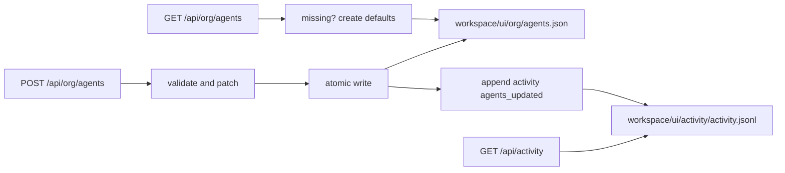
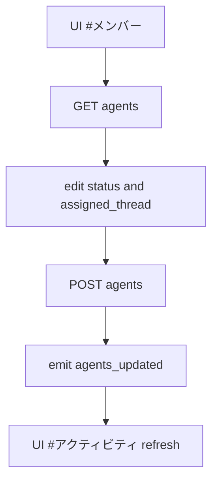

# Design: design_20260228_org_agents_activity_v1

- Status: Approved
- Owner: Codex
- Created: 2026-02-28
- Updated: 2026-02-28
- Scope: Org Agents Registry v1 + Activity Timeline v1

## Context
- Problem: region_ai has no shared member-status ledger or global timeline in the UI hub.
- Goal: add agents/activity APIs and UI channels `#メンバー` and `#アクティビティ`.
- Non-goals: 3D/2.5D workspace, autonomous agent scheduling, auth/permissions.

## Design diagram

## Whiteboard impact
- Now: Before: discussion/execution streams had no explicit member status board. After: member status and global timeline are visible in the hub.
- DoD: Before: smoke covered chat/taskify/export/inbox only. After: agents/api + activity/api + UI channels + ui_smoke green.
- Blockers: none.
- Risks: JSONL best-effort reads can skip malformed lines and hide some historical events.

## Multi-AI participation plan
- Reviewer:
  - Request: verify additive API changes do not regress existing chat/taskify/export/inbox flows.
  - Expected output format: severity-ordered bullet findings.
- QA:
  - Request: verify deterministic smoke and gate checks for agents/activity.
  - Expected output format: pass/fail bullets.
- Researcher:
  - Request: verify v1 caps/cursor shape and atomic write strategy for timeline.
  - Expected output format: concise notes.
- External AI:
  - Request: not required.
  - Expected output format: n/a
- external_participation: optional
- external_not_required: true

## Open Decisions
- [x] Decision 1
- [x] Decision 2

## Final Decisions
- Decision 1 Final: agents snapshot is stored at fixed path `workspace/ui/org/agents.json` with `version=1`.
- Decision 2 Final: successful `POST /api/org/agents` emits one `agents_updated` activity event to `workspace/ui/activity/activity.jsonl`.

## Discussion summary
- Change 1: add org agents/activity schema, validation, and endpoints in `ui_api`.
- Change 2: add `#メンバー` edit view and `#アクティビティ` list/filter/jump view in `ui_discord`.
- Change 3: add smoke checks for org/activity and update run/spec docs.

## Plan
1. Design and review files.
2. API implementation.
3. UI implementation.
4. Smoke and gate verification.

## Risks
- Risk: patch contract ambiguity for `POST /api/org/agents`.
  - Mitigation: support `agents[]` as canonical input, allow `agent` and `id` style for compatibility.

## Test Plan
- Smoke: `powershell -NoProfile -ExecutionPolicy Bypass -File tools/ui_smoke.ps1 -Json`.
- Gate: `powershell -NoProfile -ExecutionPolicy Bypass -File tools/design_gate.ps1 -DesignPath docs/design/design_20260228_org_agents_activity_v1.md`.
- Build: `npm.cmd run ui:build:smoke:json`.

## Reviewed-by
- Reviewer / Codex / 2026-02-28 / approved
- QA / Codex / 2026-02-28 / approved
- Researcher / Codex / 2026-02-28 / noted

## External Reviews
- n/a / skipped
