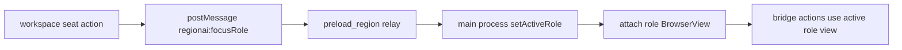
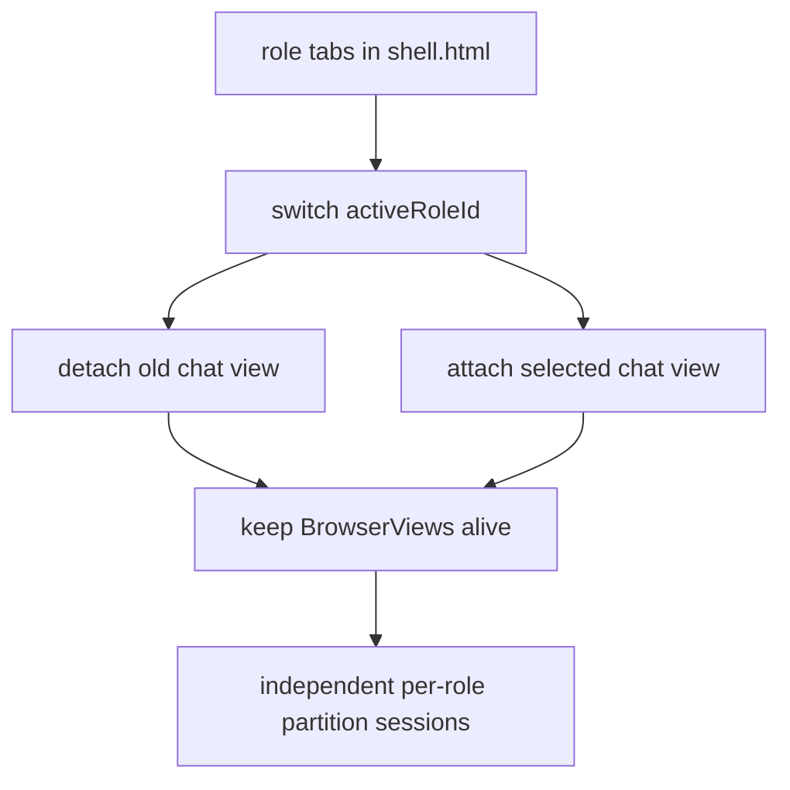

# Design: design_20260228_role_chatgpt_views_v1

- Status: Approved
- Owner: Codex
- Created: 2026-02-28
- Updated: 2026-02-28
- Scope: role-based ChatGPT BrowserViews with partition isolation and workspace focus routing

## Context
- Problem: desktop right pane uses a single ChatGPT BrowserView, so role context and login/history are mixed.
- Goal: maintain isolated ChatGPT sessions per role and switch active role via tabs/focus message.
- Non-goals: changing bridge security posture, removing desktop optional fallback, or adding new auth model.

## Design diagram

## Whiteboard impact
- Now: Before: ChatGPT pane had one shared session. After: role-based isolated sessions and role focus routing are available.
- DoD: Before: no role-aware view switch existed. After: tabs + partition isolation + active-role bridge + workspace focus route + smoke green.
- Blockers: none.
- Risks: Electron view attach/detach ordering can cause focus regressions.

## Multi-AI participation plan
- Reviewer:
  - Request: validate BrowserView switching and bridge targeting safety.
  - Expected output format: severity-ordered findings.
- QA:
  - Request: validate role switching behavior and workspace focus route.
  - Expected output format: pass/fail bullets.
- Researcher:
  - Request: validate partition mapping and fallback behavior assumptions.
  - Expected output format: concise notes.
- External AI:
  - Request: not required.
  - Expected output format: n/a
- external_participation: optional
- external_not_required: true

## Open Decisions
- [x] Decision 1
- [x] Decision 2

## Final Decisions
- Decision 1 Final: keep one BrowserView per role alive and only attach active view.
- Decision 2 Final: route workspace role focus via `regionai:focusRole` postMessage relay.

## Discussion summary
- Change 1: add role config/partitions and active-role management in desktop main process.
- Change 2: add role tabs and active role indicator in desktop shell UI.
- Change 3: keep bridge APIs role-agnostic and apply operations to currently active role view.
- Change 4: add workspace seat action to request desktop role focus.

## Plan
1. Implement desktop role BrowserViews and active role switch logic.
2. Wire shell role tab bar + preload bridge APIs.
3. Add region focusRole relay and workspace action button.
4. Update smoke/docs and run gate/smoke checks.

## Risks
- Risk: removing unattached BrowserViews may throw on some Electron builds.
  - Mitigation: best-effort attach/detach with guarded exceptions.

## Test Plan
- `node --check apps/ui_desktop_electron/main.cjs`
- `npm.cmd run desktop:smoke:json`
- `npm.cmd run docs:check:json`
- `powershell -NoProfile -ExecutionPolicy Bypass -File tools/design_gate.ps1 -DesignPath docs/design/design_20260228_role_chatgpt_views_v1.md`
- `npm.cmd run ci:smoke:gate:json`

## Reviewed-by
- Reviewer / Codex / 2026-02-28 / approved
- QA / Codex / 2026-02-28 / approved
- Researcher / Codex / 2026-02-28 / noted

## External Reviews
- n/a / skipped
