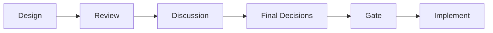
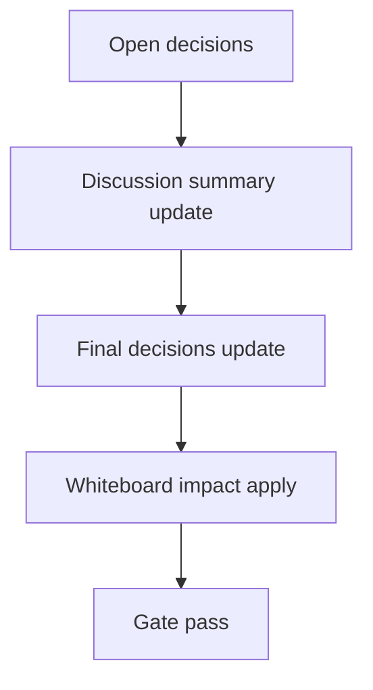

# Design: design_20260228_thread_archive_scheduler_dashboard_v1

- Status: Final
- Owner: Codex
- Created: 2026-03-01
- Updated: 2026-03-01
- Scope: Dashboard integration v1 for thread archive scheduler: status card + richer state (additive)

## Context
- Problem: thread archive scheduler state is visible in `#settings`, but daily operational view (`#dashboard`) lacks a focused status card and richer observability fields.
- Goal: expose scheduler observability on dashboard with additive state fields, dedicated dashboard endpoint, and dry-run action from dashboard.
- Non-goals: changing scheduler execution policy/logic, expanding auto-run scope, destructive archive behavior.

## Design diagram

## Whiteboard impact
- Now: Before: scheduler visibility was settings-centric. After: dashboard has a dedicated scheduler status card and dry-run trigger.
- DoD: Before: no dashboard scheduler endpoint/card. After: `/api/dashboard/thread_archive_scheduler` + card + smoke checks + docs updates.
- Blockers: none.
- Risks: additive state fields can remain empty on first boot; UI must treat missing fields as defaults.

## Multi-AI participation plan
- Reviewer:
  - Request: validate additive API/state changes and dashboard compatibility risks.
  - Expected output format: bullet findings with risks and missing tests.
- QA:
  - Request: validate deterministic smoke checks for new dashboard endpoint and field sanity.
  - Expected output format: pass/fail bullets plus test gaps.
- Researcher:
  - Request: check schema/evolution quality for additive state fields.
  - Expected output format: concise notes with migration concerns.
- External AI:
  - Request: optional.
  - Expected output format: optional risk bullets.
- external_participation: optional
- external_not_required: true

## Open Decisions
- [x] Decision 1
- [x] Decision 2

### Open Decisions checklist
- [x] Add "Decision 1 Final:" entry with final choice.
- [x] Add "Decision 2 Final:" entry with final choice.

## Final Decisions
- Decision 1 Final: scheduler state file remains additive-only; new observability fields are capped and optional.
- Decision 2 Final: dashboard consumes dedicated endpoint (`/api/dashboard/thread_archive_scheduler`) and run action uses dry-run-only wrapper.

## Discussion summary
- Change 1: add state observability fields (`last_elapsed_ms`, `last_timed_out`, `last_results_sample`, `last_failed_thread_keys`) with caps.
- Change 2: add computed `next_run_local` in scheduler state API response (not persisted).
- Change 3: add dashboard endpoint and dashboard card with refresh + dry-run action.

## Plan
1. Design
2. Review
3. Implement
4. Verify

## Risks
- Risk: UI or API consumers may assume new fields always exist.
  - Mitigation: normalization sets safe defaults; UI renders fallback values.

## Test Plan
- Unit: state normalization and dashboard endpoint field-shape sanity.
- E2E: ui_smoke dashboard endpoint check + full gate/smoke sequence.

## Reviewed-by
- Reviewer / Codex / 2026-03-01 / approved
- QA / Codex / 2026-03-01 / approved
- Researcher / Codex / 2026-03-01 / noted

## External Reviews
- docs/design/design_20260228_thread_archive_scheduler_dashboard_v1__external.md / optional_not_requested
