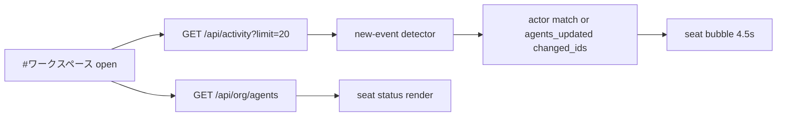
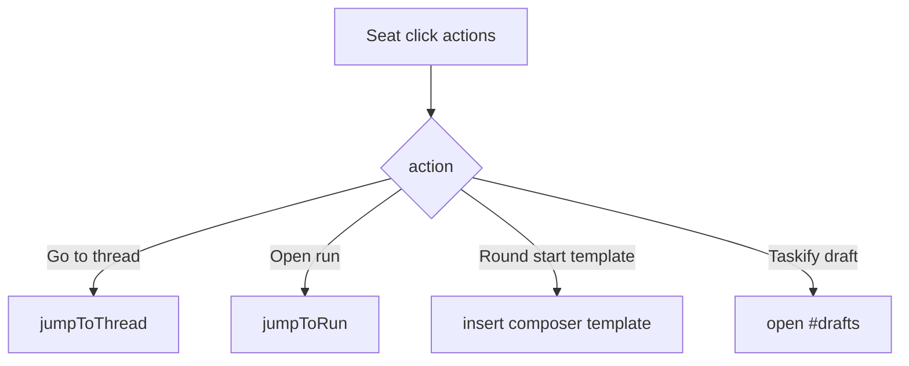

# Design: design_20260228_workspace_2p5d_v0

- Status: Approved
- Owner: Codex
- Created: 2026-02-28
- Updated: 2026-02-28
- Scope: Workspace 2.5D v0 for agents/activity visualization

## Context
- Problem: users can read members/activity in separate lists, but cannot see a shared visual room state.
- Goal: add `#ワークスペース` channel with seat-based 2.5D layout, activity bubbles, and thread/run jump actions.
- Non-goals: real 3D rendering, autonomous agent runtime, new backend APIs.

## Design diagram

## Whiteboard impact
- Now: Before: agents/activity were visible only as lists. After: workspace room view shows member seats, status accents, and transient activity bubbles.
- DoD: Before: no visual workspace lane existed. After: `#ワークスペース` renders, bubbles appear for new `agents_updated`, and jump actions work.
- Blockers: none.
- Risks: 2s polling can create extra API traffic in long-running sessions.

## Multi-AI participation plan
- Reviewer:
  - Request: verify UI additions are additive and do not break existing channels.
  - Expected output format: severity-ordered bullet findings.
- QA:
  - Request: verify bubble timing and jump behavior are deterministic enough for smoke/gate.
  - Expected output format: pass/fail bullets.
- Researcher:
  - Request: verify polling cadence and event ingestion strategy for v0.
  - Expected output format: concise notes.
- External AI:
  - Request: not required.
  - Expected output format: n/a
- external_participation: optional
- external_not_required: true

## Open Decisions
- [x] Decision 1
- [x] Decision 2

## Final Decisions
- Decision 1 Final: polling remains client-side (`/api/activity?limit=20` every 2s) only when `#ワークスペース` is active.
- Decision 2 Final: activity bubbles target agents by `actor_id` match and by `changed_ids` parsed from `agents_updated` summary.

## Discussion summary
- Change 1: add workspace channel and seat-grid UI with status accents.
- Change 2: add workspace bubble state, expiry cleanup, and new-event ingestion logic.
- Change 3: add quick actions (`Go to thread`, `Round start template`, `Taskify draft`, optional run/thread from bubble).

## Plan
1. Add design/review docs and update LATEST.
2. Implement workspace channel and activity-driven bubble logic.
3. Add 2.5D styles and responsive behavior.
4. Run build/smoke/gate verification.

## Risks
- Risk: legacy activity rows without actor/ref data may not show actionable bubble links.
  - Mitigation: bubble links are optional and fall back to plain text display.

## Test Plan
- Build: `npm.cmd run ui:build:smoke:json`.
- Smoke: `powershell -NoProfile -ExecutionPolicy Bypass -File tools/ui_smoke.ps1 -Json`.
- Gate: `npm.cmd run ci:smoke:gate:json`.

## Reviewed-by
- Reviewer / Codex / 2026-02-28 / approved
- QA / Codex / 2026-02-28 / approved
- Researcher / Codex / 2026-02-28 / noted

## External Reviews
- n/a / skipped
