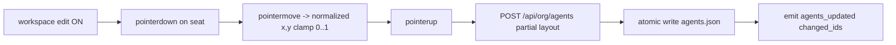
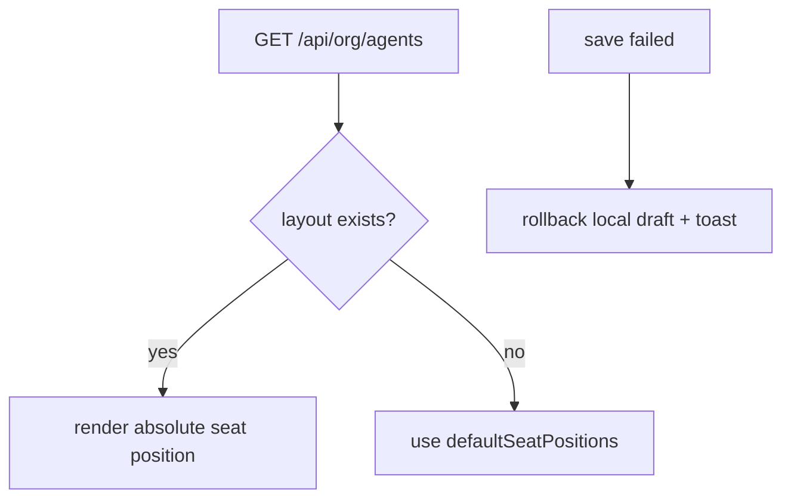

# Design: design_20260228_workspace_layout_dragdrop_v0_1

- Status: Approved
- Owner: Codex
- Created: 2026-02-28
- Updated: 2026-02-28
- Scope: Workspace layout drag & drop v0.1 with persisted agent layout

## Context
- Problem: workspace seats are visually fixed and cannot be arranged per team preference.
- Goal: enable drag & drop seat positioning in `#ワークスペース` and persist to `agents.json`.
- Non-goals: physics animation, collision avoidance, server-push updates.

## Design diagram

## Whiteboard impact
- Now: Before: workspace seat positions were static. After: each agent seat can be repositioned and persisted with drag & drop.
- DoD: Before: no persisted workspace layout in runtime state. After: `agents[].layout` saved/loaded and `agents_updated` activity emitted on layout updates.
- Blockers: none.
- Risks: accidental drag during editing can reposition seats unexpectedly.

## Multi-AI participation plan
- Reviewer:
  - Request: verify additive API/UI changes preserve existing behavior.
  - Expected output format: severity-ordered bullet findings.
- QA:
  - Request: verify drag/save/reload persistence and rollback on save failure.
  - Expected output format: pass/fail bullets.
- Researcher:
  - Request: verify normalized layout schema and validation boundaries.
  - Expected output format: concise notes.
- External AI:
  - Request: not required.
  - Expected output format: n/a
- external_participation: optional
- external_not_required: true

## Open Decisions
- [x] Decision 1
- [x] Decision 2

## Final Decisions
- Decision 1 Final: persist layout in `agents[].layout = {x,y}` as normalized values within `[0,1]`.
- Decision 2 Final: validation failure returns `400` with `reason=ERR_BAD_REQUEST` and `details.field=layout`.

## Discussion summary
- Change 1: extend org agent model/patch validation in `ui_api`.
- Change 2: implement workspace edit toggle + pointer drag handling + rollback on save error.
- Change 3: keep activity integration additive through existing `agents_updated` emit.

## Plan
1. Add design/review docs and whiteboard sync.
2. Extend API validation and partial layout patch.
3. Implement drag-drop UI and persisted save.
4. Run smoke and gate verification.

## Risks
- Risk: high-frequency pointer updates can cause local jitter on low-spec devices.
  - Mitigation: persist only on pointerup; move updates remain local state only.

## Test Plan
- `powershell -NoProfile -ExecutionPolicy Bypass -File tools/ui_smoke.ps1 -Json`
- `npm.cmd run ui:build:smoke:json`
- `npm.cmd run ci:smoke:gate:json`

## Reviewed-by
- Reviewer / Codex / 2026-02-28 / approved
- QA / Codex / 2026-02-28 / approved
- Researcher / Codex / 2026-02-28 / noted

## External Reviews
- n/a / skipped
