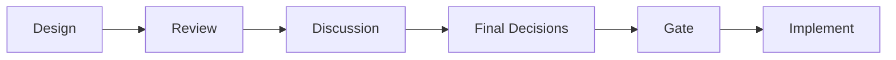
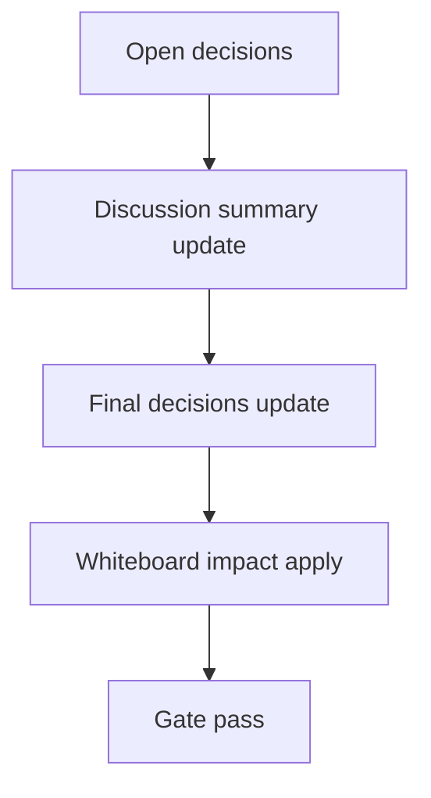

# Design: design_20260302_active_profile_revert_v3_5

- Status: Draft
- Owner: Codex
- Created: 2026-03-02
- Updated: 2026-03-02
- Scope: Active profile revert to standard with confirm + dashboard/quick action

## Context
- Problem: Active Profile を標準へ戻す安全導線がなく、運用時に手動applyや誤操作が発生しやすい。
- Goal: `REVERT` 確認付き revert API と Dashboard/QuickAction 導線を追加し、安全に standard へ戻せるようにする。
- Non-goals: 自動revert、autopilot終端での自動実行。

## Design diagram

## Whiteboard impact
- Now: Before: Active Profile は更新のみで revert 導線がない。After: API + Dashboard + QuickActions で preview/execute 分離の revert 導線を提供する。
- DoD: Before: revert preview/confirm NG の検証がない。After: dry-run preview と confirm NG(400) を smoke で検証する。
- Blockers: Quick Actions execute confirm仕様との整合（dry-run だけ confirm省略可）を維持する必要がある。
- Risks: apply成功と active_profile write の乖離。`active_profile_updated` と監査ログを best-effort で明示する。

## Multi-AI participation plan
- Reviewer:
  - Request: confirm要件(REVERT/EXECUTE)とquick action連携の整合を確認。
  - Expected output format: severity付き箇条書き。
- QA:
  - Request: dry-run preview/confirm NG の副作用なし自動化確認。
  - Expected output format: smoke観点チェックリスト。
- Researcher:
  - Request: revert endpoint schemaの互換性確認。
  - Expected output format: additive schemaメモ。
- External AI:
  - Request: optional（内部設計で完結）。
  - Expected output format: N/A。
- external_participation: optional
- external_not_required: true

## Open Decisions
- [x] Decision 1
- [x] Decision 2

### Open Decisions checklist
- [ ] Add "Decision 1 Final:" entry with final choice.
- [ ] Add "Decision 2 Final:" entry with final choice.

## Final Decisions
- Decision 1 Final: `POST /api/org/active_profile/revert` は default `dry_run=true`、`dry_run=false` 時のみ `confirm_phrase=REVERT` を必須にする。
- Decision 2 Final: Quick Action は `revert_active_profile_standard` を追加し、execute本番は既存 `EXECUTE` confirm、previewはconfirmなし許可とする。

## Discussion summary
- Change 1: Dashboard Active Profile card に Revert モーダルを追加し、preview結果を確認してから REVERT 実行する。

## Plan
1. Design
2. Review
3. Implement
4. Verify

## Risks
- Risk: revert audit append 失敗時に監査欠落。
  - Mitigation: audit は best-effort、API 本体は fail-open（戻し処理優先）。

## Test Plan
- Unit: revert endpoint confirm判定、target allowlist、dry-run/additive response。
- E2E: ui_smoke で revert preview/confirm NG/quick action preview を追加検証。

## Reviewed-by
- Reviewer / approved / 2026-03-02 / safety gating accepted
- QA / approved / 2026-03-02 / deterministic smoke accepted
- Researcher / noted / 2026-03-02 / additive compatibility noted

## External Reviews
- <optional reviewer file path> / <status>
