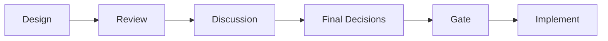
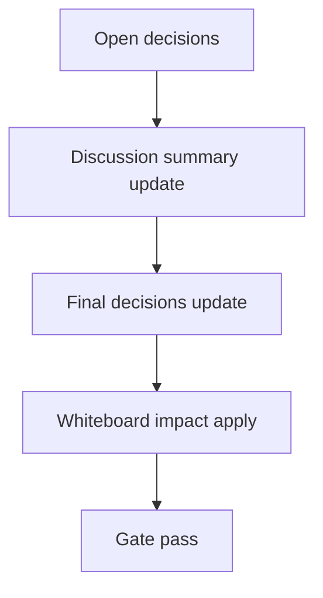

# Design: design_20260302_active_profile_state_v3_4

- Status: Draft
- Owner: Codex
- Created: 2026-03-02
- Updated: 2026-03-02
- Scope: Active profile SSOT + dashboard display v3.4

## Context
- Problem: 現在適用中の profile が API/UI で単一表示されず、recommended とのズレが運用時に見えない。
- Goal: workspace SSOT (`active_profile.json`) を追加し、apply/dry-run/ダッシュボードで一貫して active profile を可視化する。
- Non-goals: 自動revert、smokeでの実apply、副作用付きe2e。

## Design diagram

## Whiteboard impact
- Now: Before: recommended profile は見えるが active profile は不明。After: `/api/org/active_profile` と Dashboard card で常時表示。
- DoD: Before: apply_preset dry-run は差分のみ。After: dry-runで `active_profile_preview`、applyで `active_profile_updated/active_profile` を返す。
- Blockers: 既存 apply 呼び出し経路が多いため additive 拡張で後方互換を維持する必要がある。
- Risks: write失敗時に apply 成否と state 更新が乖離する。best-effort 更新と `active_profile_updated` で明示する。

## Multi-AI participation plan
- Reviewer:
  - Request: active_profile SSOT 追加の互換性と fail-closed 挙動を確認。
  - Expected output format: severity付き箇条書き。
- QA:
  - Request: smoke の副作用なし検証（GET + dry-run preview）の妥当性確認。
  - Expected output format: チェック観点一覧。
- Researcher:
  - Request: active profile schema の最小互換性評価。
  - Expected output format: schema互換メモ。
- External AI:
  - Request: optional（内部仕様で完結）。
  - Expected output format: N/A。
- external_participation: optional
- external_not_required: true

## Open Decisions
- [x] Decision 1
- [x] Decision 2

### Open Decisions checklist
- [ ] Add "Decision 1 Final:" entry with final choice.
- [ ] Add "Decision 2 Final:" entry with final choice.

## Final Decisions
- Decision 1 Final: active profile SSOT は `workspace/ui/org/active_profile.json` 固定、GET は missing/parse fail でも 200+default。
- Decision 2 Final: `apply_preset` は additive で `active_profile_preview`(dry-run) と `active_profile_updated/active_profile`(apply) を返す。

## Discussion summary
- Change 1: Dashboard に Active Profile card を追加し、Recommended との一致/不一致を同一画面で明示する。

## Plan
1. Design
2. Review
3. Implement
4. Verify

## Risks
- Risk: apply本体成功後に active_profile 書き込みのみ失敗する可能性。
  - Mitigation: best-effort更新で API を失敗させず `active_profile_updated=false` を返す。

## Test Plan
- Unit: active_profile read fallback、apply_preset response additive fields、quick_action reason上書き。
- E2E: ui_smoke で `GET /api/org/active_profile` と dry-run preview を検証。

## Reviewed-by
- Reviewer / approved / 2026-03-02 / compatibility accepted
- QA / approved / 2026-03-02 / smoke determinism accepted
- Researcher / noted / 2026-03-02 / schema additive noted

## External Reviews
- <optional reviewer file path> / <status>
