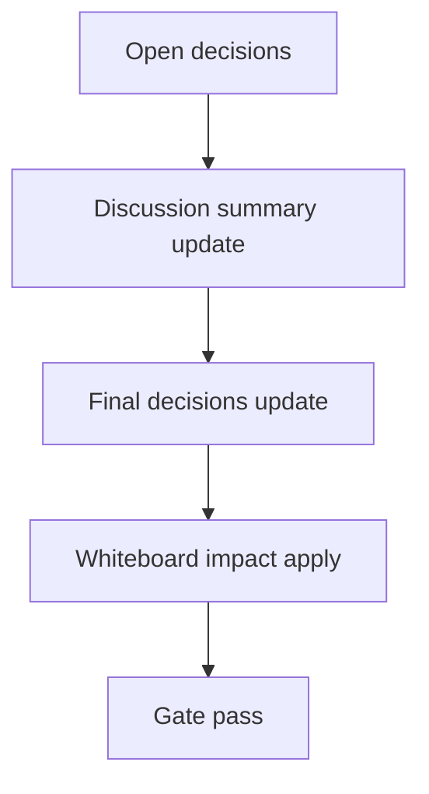

# Design: design_20260302_agent_identity_presets_v2_9

- Status: Final
- Owner: Codex
- Created: 2026-03-02
- Updated: 2026-03-02
- Scope: Agent Identity Presets v2.9: one-click preset sets for council roles

## Context
- Problem: switching agent identity style requires manual per-agent edits and is slow for council tuning.
- Goal: one-click identity preset sets with dry-run preview and safe apply for council roles.
- Non-goals: scheduler-based auto-apply, memory rewrite, historical backfill.

## Design diagram

## Whiteboard impact
- Now: Before: identity edits were manual and granular. After: preset set dry-run/apply supports fast "議論の色" switching.
- DoD: Before: no preset API/flow. After: presets list + apply(dry-run/apply) + UI panel + smoke checks.
- Blockers: none.
- Risks: malformed preset payloads can break identity consistency; mitigated by allowlist IDs, caps, and strict validation.

## Multi-AI participation plan
- Reviewer:
  - Request: validate additive API compatibility and safe apply scope.
  - Expected output format: risk and missing-test bullets.
- QA:
  - Request: validate dry-run no-side-effect behavior and smoke checks.
  - Expected output format: deterministic pass/fail bullets.
- Researcher:
  - Request: validate preset schema durability and migration implications.
  - Expected output format: compatibility notes.
- External AI:
  - Request: optional UX sanity for one-click preset workflow.
  - Expected output format: short bullets.
- external_participation: optional
- external_not_required: true

## Open Decisions
- [x] Decision 1
- [x] Decision 2

### Open Decisions checklist
- [x] Add "Decision 1 Final:" entry with final choice.
- [x] Add "Decision 2 Final:" entry with final choice.

## Final Decisions
- Decision 1 Final: fixed allowlist preset sets are stored at `workspace/ui/org/agent_presets.json` and auto-created on first access.
- Decision 2 Final: apply endpoint updates identity fields only, supports `dry_run` diff preview, and emits `agents_updated` on actual apply.

## Discussion summary
- Change 1: add presets storage/validation and GET endpoints.
- Change 2: add apply preset API with council scope defaults, optional agent scope, and hash-based diff preview.
- Change 3: add members panel controls (reload/dry-run/apply) and smoke checks.

## Plan
1. Design
2. Review
3. Implement
4. Verify

## Risks
- Risk: council role IDs may differ per workspace.
  - Mitigation: role mapping fallback (`critic->qa`, `operator->impl`) with council-only guard.

## Test Plan
- Unit: none (repo baseline uses smoke/build/gate).
- E2E: docs_check + design_gate + ui_smoke (presets get/apply dry-run) + ui/desktop/ci smoke gate.

## Reviewed-by
- Reviewer / Codex / 2026-03-02 / approved
- QA / Codex / 2026-03-02 / approved
- Researcher / Codex / 2026-03-02 / noted

## External Reviews
- docs/design/design_20260302_agent_identity_presets_v2_9__external.md / optional_not_requested
