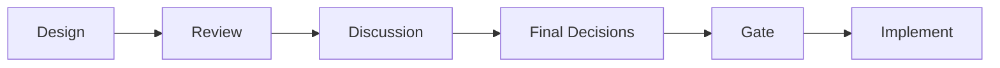
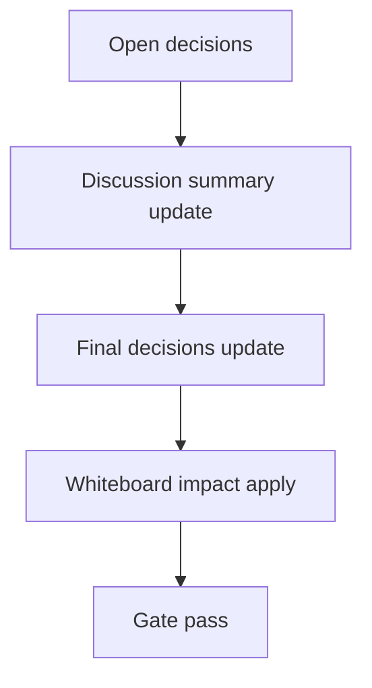

# Design: design_20260302_autopilot_final_revert_suggestion_v3_6

- Status: Draft
- Owner: Codex
- Created: 2026-03-03
- Updated: 2026-03-03
- Scope: Autopilot final -> inbox revert suggestion (no auto exec)

## Context
- Problem: Autopilot 完了後に non-standard profile の戻し忘れが起きやすく、thread 上に戻し導線が残らない。
- Goal: Autopilot final 時に `revert_suggestion` を同一 thread_key へ追記し、標準へ戻す提案を安全に案内する（自動実行なし）。
- Non-goals: profile の自動 revert 実行、smoke で実 autopilot 実行。

## Design diagram

## Whiteboard impact
- Now: Before: final inbox は完了通知のみで profile 戻し提案がない。After: non-standard 時に `source=revert_suggestion` が同一 thread に追記される。
- DoD: Before: revert suggestion の preview 検証がない。After: council dry-run response で `revert_suggestion_preview` を smoke 検証できる。
- Blockers: final sweep の重複通知抑制（thread/day dedupe）実装が必要。
- Risks: dedupe state 破損時に重複提案が出る可能性。state + inbox tail fallback の二段抑制で軽減する。

## Multi-AI participation plan
- Reviewer:
  - Request: final sweep への差し込みと既存通知互換性を確認。
  - Expected output format: severity付き箇条書き。
- QA:
  - Request: dry-run preview の副作用なし検証を確認。
  - Expected output format: smoke観点チェック。
- Researcher:
  - Request: dedupe state schemaとinbox source追加の互換性確認。
  - Expected output format: additive schemaメモ。
- External AI:
  - Request: optional（内部仕様のみ）。
  - Expected output format: N/A。
- external_participation: optional
- external_not_required: true

## Open Decisions
- [x] Decision 1
- [x] Decision 2

### Open Decisions checklist
- [ ] Add "Decision 1 Final:" entry with final choice.
- [ ] Add "Decision 2 Final:" entry with final choice.

## Final Decisions
- Decision 1 Final: final到達時の提案条件は `active_profile != standard` かつ `thread_key` 有効、同日同threadは dedupe する。
- Decision 2 Final: dry-run preview へ `revert_suggestion_preview` を additive 追加し、smoke はこの preview のみ検証する。

## Discussion summary
- Change 1: dedupe は `workspace/ui/org/revert_suggest_state.json` を主、inbox tail scan を副にした best-effort 二段防止とする。

## Plan
1. Design
2. Review
3. Implement
4. Verify

## Risks
- Risk: inbox tail scan 失敗時の重複抑止不足。
  - Mitigation: state更新優先・tail scan は補助、失敗しても autopilot 本体は継続。

## Test Plan
- Unit: revert suggestion 条件判定・state dedupe・preview payload 生成。
- E2E: ui_smoke で `revert_suggestion_preview` の shape/値を dry-run で検証。

## Reviewed-by
- Reviewer / approved / 2026-03-03 / compatibility accepted
- QA / approved / 2026-03-03 / dry-run smoke accepted
- Researcher / noted / 2026-03-03 / additive schema noted

## External Reviews
- <optional reviewer file path> / <status>
