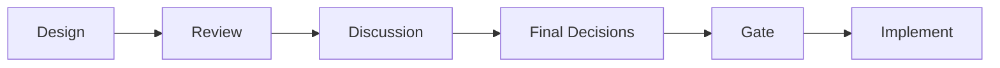
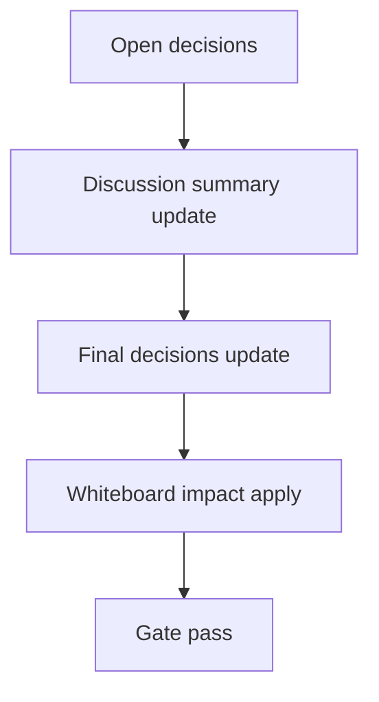

# Design: design_20260302_autopilot_suggest_preset_link_v3_0

- Status: Ready for Gate
- Owner: Codex
- Created: 2026-03-02
- Updated: 2026-03-02
- Scope: Autopilot Suggest v3.0: preset-linked candidates and safe apply-before-start

## Context
- Problem: Heartbeat suggestion から Autopilot を開始する際に、議論プロファイル（preset）を suggestion と連動して安全適用する導線がない。
- Goal: suggestion 候補に preset 候補を付与し、`dry_run preview -> apply -> start` の順で安全に開始できるようにする。
- Non-goals: preset 自動生成、auto-accept での自動適用、council 生成ロジックの改変。

## Design diagram

## Whiteboard impact
- Now: Before: suggestion は rank のみで Start。After: suggestion に preset 候補を持ち、Start は preset preflight/apply を経由。
- DoD: Before: accept は即 start。After: dry_run preview と apply 失敗時の start ブロックを実装し smoke で確認。
- Blockers: なし
- Risks: 既存 accept レスポンス互換。additive field で吸収し旧クライアント互換を維持。

## Multi-AI participation plan
- Reviewer:
  - Request:
  - Expected output format:
- QA:
  - Request:
  - Expected output format:
- Researcher:
  - Request:
  - Expected output format:
- External AI:
  - Request:
  - Expected output format:
- external_participation: optional
- external_not_required: false

## Open Decisions
- [x] Decision 1
- [x] Decision 2

### Open Decisions checklist
- [x] Add "Decision 1 Final:" entry with final choice.
- [x] Add "Decision 2 Final:" entry with final choice.

## Final Decisions
- Decision 1 Final: suggestion candidate に additive で `preset_candidates` を付与。既定マッピングは rank1=`standard`, rank2=`harsh_critic`, rank3=`ops_first`（未存在は skip）。
- Decision 2 Final: `POST /api/heartbeat/autopilot_suggestions/:id/accept` を additive 拡張し、`dry_run=true` は preset preview のみ、`dry_run=false` は preset apply 成功時のみ autopilot start。

## Discussion summary
- Change 1: v2.9 `applyAgentPresetInternal` を再利用して preset 適用の validation を一元化。
- Change 2: auto-accept 経路では `apply_preset=false` を明示して v3.0 の手動開始ポリシーを維持。
- Change 3: UI は Select & Start で preflight 結果表示と `APPLY` 確認を追加。

## Plan
1. Design
2. Review
3. Implement
4. Verify

## Risks
- Risk: preset SSOT 欠損時に提案 rank と不整合。
  - Mitigation: preset 候補は存在確認後にのみ埋める（skip 許容）。
- Risk: apply 後 start 失敗時に traits だけ変更される。
  - Mitigation: 仕様として許容し、レスポンスに失敗理由を返して再試行導線を確保。

## Test Plan
- Unit: suggestion sanitize/accept の preset 解決優先順位、dry_run 分岐、start ブロックを検証。
- E2E: `tools/ui_smoke.ps1` で preset candidate と accept dry_run preview を検証。

## Reviewed-by
- Reviewer / codex / 2026-03-02 / approved
- QA / codex / 2026-03-02 / approved
- Researcher / codex / 2026-03-02 / noted

## External Reviews
- docs/design/design_20260302_autopilot_suggest_preset_link_v3_0__external.md / optional_not_requested
