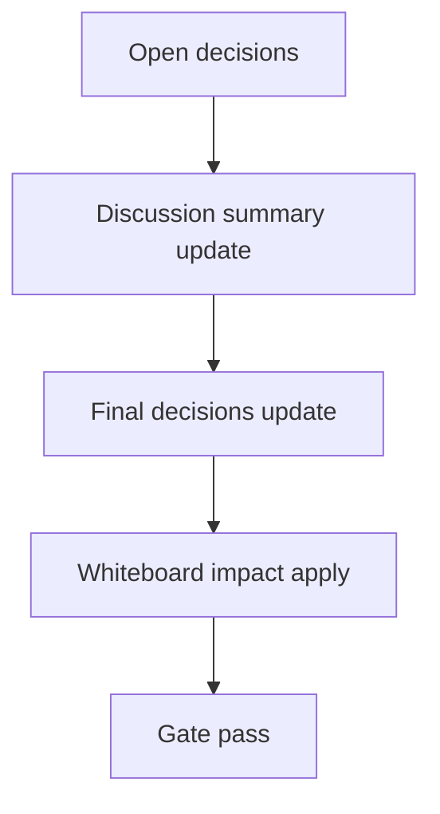

# Design: design_20260302_council_autopilot_identity_memory_assist_v2_8

- Status: Final
- Owner: Codex
- Created: 2026-03-02
- Updated: 2026-03-02
- Scope: Autopilot v2.8: identity/memory assisted role lines

## Context
- Problem: v2.7 fixed role labels improved structure, but lines can still be semantically sparse when source round summary is thin.
- Goal: assist role lines with identity traits and recent memory snippets while guaranteeing each role line is meaningfully non-empty.
- Non-goals: changing council generation algorithm, adding automatic execution, historical backfill.

## Design diagram

## Whiteboard impact
- Now: Before: role lines could be near-empty with only labels. After: role lines include best-effort identity/memory hints and fallback templates.
- DoD: Before: dry-run preview version was v2_7. After: dry-run preview upgrades to v2_8 with non-empty guarantees and hint usage flags.
- Blockers: none.
- Risks: overly long hints can reduce readability; mitigated by per-field caps and global 4KB cap with truncation marker.

## Multi-AI participation plan
- Reviewer:
  - Request: validate additive safety and compatibility with v2.7 thread/append behavior.
  - Expected output format: risk and missing-test bullets.
- QA:
  - Request: validate dry-run preview v2_8 checks and non-empty guarantees.
  - Expected output format: deterministic pass/fail bullets.
- Researcher:
  - Request: validate identity/memory hinting contract and migration implications.
  - Expected output format: compatibility notes.
- External AI:
  - Request: optional readability sanity check for assisted role lines.
  - Expected output format: short bullets.
- external_participation: optional
- external_not_required: true

## Open Decisions
- [x] Decision 1
- [x] Decision 2

### Open Decisions checklist
- [x] Add "Decision 1 Final:" entry with final choice.
- [x] Add "Decision 2 Final:" entry with final choice.

## Final Decisions
- Decision 1 Final: v2.7 4-line role format is preserved; identity/memory hints are additive best-effort and capped.
- Decision 2 Final: empty-slot fallback templates enforce minimum non-empty semantics per role line; dry-run preview version set to `v2_8`.

## Discussion summary
- Change 1: add identity/memory assist loaders and compact hint serialization.
- Change 2: extend role body builder with non-empty guarantees and capped hint attachment.
- Change 3: update dry-run smoke checks for v2_8 preview and role-line effective non-empty assertions.

## Plan
1. Design
2. Review
3. Implement
4. Verify

## Risks
- Risk: memory/identity read failures could reduce assist quality.
  - Mitigation: strict best-effort fallback to v2.7-style behavior with role guarantees.

## Test Plan
- Unit: none (repo baseline uses smoke/build/gate).
- E2E: docs_check + design_gate + ui_smoke(v2_8 preview checks) + ui/desktop/ci smoke gate.

## Reviewed-by
- Reviewer / Codex / 2026-03-02 / approved
- QA / Codex / 2026-03-02 / approved
- Researcher / Codex / 2026-03-02 / noted

## External Reviews
- docs/design/design_20260302_council_autopilot_identity_memory_assist_v2_8__external.md / optional_not_requested
