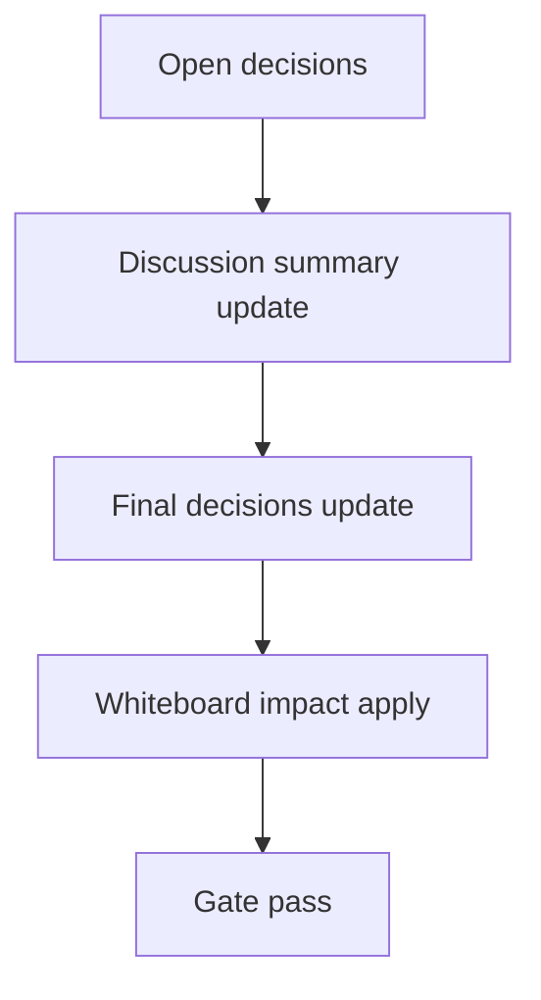

# Design: design_20260302_council_autopilot_inbox_thread_link_v2_6

- Status: Final
- Owner: Codex
- Created: 2026-03-02
- Updated: 2026-03-02
- Scope: Council Autopilot v2.6: inbox thread debate log

## Context
- Problem: council autopilot debate progress and final result are not grouped in `#inbox` thread view, so operators cannot read start/round/final in one timeline.
- Goal: deterministic `ap:*` thread linkage for autopilot start/round/final with one-click UI jump to thread view.
- Non-goals: automatic execution expansion, historical backfill, broad UI redesign.

## Design diagram

## Whiteboard impact
- Now: Before: autopilot status existed but inbox thread timeline was fragmented. After: start/round/final append to same `thread_key` and UI can open that thread directly.
- DoD: Before: no deterministic autopilot thread linkage. After: start response includes `thread_key`, runtime persists it, and inbox derive aligns `council_autopilot*`.
- Blockers: none.
- Risks: duplicate/verbose round logs; mitigated by round cap, short summaries, and best-effort append guard.

## Multi-AI participation plan
- Reviewer:
  - Request: validate additive API/runtime compatibility and no breaking changes for existing council flow.
  - Expected output format: risks + missing tests bullets.
- QA:
  - Request: validate dry-run smoke path (`thread_key` regex + inbox thread lookup) and council existing smoke path.
  - Expected output format: deterministic pass/fail bullets.
- Researcher:
  - Request: validate `ap:*` naming strategy and backward derivation behavior for missing thread_key rows.
  - Expected output format: compatibility notes.
- External AI:
  - Request: optional UX sanity review for `Open thread` workflow.
  - Expected output format: short bullets.
- external_participation: optional
- external_not_required: true

## Open Decisions
- [x] Decision 1
- [x] Decision 2

### Open Decisions checklist
- [x] Add "Decision 1 Final:" entry with final choice.
- [x] Add "Decision 2 Final:" entry with final choice.

## Final Decisions
- Decision 1 Final: `makeCouncilAutopilotThreadKey` uses deterministic priority `request_id -> run_id -> fallback`, and dry-run returns `preview`.
- Decision 2 Final: `#inbox` append is best-effort with capped round logs (`max 5`) and final mention on failure using mention token fallback.

## Discussion summary
- Change 1: start endpoint returns additive `thread_key` / `thread_key_source` / `inbox_thread_hint` and supports `dry_run=true` no-side-effect preview.
- Change 2: runtime state/request persist `thread_key` and tracker sweep appends `council_autopilot`, `council_autopilot_round`, `council_autopilot_final`.
- Change 3: UI council panel shows/copies thread key and opens `#inbox` thread view directly.

## Plan
1. Design
2. Review
3. Implement
4. Verify

## Risks
- Risk: round summary extraction from external log schema can miss details.
  - Mitigation: fallback to concise generic summary (`status/role`) and keep final notification authoritative.

## Test Plan
- Unit: none (current repo baseline is smoke/build/gate).
- E2E: docs_check + design_gate + ui_smoke (new dry-run key checks) + ui/desktop/ci smoke gates.

## Reviewed-by
- Reviewer / Codex / 2026-03-02 / approved
- QA / Codex / 2026-03-02 / approved
- Researcher / Codex / 2026-03-02 / noted

## External Reviews
- docs/design/design_20260302_council_autopilot_inbox_thread_link_v2_6__external.md / optional_not_requested
