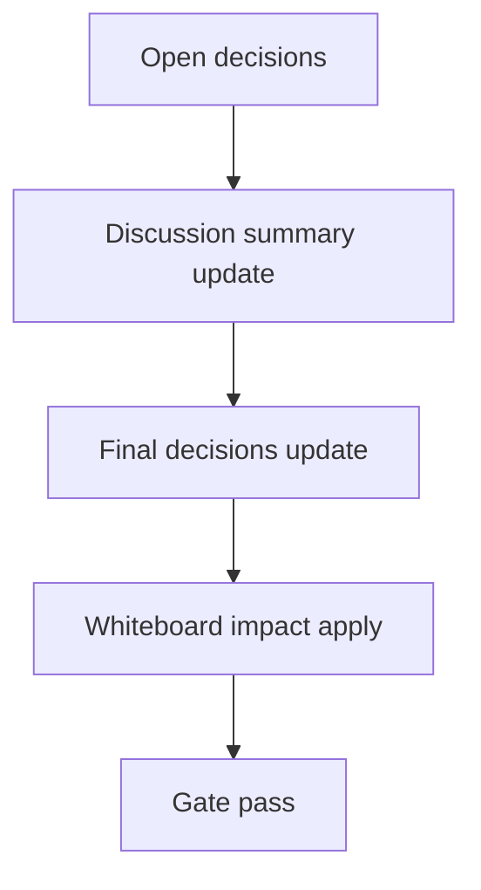

# Design: design_20260302_council_autopilot_round_role_format_v2_7

- Status: Final
- Owner: Codex
- Created: 2026-03-02
- Updated: 2026-03-02
- Scope: Autopilot round log role format v2.7

## Context
- Problem: `council_autopilot_round` inbox logs are single-line summaries, making thread readability poor for role-based debate flow.
- Goal: format round logs into fixed role-labeled lines and expose dry-run preview for deterministic smoke checks.
- Non-goals: changing debate generation logic, backfilling historical logs, adding new auto-run behavior.

## Design diagram

## Whiteboard impact
- Now: Before: round logs were free-form and hard to scan. After: round logs are role-labeled multi-line text with stable ordering.
- DoD: Before: no contract-level preview for round formatting. After: `dry_run` response includes `round_log_format_preview` and `round_log_format_version=v2_7`.
- Blockers: none.
- Risks: role fields may be empty when source logs lack role detail; mitigated by always rendering labels and fallback summary in facilitator line.

## Multi-AI participation plan
- Reviewer:
  - Request: validate additive compatibility and no regressions in council run/thread-key behavior.
  - Expected output format: risk + missing-tests bullets.
- QA:
  - Request: validate dry-run preview assertions and no-side-effect smoke behavior.
  - Expected output format: deterministic pass/fail bullets.
- Researcher:
  - Request: validate format contract clarity and migration impact for existing round logs.
  - Expected output format: compatibility notes.
- External AI:
  - Request: optional readability/UX sanity check.
  - Expected output format: short bullets.
- external_participation: optional
- external_not_required: true

## Open Decisions
- [x] Decision 1
- [x] Decision 2

### Open Decisions checklist
- [x] Add "Decision 1 Final:" entry with final choice.
- [x] Add "Decision 2 Final:" entry with final choice.

## Final Decisions
- Decision 1 Final: round body uses fixed 4-line role labels (`司会/批判役/実務/道化師`) with normalized/truncated field values.
- Decision 2 Final: `POST /api/council/run` `dry_run=true` returns additive `round_log_format_preview` + `round_log_format_version=v2_7`.

## Discussion summary
- Change 1: add role-format helpers and replace round append body with structured lines.
- Change 2: add UI readability treatment for `council_autopilot_round` in inbox detail/thread view.
- Change 3: extend smoke to validate dry-run preview labels and version.

## Plan
1. Design
2. Review
3. Implement
4. Verify

## Risks
- Risk: truncation could cut semantic detail in long summaries.
  - Mitigation: per-field cap + explicit truncation marker and fixed labels keep structural readability.

## Test Plan
- Unit: none (repository baseline is smoke/build/gate).
- E2E: docs_check + design_gate + ui_smoke preview assertions + ui/desktop/ci smoke gate.

## Reviewed-by
- Reviewer / Codex / 2026-03-02 / approved
- QA / Codex / 2026-03-02 / approved
- Researcher / Codex / 2026-03-02 / noted

## External Reviews
- docs/design/design_20260302_council_autopilot_round_role_format_v2_7__external.md / optional_not_requested
