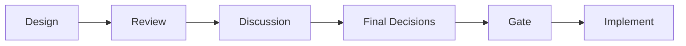
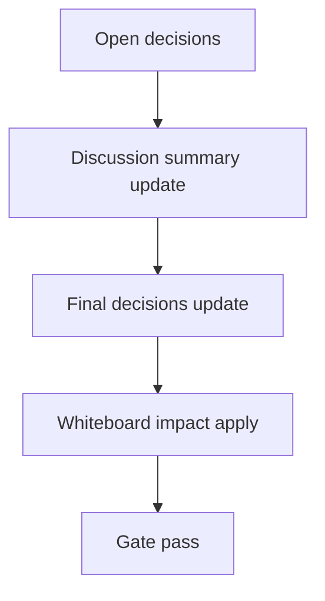

# Design: design_20260302_dashboard_quick_action_morning_brief_autopilot_start_v3_3

- Status: Draft
- Owner: Codex
- Created: 2026-03-02
- Updated: 2026-03-02
- Scope: Dashboard quick action: morning brief + recommended profile apply + council autopilot start

## Context
- Problem: Dashboard quick action では morning brief / recommended profile apply / autopilot start が分断され、手順ミスで安全確認なし実行になる余地がある。
- Goal: `morning_brief_autopilot_start` を追加し、dry-run preview と execute(confirm) を分離して `EXECUTE + APPLY` 必須で安全に一発起動できるようにする。
- Non-goals: scheduler自動実行、confirm省略実行、apply失敗時のstart継続。

## Design diagram

## Whiteboard impact
- Now: Before: Quick Actions execute は一部ジョブのみで、morning brief->preset->autopilot の統合導線がない。After: `morning_brief_autopilot_start` で preview と execute を統合し、thread_key 追跡まで一貫化する。
- DoD: Before: preflight結果と実行結果が分断され、confirm要件が1種のみ。After: previewで `recommended_profile + preflight + autopilot_preview` が返り、executeは `EXECUTE+APPLY` を満たさない限り 400 で停止する。
- Blockers: 既存 quick action tracking が export系中心のため inbox_thread polling を追加調整する必要がある。
- Risks: morning brief/run/council の内部呼び出し依存が増えるため timeout 連鎖で失敗しやすくなる。step別 timeout と正規化エラーで吸収する。

## Multi-AI participation plan
- Reviewer:
  - Request: confirm phrase要件と失敗時停止条件が仕様通りか確認。
  - Expected output format: severity付き箇条書き（risk/compat/test gap）。
- QA:
  - Request: dry-run preview と APPLY欠落400の自動化可否を確認。
  - Expected output format: smoke観点チェックリスト。
- Researcher:
  - Request: quick action execute payload拡張の将来互換性を確認。
  - Expected output format: schema互換性メモ。
- External AI:
  - Request: optional（本件は内部規約準拠のため外部レビュー不要）。
  - Expected output format: N/A。
- external_participation: optional
- external_not_required: true

## Open Decisions
- [x] Decision 1
- [x] Decision 2

### Open Decisions checklist
- [ ] Add "Decision 1 Final:" entry with final choice.
- [ ] Add "Decision 2 Final:" entry with final choice.

## Final Decisions
- Decision 1 Final: execute id は `morning_brief_autopilot_start`、dry id は `morning_brief_autopilot_start_dry` とし、既存 quick action allowlist に追加する。
- Decision 2 Final: execute本番は `confirm_phrase=EXECUTE` と `apply_confirm_phrase=APPLY` を両方必須にし、どちらか不一致で 400 `ERR_CONFIRM_REQUIRED` を返す。

## Discussion summary
- Change 1: previewは副作用なしで `recommended_profile` と `apply_preset(dry_run)` と `council dry_run preview` を返し、tracking_planは inbox_thread を明示する。

## Plan
1. Design
2. Review
3. Implement
4. Verify

## Risks
- Risk: step chainingで1ステップ失敗時の副作用境界が曖昧になる。
  - Mitigation: `step_results` を保持し、apply失敗時は autopilot start を呼ばず `ok=false` を返す。

## Test Plan
- Unit: quick_actions execute handler の APPLY必須分岐、morning action preview/execute 正規化レスポンス。
- E2E: ui_smoke に morning action preview成功と APPLY欠落400を追加し、副作用なしで検証。

## Reviewed-by
- Reviewer / approved / 2026-03-02 / confirm+safety flow accepted
- QA / approved / 2026-03-02 / smoke determinism accepted
- Researcher / noted / 2026-03-02 / additive payload compatibility noted

## External Reviews
- <optional reviewer file path> / <status>
