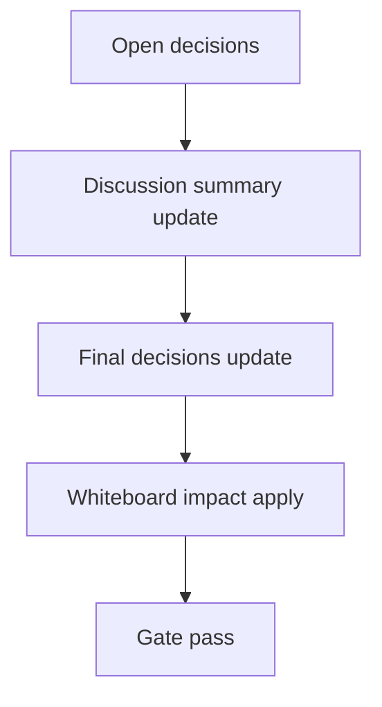

# Design: design_20260302_dashboard_quick_actions_thread_link_v2_5

- Status: Final
- Owner: Codex
- Created: 2026-03-02
- Updated: 2026-03-02
- Scope: Quick Actions v2.5: inbox thread linkage

## Context
- Problem: quick action execute/tracker events and export completion notifications are not consistently grouped in `#inbox` thread view.
- Goal: deterministic `thread_key` linkage across execute/tracker/completion and one-click `Open thread` in tracker UI.
- Non-goals: scheduler integration, DB changes, automatic execute expansion.

## Design diagram

## Whiteboard impact
- Now: Before: tracker-to-inbox transitions were search-based and not execution-thread deterministic. After: execute response returns `thread_key`, inbox derivation aligns completion notices, and tracker opens thread directly.
- DoD: Before: no deterministic qa:* thread linkage. After: request_id/run_id-based `qa:*` keys and derive-consistent inbox thread reads.
- Blockers: none.
- Risks: malformed or oversized ids causing invalid keys; mitigated by sanitization, caps, and fallback token/hash.

## Multi-AI participation plan
- Reviewer:
  - Request: validate additive safety and compatibility with existing inbox/thread APIs.
  - Expected output format: risk and missing-test bullets.
- QA:
  - Request: validate dry-run smoke coverage for thread_key response and `/api/inbox/thread` lookup.
  - Expected output format: deterministic pass/fail bullets.
- Researcher:
  - Request: validate thread_key naming strategy and migration impact for legacy rows.
  - Expected output format: compatibility notes.
- External AI:
  - Request: optional UX safety sanity review.
  - Expected output format: short bullets.
- external_participation: optional
- external_not_required: true

## Open Decisions
- [x] Decision 1
- [x] Decision 2

### Open Decisions checklist
- [x] Add "Decision 1 Final:" entry with final choice.
- [x] Add "Decision 2 Final:" entry with final choice.

## Final Decisions
- Decision 1 Final: execute response always carries additive `thread_key` and `thread_key_source` (preview included).
- Decision 2 Final: inbox derive uses request_id/run_id mapping to align `quick_actions_execute` and export completion under the same `qa:*` key.

## Discussion summary
- Change 1: add backend thread-key generator and quick-actions execute audit append (`source=quick_actions_execute`).
- Change 2: extend inbox thread-key derivation for request_id/run_id-based qa namespace.
- Change 3: add tracker `Open thread` UI and history `thread_key` additive support.

## Plan
1. Design
2. Review
3. Implement
4. Verify

## Risks
- Risk: key collision or invalid characters from raw ids.
  - Mitigation: sanitize to `^[a-z0-9:_-]+$`, cap lengths, and suffix short hash fallback.

## Test Plan
- Unit: none (current repository validation posture is smoke/build/gate).
- E2E: design_gate + ui_smoke(thread_key + inbox thread lookup) + ui_build + desktop + ci_smoke_gate.

## Reviewed-by
- Reviewer / Codex / 2026-03-02 / approved
- QA / Codex / 2026-03-02 / approved
- Researcher / Codex / 2026-03-02 / noted

## External Reviews
- docs/design/design_20260302_dashboard_quick_actions_thread_link_v2_5__external.md / optional_not_requested
