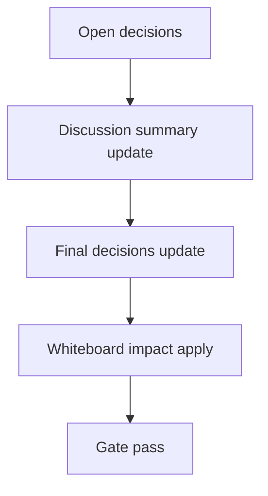

# Design: design_20260302_dashboard_tracker_history_workspace_v1

- Status: Final
- Owner: Codex
- Created: 2026-03-02
- Updated: 2026-03-02
- Scope: Tracker history workspace persistence v1

## Context
- Problem: tracker history survives only in browser localStorage and can be lost/reset per browser profile.
- Goal: add workspace JSONL persistence and UI restore path (workspace-first merge with local) without breaking v2.3 export/import/clear.
- Non-goals: DB adoption, inbox/thread coupling, full historical backfill.

## Design diagram

## Whiteboard impact
- Now: Before: tracker history was localStorage-only. After: workspace tracker history API (`GET`/`append`) and UI restore+best-effort append are additive.
- DoD: Before: no durable workspace source. After: workspace history API works with dry-run append and UI merges workspace/local capped to 10.
- Blockers: none.
- Risks: malformed JSONL lines and oversized lines; mitigated by tail-read skip strategy and line-size caps.

## Multi-AI participation plan
- Reviewer:
  - Request: confirm additive API safety and no regression risk for existing dashboard quick actions.
  - Expected output format: concise bullets with risks/missing tests.
- QA:
  - Request: confirm smoke strategy for dry-run append + GET and no side-effect validation.
  - Expected output format: deterministic pass/fail bullets.
- Researcher:
  - Request: assess JSONL schema compatibility and migration path from local-only history.
  - Expected output format: compatibility notes.
- External AI:
  - Request: optional UI/operational sanity review.
  - Expected output format: short bullets.
- external_participation: optional
- external_not_required: true

## Open Decisions
- [x] Decision 1
- [x] Decision 2

### Open Decisions checklist
- [x] Add "Decision 1 Final:" entry with final choice.
- [x] Add "Decision 2 Final:" entry with final choice.

## Final Decisions
- Decision 1 Final: workspace persistence format is append-only JSONL at `workspace/ui/dashboard/tracker_history.jsonl` with validated read path.
- Decision 2 Final: UI restore order is workspace-first then local merge (same dedupe key), cap 10, with API failure fallback to local-only.

## Discussion summary
- Change 1: add backend APIs `/api/dashboard/tracker_history` and `/api/dashboard/tracker_history/append`.
- Change 2: add UI workspace restore + terminal best-effort append while preserving v2.3 export/import/clear.
- Change 3: extend UI smoke with workspace tracker history checks (append dry-run + GET).

## Plan
1. Design
2. Review
3. Implement
4. Verify

## Risks
- Risk: JSONL growth and parse noise from broken lines.
  - Mitigation: bounded tail-read 256KB, 64KB line cap, skip-invalid strategy, limit clamp.

## Test Plan
- Unit: none (current repo validation posture is smoke/build/gate).
- E2E: docs_check + design_gate + ui_smoke + ui_build_smoke + desktop_smoke + ci_smoke_gate + whiteboard dry-run.

## Reviewed-by
- Reviewer / Codex / 2026-03-02 / approved
- QA / Codex / 2026-03-02 / approved
- Researcher / Codex / 2026-03-02 / noted

## External Reviews
- docs/design/design_20260302_dashboard_tracker_history_workspace_v1__external.md / optional_not_requested
