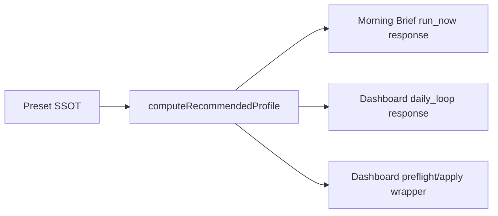
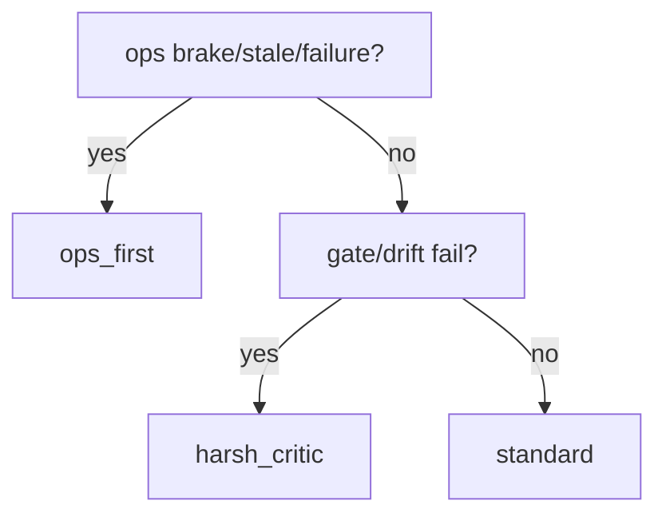

# Design: design_20260302_morning_brief_dashboard_recommended_profile_v3_1

- Status: Ready for Gate
- Owner: Codex
- Created: 2026-03-02
- Updated: 2026-03-02
- Scope: Morning Brief + Dashboard recommended profile v3.1

## Context
- Problem: Morning Brief と Dashboard に「今日の推奨議論プロファイル」がなく、apply 前の安全確認導線が弱い。
- Goal: Morning Brief / Dashboard 応答に deterministic な `recommended_profile` を追加し、Dashboard から one-click preflight/apply を可能にする。
- Non-goals: preset 自動適用、autopilot start までの自動化。

## Design diagram

## Whiteboard impact
- Now: Before: profile 推奨は手動判断。After: Morning Brief/Dashboard が同一ロジックで推奨 preset を提示。
- DoD: Before: preset apply は別画面個別操作。After: Dashboard から preflight/apply を安全フローで実行。
- Blockers: なし
- Risks: 推奨判定の入力が欠損した場合の誤推奨。fallback を `standard` に固定して回避。

## Multi-AI participation plan
- Reviewer:
  - Request: additive contractの後方互換性確認
  - Expected output format: verdict/findings/risks
- QA:
  - Request: dry_run副作用なし検証観点
  - Expected output format: verdict/findings/missing_tests
- Researcher:
  - Request: deterministic ruleの妥当性確認
  - Expected output format: verdict/alternatives
- External AI:
  - Request: optional_not_requested
  - Expected output format: none
- external_participation: optional
- external_not_required: false

## Open Decisions
- [x] Decision 1
- [x] Decision 2

### Open Decisions checklist
- [x] Add "Decision 1 Final:" entry with final choice.
- [x] Add "Decision 2 Final:" entry with final choice.

## Final Decisions
- Decision 1 Final: `recommended_profile` は Morning Brief run_now / Dashboard daily_loop へ additive 追加し、同一 helper で算出。
- Decision 2 Final: Dashboard 向けに `preflight`/`apply(confirm)` wrapper API を追加し、内部で既存 `apply_preset` を再利用する。

## Discussion summary
- Change 1: preset catalog は既存 v2.9 SSOT loader を再利用。
- Change 2: preflight は常に dry_run 強制で副作用を防止。
- Change 3: apply は confirm phrase 必須、失敗時は正規化エラー返却。

## Plan
1. Backend helper + APIs
2. UI Dashboard card
3. Smoke + Docs/SSOT
4. Full verification

## Risks
- Risk: Dashboard指標の取得失敗で推奨が不安定。
  - Mitigation: best-effort + deterministic fallback (`standard`)。
- Risk: apply 成功後の他画面表示遅延。
  - Mitigation: UI で agents/dashboard を再fetch。

## Test Plan
- Unit: recommended profile rule分岐、preset存在fallback、wrapper confirm validation。
- E2E: ui_smoke で morning_brief/dashboard/preflight を dry-run 検証。

## Reviewed-by
- Reviewer / codex / 2026-03-02 / approved
- QA / codex / 2026-03-02 / approved
- Researcher / codex / 2026-03-02 / noted

## External Reviews
- docs/design/design_20260302_morning_brief_dashboard_recommended_profile_v3_1__external.md / optional_not_requested
