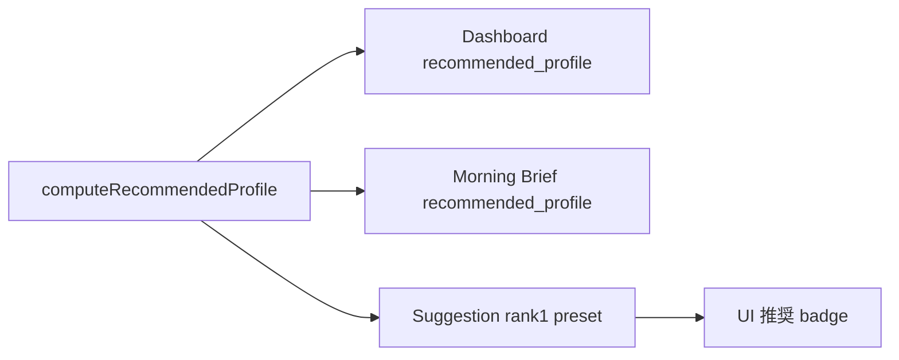
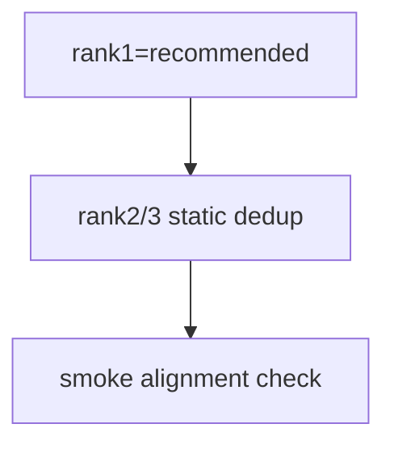

# Design: design_20260302_recommended_profile_autopilot_suggest_alignment_v3_2

- Status: Ready for Gate
- Owner: Codex
- Created: 2026-03-02
- Updated: 2026-03-02
- Scope: Align recommended_profile with autopilot suggest rank1 preset

## Context
- Problem: dashboard/morning-brief の推奨プロファイルと suggestion rank1 preset が分離しており、ユーザー判断がぶれる。
- Goal: suggestion rank1 preset を `computeRecommendedProfile()` と一致させ、UIで推奨由来を明示する。
- Non-goals: 自動apply、自動start、recommendationロジック刷新。

## Design diagram

## Whiteboard impact
- Now: Before: suggestion rank1 は固定寄り。After: rank1 は recommended_profile 単一真実。
- DoD: Before: rec_id と suggestion rank1 の一致保証なし。After: smoke で一致を検証。
- Blockers: なし
- Risks: preset 欠損時の不整合は `standard` fallback で吸収。

## Multi-AI participation plan
- Reviewer:
  - Request: API additivity/互換性を確認
  - Expected output format: verdict/findings/risks
- QA:
  - Request: smoke の非副作用と alignment 検証を確認
  - Expected output format: verdict/findings/missing_tests
- Researcher:
  - Request: single source ルールの妥当性確認
  - Expected output format: verdict/findings
- External AI:
  - Request: optional_not_requested
  - Expected output format: none
- external_participation: optional
- external_not_required: false

## Open Decisions
- [x] Decision 1
- [x] Decision 2

### Open Decisions checklist
- [x] Add "Decision 1 Final:" entry with final choice.
- [x] Add "Decision 2 Final:" entry with final choice.

## Final Decisions
- Decision 1 Final: suggestion `preset_candidates` rank1 は recommended_profile 由来、rank2/3 は static 候補を重複除外で付与。
- Decision 2 Final: additive で `preset_candidates[].source` と `recommended_profile_snapshot` を保持する。

## Discussion summary
- Change 1: `computeRecommendedProfile()` を suggestion 生成にも再利用（single source）。
- Change 2: UI に rank1 推奨表示と dashboard/suggestion の alignment 表示を追加。

## Plan
1. Backend alignment
2. UI badges/alignment view
3. Smoke/docs update
4. Verification

## Risks
- Risk: legacy suggestion row で `source` 不在。
  - Mitigation: optional field として扱い、未設定でも互換動作。

## Test Plan
- Unit: rank1/recommended一致、rank2/3 dedup、fallback標準。
- E2E: ui_smoke で dashboard rec_id と suggestion rank1 preset_id の一致検証。

## Reviewed-by
- Reviewer / codex / 2026-03-02 / approved
- QA / codex / 2026-03-02 / approved
- Researcher / codex / 2026-03-02 / noted

## External Reviews
- docs/design/design_20260302_recommended_profile_autopilot_suggest_alignment_v3_2__external.md / optional_not_requested
