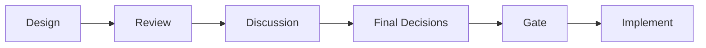
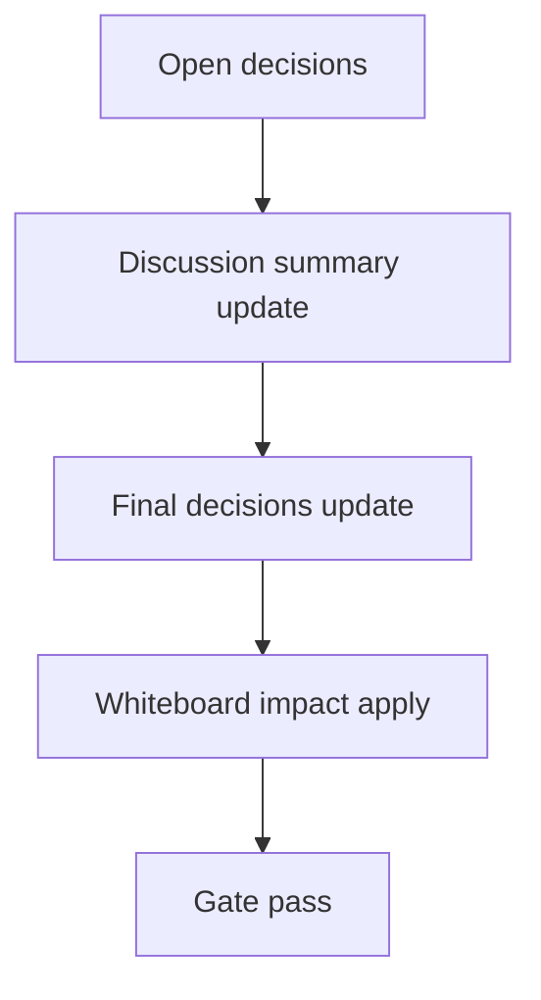

# Design: design_20260303_dashboard_next_actions_v3_7

- Status: Draft
- Owner: Codex
- Created: 2026-03-03
- Updated: 2026-03-03
- Scope: Dashboard Next Actions: surface revert_suggestion + misalignment

## Context
- Problem: Important actions are split across cards, so revert suggestions and ACTIVE/RECOMMENDED mismatch can be missed.
- Goal: Add a single "Next Actions" dashboard card that surfaces highest-priority actions with one-click navigation.
- Non-goals: No automatic revert execution; no inbox schema migration.

## Design diagram

## Whiteboard impact
- Now: Before: operators must inspect Inbox/Quick Actions/Active Profile cards separately. After: dashboard shows a dedicated Next Actions card with direct actions (open thread, quick action jump, revert confirm path).
- DoD: Before: revert_suggestion visibility is implicit and manual. After: `/api/dashboard/next_actions` returns normalized items and UI renders actionable rows with safe no-auto-exec behavior.
- Blockers: none
- Risks: stale or missing inbox links can reduce action detail quality; mitigate with best-effort fallback from active profile + recommended profile computation.

## Multi-AI participation plan
- Reviewer:
  - Request: Validate API/UI compatibility and regression risk in existing dashboard/quick-actions flows.
  - Expected output format: Bullet list of risks + compatibility notes + missing tests.
- QA:
  - Request: Validate deterministic smoke checks for next_actions endpoint with empty/non-empty inbox states.
  - Expected output format: Bullet list with positive/negative test cases and flakiness concerns.
- Researcher:
  - Request: Validate normalized payload shape longevity and best-effort error handling policy.
  - Expected output format: Bullet list with schema guidance and migration cautions.
- External AI:
  - Request: Quick independent review for UX clarity of one-click action paths.
  - Expected output format: 3-5 bullets with concerns and suggested simplifications.
- external_participation: optional
- external_not_required: false

## Open Decisions
- [x] Decision 1
- [x] Decision 2

### Open Decisions checklist
- [x] Add "Decision 1 Final:" entry with final choice.
- [x] Add "Decision 2 Final:" entry with final choice.

## Final Decisions
- Decision 1 Final: Add `GET /api/dashboard/next_actions?limit=` and always return `200` with `items` array (best-effort, empty on failures).
- Decision 2 Final: UI card priority order is `revert_suggestion` first, then `profile_misalignment`, with one-click navigation actions and optional reuse of existing revert confirm modal.

## Discussion summary
- Keep implementation additive: new endpoint + new card only; reuse existing quick action execute modal and active profile revert modal to avoid confirm-policy drift.
- Enforce no-auto-exec by wiring all actions to existing confirm-gated flows.

## Plan
1. Design
2. Review
3. Implement
4. Verify

## Risks
- Risk: `revert_suggestion` entries may miss `active_profile_preset_set_id` link fields.
  - Mitigation: fallback to current active profile API/state and still emit actionable item with conservative defaults.
- Risk: UI anchor/jump behavior may break if cards are reordered.
  - Mitigation: use explicit element refs and safe no-op fallback when ref is unavailable.

## Test Plan
- Unit: endpoint normalization (`action`, `items[]`, caps/default limit, optional revert item validation).
- E2E: `tools/ui_smoke.ps1` check for `dashboard_next_actions_ok` and conditional validation of `revert_suggestion` fields.

## Reviewed-by
- Reviewer / approved / 2026-03-03 / payload+ui flow acceptable for additive change
- QA / approved / 2026-03-03 / deterministic checks with conditional revert validation
- Researcher / noted / 2026-03-03 / schema is stable enough for v3.7

## External Reviews
- docs/design/design_20260303_dashboard_next_actions_v3_7__external_claude.md / noted
