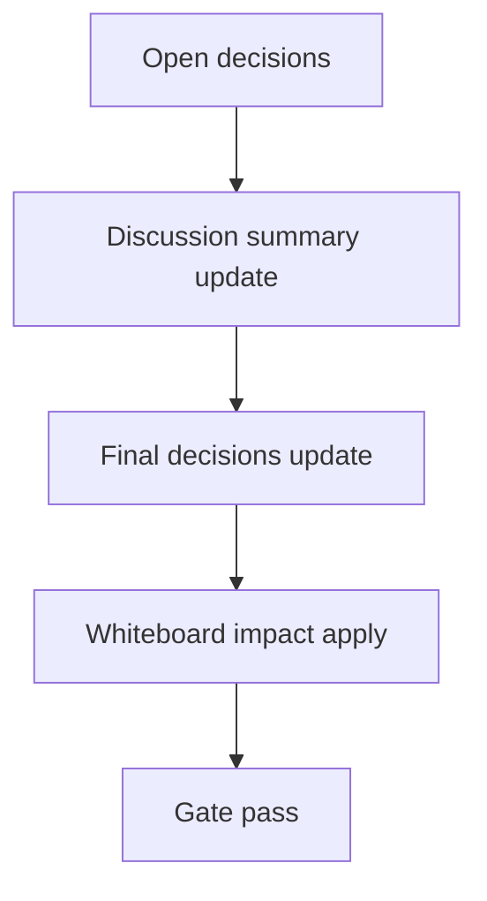

# Design: design_20260304_character_sheet_v1

- Status: Draft
- Owner: Codex
- Created: 2026-03-04
- Updated: 2026-03-04
- Scope: Character Sheet v1: one-click agent status panel (traits+memory+activity) while chat remains primary

## Context
- Problem: Agent status, traits, memory, and live activity are split across `#ワークスペース`, `#メンバー`, and `#アクティビティ`, which increases navigation overhead and interrupts chat-first operations.
- Goal: Add a one-click right-pane "キャラシート" that opens from workspace/member entry points and summarizes traits+memory+activity for a selected agent while keeping chat as the primary workspace.
- Non-goals: No new backend API in v1, no auto-apply preset behavior from the sheet, no change to existing confirm-required actions or thread navigation semantics.

## Design diagram

## Whiteboard impact
- Now: Before: agent operators jump between multiple channels to assess one agent. After: one click from seat/member opens a consolidated Character Sheet side panel with links back to existing edit/memory/preset/inbox views.
- DoD: Before: no dedicated status panel and no scoped live feed per agent. After: panel exists, uses existing APIs only, loads SSE/polling only while visible, and passes docs/design/ui/desktop/ci smoke gates.
- Blockers: None currently; implementation depends on existing `/api/org/agents`, `/api/memory/*`, `/api/activity/stream`, heartbeat endpoints staying available.
- Risks: Long text/IDs causing overflow and activity stream noise; mitigate with `wrapAnywhere`, capped preview lengths, event dedupe, and fixed-size event history.

## Multi-AI participation plan
- Reviewer:
  - Request: Validate UX behavior against one-click open requirement and confirm no regressions in existing thread navigation.
  - Expected output format: Bullet list with `pass/fail`, impacted file/area, and concrete follow-up.
- QA:
  - Request: Verify required DoD command list and panel behaviors (open from workspace/member, memory snapshot, live activity fallback).
  - Expected output format: Command-by-command table with exit code and key assertion.
- Researcher:
  - Request: Confirm existing API compatibility for memory/activity endpoints and identify any payload caveats for UI-only v1.
  - Expected output format: Endpoint checklist with assumptions and risk notes.
- External AI:
  - Request: Optional; not required for v1.
  - Expected output format: N/A.
- external_participation: optional
- external_not_required: true

## Open Decisions
- [x] Should Character Sheet auto-open on app load from last viewed agent?
- [x] Should SSE stay subscribed globally or only while Character Sheet is visible?

### Open Decisions checklist
- [x] Add "Decision 1 Final:" entry with final choice.
- [x] Add "Decision 2 Final:" entry with final choice.

## Final Decisions
- Decision 1 Final: Do not auto-open on app load; persist last agent ID only for quick reopen to avoid surprising navigation.
- Decision 2 Final: Subscribe to activity SSE only while Character Sheet is open for a selected agent; otherwise remain idle and release timers/streams.

## Discussion summary
- Change 1: Character Sheet v1 remains UI-only and reuses existing org/memory/activity/heartbeat endpoints.
- Change 2: Entry points are added in `#ワークスペース` and `#メンバー` with no changes to existing "Go to thread" flows.
- Change 3: Live activity is best-effort using SSE filtered by `actor_id == agent_id` with dedupe/cap and 5s polling fallback.

## Plan
1. Design
2. Review
3. Implement
4. Verify

## Risks
- Risk: API response variance for optional profile alignment fields.
  - Mitigation: Render guards with empty-state labels and hide unavailable actions.
- Risk: Overflow from long IDs or memory bodies.
  - Mitigation: Existing `jsonOutput` and `wrapAnywhere`, body caps (300 chars), and monospace ID blocks.

## Test Plan
- Unit: TypeScript compile checks through `npm.cmd run ui:build:smoke:json`.
- E2E:
  1. `npm.cmd run docs:check:json`
  2. `powershell -NoProfile -ExecutionPolicy Bypass -File tools/design_gate.ps1 -DesignPath docs/design/design_20260304_character_sheet_v1.md`
  3. `powershell -NoProfile -ExecutionPolicy Bypass -File tools/ui_smoke.ps1 -Json`
  4. `npm.cmd run ui:build:smoke:json`
  5. `npm.cmd run desktop:smoke:json`
  6. `npm.cmd run ci:smoke:gate:json`
  7. `powershell -NoProfile -ExecutionPolicy Bypass -File tools/whiteboard_update.ps1 -DryRun -Json` (expect `changed=false`)

## Reviewed-by
- Reviewer / approved / 2026-03-04 / one-click sheet open and chat-primary layout are additive and safe
- QA / approved / 2026-03-04 / DoD command set covers docs gate, smoke, and build regression checks
- Researcher / noted / 2026-03-04 / existing API coverage is sufficient for UI-only v1

## External Reviews
- none / optional
